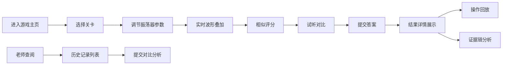

## 1. 产品概述

电子音乐社"合成器波形闯关"游戏 - 玩家通过叠加振荡器匹配目标音色，系统记录所有操作细节供老师课后查阅。

- 核心目的：通过游戏化方式学习波形合成原理，支持教学回放和操作审计
- 目标用户：电子音乐社学生（玩家）、指导老师（查阅者）
- 价值：寓教于乐的合成器学习，完整的操作追溯体系

## 2. 核心功能

### 2.1 用户角色
| 角色 | 注册方式 | 核心权限 |
|------|----------|----------|
| 学生/玩家 | 本地昵称 | 游戏闯关、调节参数、提交答案 |
| 老师/查阅者 | 无需注册 | 查看历史记录、操作回放、详细分析 |

### 2.2 功能模块
1. **游戏主页**：关卡选择、游戏说明、历史记录入口
2. **闯关页面**：波形可视化、振荡器控制、实时试听、相似评分
3. **结果详情页**：成功/失败反馈、操作回放、证据链展示
4. **历史记录页**：玩家列表、每次闯关详情、更新对比

### 2.3 页面详情
| 页面名称 | 模块名称 | 功能描述 |
|-----------|-------------|---------------------|
| 游戏主页 | 关卡列表 | 显示所有关卡，已解锁/未解锁状态，最高分 |
| 游戏主页 | 操作说明 | 游戏规则、波形合成原理简介 |
| 闯关页面 | 目标波形展示 | Canvas绘制目标波形和频谱 |
| 闯关页面 | 振荡器控制面板 | 多振荡器：波形类型、频率、音量、相位旋钮 |
| 闯关页面 | 实时波形叠加 | 实时计算并显示叠加后的波形 |
| 闯关页面 | 试听按钮 | 播放目标音色、播放当前合成音色 |
| 闯关页面 | 相似评分 | 实时显示匹配度百分比及明细 |
| 结果详情页 | 成功/失败提示 | 动画反馈、得分展示 |
| 结果详情页 | 操作时间线 | 按顺序显示所有旋钮调节、相位抵消、音量爆峰事件 |
| 结果详情页 | 证据链面板 | 波形结论、试听对比、评分明细相互印证 |
| 结果详情页 | 冲突补充说明 | 当波形与振荡器结论不一致时，滤波作为补充证据 |
| 历史记录页 | 玩家记录列表 | 按玩家分组显示所有闯关记录 |
| 历史记录页 | 提交对比 | 显示同一批材料的更新内容与重复提交 |

## 3. 核心流程

学生进入游戏主页，选择关卡开始闯关。调节多个振荡器的波形、频率、音量、相位参数，系统实时计算叠加波形并计算与目标波形的相似度。学生可随时试听目标音色和当前合成音色。提交后系统展示结果详情，包括操作时间线和完整证据链。老师可进入历史记录页查看所有学生的操作记录，同一批材料的多次提交会标注更新内容和重复内容。

## 4. 用户界面设计

### 4.1 设计风格
- **主色调**：赛博朋克风格 - 深紫色(#1a0a2e)背景，霓虹青(#00f5ff)主色，霓虹粉(#ff00ff)强调色
- **按钮风格**：霓虹发光效果，圆角矩形，hover时有脉冲动画
- **字体**：Orbitron（数字显示） + JetBrains Mono（控制面板）
- **布局风格**：模块化卡片布局，科技感网格背景
- **图标风格**：线性霓虹图标，旋钮采用拟物化设计

### 4.2 页面设计概述
| 页面名称 | 模块名称 | UI元素 |
|-----------|-------------|-------------|
| 游戏主页 | 关卡卡片 | 霓虹边框、关卡名称、进度条、最高分 |
| 闯关页面 | 波形画布 | 深色背景、荧光波形线、网格参考线 |
| 闯关页面 | 旋钮控制 | 圆形旋钮、刻度线、数值显示、拖拽旋转 |
| 结果详情页 | 时间线 | 垂直时间轴、事件节点、悬停详情、顺序标注 |
| 历史记录页 | 对比面板 | 左右分栏、差异高亮、新增/删除标记 |

### 4.3 响应性
- Desktop-first设计，主画布区域自适应
- 控制面板在小屏幕下转为垂直布局
- 旋钮支持触摸操作

### 4.4 音效与动效
- 旋钮调节时的滴答声反馈
- 成功时的上升音阶，失败时的下降音阶
- 波形实时更新的平滑过渡动画
- 相位抵消时的特殊视觉闪烁效果
- 音量爆峰时的红色警告动画
