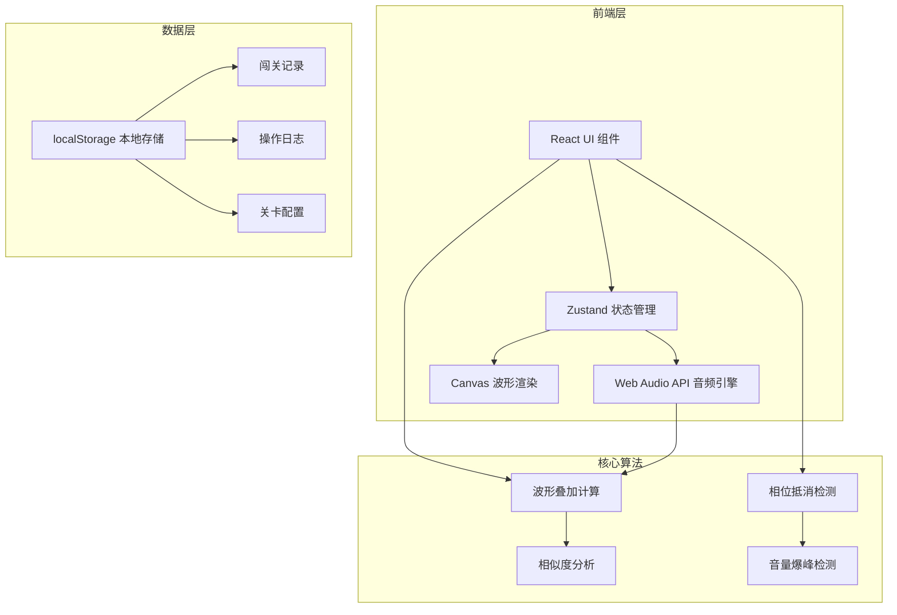
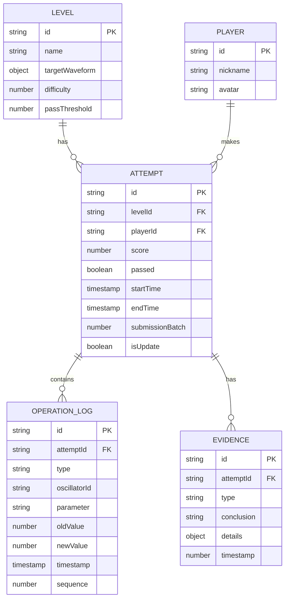

## 1. 架构设计



## 2. 技术描述
- **前端**：React@18 + TypeScript + tailwindcss@3 + Vite
- **状态管理**：zustand
- **音频引擎**：Web Audio API（原生）
- **图形渲染**：HTML5 Canvas
- **数据存储**：localStorage（本地持久化）
- **初始化工具**：vite-init

## 3. 路由定义
| 路由 | 页面组件 | 功能描述 |
|------|---------|----------|
| / | HomePage | 游戏主页，关卡选择 |
| /game/:levelId | GamePage | 闯关页面，振荡器控制 |
| /result/:attemptId | ResultPage | 结果详情页，操作回放 |
| /history | HistoryPage | 历史记录页，提交对比 |

## 4. 核心数据模型

### 4.1 数据模型定义



### 4.2 TypeScript 类型定义

```typescript
// 波形类型
type WaveformType = 'sine' | 'square' | 'sawtooth' | 'triangle';

// 振荡器配置
interface OscillatorConfig {
  id: string;
  enabled: boolean;
  waveform: WaveformType;
  frequency: number;
  volume: number;
  phase: number;
}

// 关卡配置
interface Level {
  id: string;
  name: string;
  description: string;
  targetOscillators: OscillatorConfig[];
  difficulty: 1 | 2 | 3;
  passThreshold: number;
  unlocked: boolean;
}

// 操作日志
interface OperationLog {
  id: string;
  type: 'parameter_change' | 'phase_cancellation' | 'volume_peak' | 'preset_override' | 'playback';
  oscillatorId?: string;
  parameter?: string;
  oldValue?: number;
  newValue?: number;
  timestamp: number;
  sequence: number;
  details?: Record<string, any>;
}

// 证据项
interface Evidence {
  id: string;
  type: 'waveform' | 'oscillator' | 'filter' | 'similarity' | 'audition';
  conclusion: string;
  details: Record<string, any>;
  timestamp: number;
  supports?: string;
  conflicts?: string;
}

// 闯关记录
interface Attempt {
  id: string;
  levelId: string;
  playerId: string;
  playerName: string;
  oscillators: OscillatorConfig[];
  score: number;
  similarityBreakdown: {
    waveformMatch: number;
    frequencyMatch: number;
    harmonicMatch: number;
    total: number;
  };
  passed: boolean;
  startTime: number;
  endTime: number;
  operationLogs: OperationLog[];
  evidences: Evidence[];
  submissionBatch: string;
  isUpdate: boolean;
  updatedFields: string[];
}

// 玩家信息
interface Player {
  id: string;
  nickname: string;
  highScores: Record<string, number>;
}

// 游戏状态
interface GameState {
  currentLevel: Level | null;
  oscillators: OscillatorConfig[];
  operationLogs: OperationLog[];
  isPlaying: boolean;
  isTargetPlaying: boolean;
  currentScore: number;
}
```

## 5. 核心算法模块

### 5.1 波形叠加算法
- 输入：多个振荡器配置（波形类型、频率、音量、相位）
- 输出：叠加后的波形数据
- 采样率：44100Hz，采样窗口：1024点

### 5.2 相似度评分算法
- 波形相关性：使用互相关函数计算波形形状匹配度
- 频谱匹配：FFT转换后计算频谱包络相似度
- 谐波分析：检测泛音结构匹配度
- 总分加权：波形40% + 频谱40% + 谐波20%

### 5.3 事件检测算法
- 相位抵消检测：检测输出音量骤降且波形幅度接近零
- 音量爆峰检测：检测波形峰值超过阈值(>0.95)
- 时序记录：精确记录事件发生顺序，毫秒级时间戳
