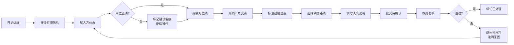

## 1. 产品概述

"海上救援三角定位"是一款面向航海课程学员的交互训练小游戏，通过模拟真实海上救援场景，让学员掌握三角定位法的实际应用。玩家需要根据三座灯塔的方位角数据，在海图上确定遇险船只的位置，并规划救援路线。

- 核心目标：通过沉浸式交互让学员理解三角定位原理，感受实际操作中的权衡与取舍
- 目标用户：航海专业学员、海事培训人员
- 产品价值：将抽象的航海理论转化为可操作的实践体验，保留完整操作轨迹便于教学复盘

## 2. 核心功能

### 2.1 用户角色

| 角色 | 登录方式 | 核心权限 |
|------|----------|----------|
| 学员 | 直接进入 | 进行定位训练、查看个人历史记录 |
| 教员 | 密码登录 | 查看所有学员记录、复核定位结果、退回补材料 |

### 2.2 功能模块

1. **主训练页面**：海图交互区、灯塔信息面板、方位角测量工具、定位标注
2. **记录管理页面**：按状态分类的训练记录列表（已处理/待确认/需退回）
3. **复盘详情页面**：完整操作轨迹回放、决策过程查看、结果复核
4. **结果导出**：整合定位数据、海图标注、路线选择的可复查报告

### 2.3 页面详情

| 页面名称 | 模块名称 | 功能描述 |
|----------|----------|----------|
| 主训练页面 | 海图交互区 | Canvas绘制海图、经纬网格、灯塔位置、可拖拽的定位点和方位线 |
| 主训练页面 | 灯塔信息面板 | 展示三座灯塔的名称、坐标、信号特征，支持手动输入/选择方位角 |
| 主训练页面 | 方位角测量工具 | 支持度/分/秒和十进制度两种单位输入，自动检测单位错误并标记 |
| 主训练页面 | 定位标注区 | 玩家标注预估遇险船位置，系统实时显示三角交点误差 |
| 主训练页面 | 救援路线选择 | 从救援站到遇险点规划多条路线，显示距离、时间、风险权衡 |
| 记录管理页面 | 状态筛选栏 | 按"已处理/待确认/需退回"分类筛选记录 |
| 记录管理页面 | 记录列表 | 展示训练时间、学员、误差值、状态标签 |
| 复盘详情页面 | 操作时间线 | 按时间顺序展示每一步操作（灯塔选择、角度输入、位置调整） |
| 复盘详情页面 | 数据溯源面板 | 显示每个方位角的来源、输入时间、修改历史 |
| 复盘详情页面 | 决策说明区 | 玩家填写的路线选择理由、教员复核意见 |
| 结果导出 | 报告生成 | 整合所有数据生成PDF格式的可复查报告 |

## 3. 核心流程

### 3.1 训练流程
玩家进入训练后，系统随机生成遇险船位置和三座灯塔的方位角数据。玩家需要：
1. 查看每座灯塔的信息，理解其位置和信号特征
2. 依次输入三座灯塔的方位角（注意单位转换）
3. 在海图上拖拽方位线，观察三条线的交点区域
4. 根据交点区域标注预估的遇险船位置
5. 选择救援路线（需权衡距离、海况、时间）
6. 填写决策说明，提交记录进入待确认状态

### 3.2 复核流程
教员进入记录管理页面，查看待确认记录：
1. 查看完整操作时间线和数据溯源
2. 检查角度单位是否正确、定位误差是否合理
3. 查看救援路线选择和决策说明
4. 选择"通过"标记为已处理，或"退回"要求补材料

## 4. 用户界面设计

### 4.1 设计风格
- **主色调**：深海蓝 `#0A2463` 作为主色，搭配海雾灰 `#E7ECEF` 背景
- **辅助色**：警示橙 `#F76C5E` 标记错误，确认绿 `#44AF69` 标记正确，警戒黄 `#F9C80E` 标记待确认
- **字体选择**：
  - 标题：使用具有航海气质的衬线字体 `Playfair Display`，体现专业感
  - 正文：使用清晰易读的无衬线字体 `Source Sans Pro`
  - 数据数字：使用等宽字体 `JetBrains Mono`，便于角度和坐标读数
- **交互设计**：
  - 按钮采用圆角矩形，边框1px，hover时微浮起效果
  - 海图采用真实航海图的质感，带有经纬线和水深标记
  - 方位线采用不同颜色区分三座灯塔，带有虚线延长线显示延伸方向
- **视觉细节**：
  - 背景添加轻微的纸纹噪点效果
  - 海图边缘添加渐变晕影，模拟老旧航海图质感
  - 错误标记采用红色边框 + 角标，不可被覆盖

### 4.2 页面设计概述

| 页面名称 | 模块名称 | UI元素 |
|----------|----------|--------|
| 主训练页面 | 海图交互区 | Canvas画布、经纬网格、灯塔图标、可拖拽方位线、交点误差圈 |
| 主训练页面 | 灯塔信息卡 | 三座灯塔分开展示，每卡包含灯塔名称、坐标、信号、方位角输入框、单位切换 |
| 主训练页面 | 操作时间线 | 右侧窄条，实时记录每一步操作，可点击回溯 |
| 主训练页面 | 误差显示区 | 实时显示三角交点的误差三角形面积、定位精度评估 |
| 记录管理页面 | 顶部状态栏 | 三种状态的数量统计卡片，可点击筛选 |
| 记录管理页面 | 记录列表 | 卡片式列表，每张卡片带状态标签色、学员头像、误差值、操作时间 |
| 复盘详情页面 | 双栏布局 | 左侧海图复现，右侧操作时间线和数据溯源面板 |
| 复盘详情页面 | 决策对比区 | 同时显示玩家选择和最优解，标注差异原因 |

### 4.3 响应式
- 桌面端：采用三栏布局（海图区 + 灯塔面板 + 时间线）
- 平板端：海图区占上半屏，下方左右分栏
- 移动端：垂直堆叠，海图区支持全屏展开
- 所有拖拽操作支持触摸手势

### 4.4 动画与交互
- 方位线绘制时采用路径动画，从灯塔出发缓缓延伸
- 定位点拖拽时显示吸附效果，靠近交点时产生磁力吸引
- 错误标记出现时带有轻微震动动画，提醒玩家注意
- 页面切换采用淡入淡出，操作时间线新条目从右侧滑入
- 状态变更时标签颜色渐变过渡
