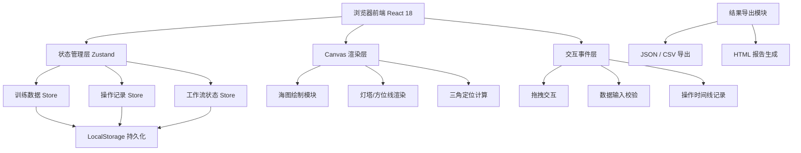
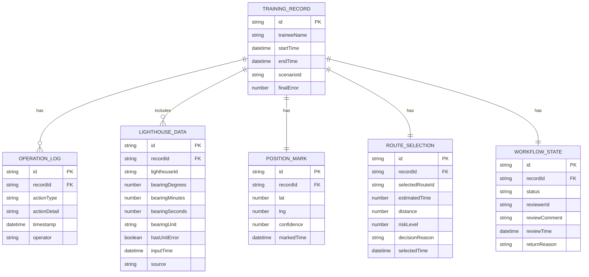

## 1. 架构设计



## 2. 技术描述

- **前端框架**：React@18 + TypeScript@5 + Vite@5
- **状态管理**：Zustand@4，采用模块化 Store 设计
- **样式方案**：TailwindCSS@3 + CSS 变量主题系统
- **图标库**：Lucide React
- **海图渲染**：原生 Canvas API，无第三方图形库
- **数据持久化**：LocalStorage，无需后端服务
- **初始化工具**：vite-init 模板 `react-ts`

## 3. 目录结构

```
src/
├── components/          # 组件目录
│   ├── ChartCanvas/     # 海图Canvas组件
│   │   ├── ChartCanvas.tsx
│   │   ├── LighthouseRenderer.ts
│   │   ├── BearingLineRenderer.ts
│   │   └── PositionMarker.ts
│   ├── LighthousePanel/ # 灯塔信息面板
│   │   ├── LighthouseCard.tsx
│   │   └── BearingInput.tsx
│   ├── Timeline/        # 操作时间线
│   │   ├── Timeline.tsx
│   │   └── TimelineItem.tsx
│   ├── RecordList/      # 记录列表
│   │   ├── RecordCard.tsx
│   │   └── StatusFilter.tsx
│   ├── RouteSelector/   # 救援路线选择
│   │   └── RouteSelector.tsx
│   └── common/          # 通用组件
│       ├── StatusBadge.tsx
│       └── ErrorMarker.tsx
├── hooks/               # 自定义Hooks
│   ├── useTriangulation.ts
│   ├── useCanvasDrag.ts
│   ├── useTimeline.ts
│   └── useBearingValidation.ts
├── store/               # Zustand状态管理
│   ├── trainingStore.ts
│   ├── recordStore.ts
│   └── workflowStore.ts
├── utils/               # 工具函数
│   ├── geoCalculations.ts    # 地理计算
│   ├── triangulation.ts      # 三角定位算法
│   ├── bearingConversion.ts  # 角度单位转换
│   ├── exportReport.ts       # 报告导出
│   └── formatters.ts         # 格式化函数
├── types/               # TypeScript类型定义
│   ├── index.ts
│   ├── geo.ts
│   └── workflow.ts
├── data/                # Mock数据
│   ├── lighthouses.ts
│   └── scenarios.ts
├── pages/               # 页面组件
│   ├── TrainingPage.tsx
│   ├── RecordsPage.tsx
│   └── ReviewPage.tsx
├── App.tsx
├── main.tsx
└── index.css
```

## 4. 路由定义

| 路由路径 | 页面名称 | 功能描述 |
|----------|----------|----------|
| `/` | 训练主页 | 三角定位训练主界面 |
| `/records` | 记录列表 | 按状态分类的训练记录列表 |
| `/review/:recordId` | 复盘详情 | 查看单条记录的完整操作轨迹和数据 |

## 5. 数据模型

### 5.1 核心类型定义



### 5.2 工作流状态枚举

```typescript
enum WorkflowStatus {
  PENDING = 'pending',      // 待确认
  APPROVED = 'approved',    // 已处理
  RETURNED = 'returned'     // 需退回补材料
}
```

### 5.3 操作类型枚举

```typescript
enum OperationType {
  BEARING_INPUT = 'bearing_input',
  BEARING_MODIFY = 'bearing_modify',
  POSITION_MARK = 'position_mark',
  POSITION_ADJUST = 'position_adjust',
  ROUTE_SELECT = 'route_select',
  SUBMIT = 'submit',
  UNIT_ERROR_DETECTED = 'unit_error_detected'
}
```

## 6. 核心算法说明

### 6.1 三角定位算法
1. 从每座灯塔位置出发，根据方位角绘制射线
2. 计算每两条射线的交点，得到三个交点
3. 三个交点形成误差三角形，计算其面积作为定位精度指标
4. 取三角形重心作为最优估计位置

### 6.2 方位角单位校验
1. 检测输入的度/分/秒是否在合理范围（0-359°, 0-59', 0-59''）
2. 检测十进制度是否在合理范围（0-360）
3. 标记单位不匹配错误，保留原始输入不自动修正
4. 错误记录永久保留在操作日志中，不可删除

### 6.3 地理坐标转换
1. 经纬度坐标转换为Canvas像素坐标
2. 支持墨卡托投影简化计算
3. 距离计算采用球面三角公式
