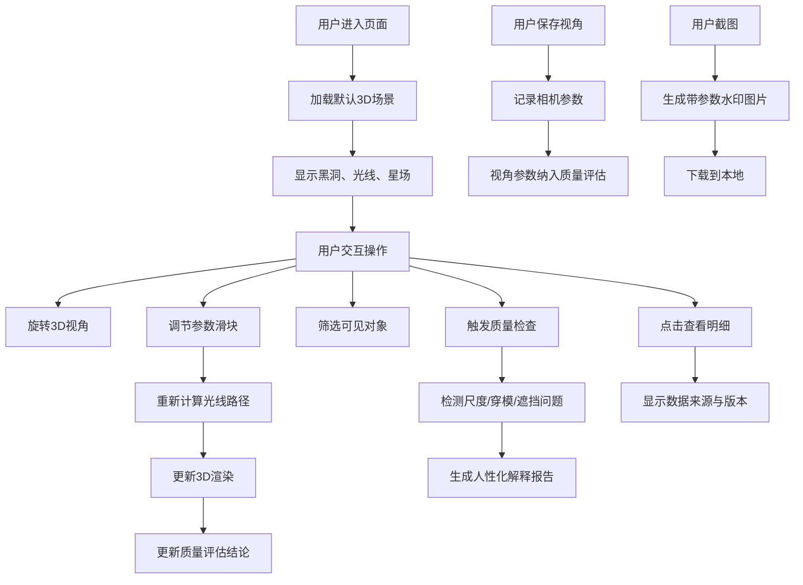

## 1. 产品概述

黑洞引力透镜教具是一个面向天文教学的交互式Web3D可视化工具，通过真实物理模型展示黑洞如何弯曲背景星光，解决传统静态图片难以解释引力透镜效应的教学痛点。

- 核心用户：天文教师、学生、天文爱好者
- 核心价值：将抽象的广义相对论效应转化为可交互、可探索的3D可视化体验
- 教学目标：让学习者直观理解引力透镜的物理原理、参数影响和观测特征

## 2. 核心 Features

### 2.1 Feature Module

1. **主3D场景页**：黑洞模型、光线路径追踪、背景星场渲染、实时引力透镜效果
2. **交互控制面板**：参数滑块调节、对象筛选开关、视角预设与保存、质量检查报告
3. **对象明细面板**：点击对象展示物理参数、数据来源、版本信息
4. **截图导出模块**：一键截图、带参数水印导出

### 2.3 Page Details

| 页面名称 | 模块名称 | Feature 描述 |
|----------|----------|--------------|
| 主3D场景页 | 黑洞模型 | 史瓦西半径可视化、吸积盘渲染、事件视界标识 |
| 主3D场景页 | 光线路径 | 基于测地线方程的3D光线追踪、实时参数响应 |
| 主3D场景页 | 背景星场 | 可配置星点分布、引力偏折实时计算、遮挡检测 |
| 交互控制面板 | 参数滑块 | 黑洞质量、观测距离、光线数量等参数实时调节，影响渲染结果 |
| 交互控制面板 | 对象筛选 | 独立开关控制黑洞、光线、星场的可见性 |
| 交互控制面板 | 视角管理 | 预设视角、自定义保存、视角参数参与质量评估 |
| 交互控制面板 | 质量检查 | 自动检测尺度错误、光线穿模、背景遮挡，给出人性化解释 |
| 对象明细面板 | 数据溯源 | 显示每个对象的数据源、版本号、生成时间、计算公式 |
| 对象明细面板 | 物理参数 | 展示黑洞质量、光线路径参数、星场坐标等精确数值 |
| 截图导出模块 | 一键截图 | 包含当前参数水印的PNG导出，可用于教学资料 |

## 3. 核心流程

## 4. 用户界面设计

### 4.1 设计风格

- **主色调**：深空黑 (#0a0a1a) 为主，配合宇宙蓝 (#1a3a5c)、引力红 (#5c1a1a)、星点白 (#ffffff)
- **点缀色**：霍金辐射橙 (#ff8c42) 用于强调交互元素
- **视觉风格**：宇宙深空科幻风，暗背景、发光元素、星点粒子背景
- **字体**：
  - 标题：Orbitron（科幻等宽字体，营造科学感）
  - 正文：Noto Sans SC（清晰易读的中文无衬线字体）
- **布局**：左侧控制面板 + 中央3D画布 + 右侧明细面板的三栏布局
- **按钮风格**：半透明玻璃态、发光边框、悬停时亮度增强
- **图标风格**：线性简约风格，天文相关图标（黑洞、光线、星轨等）

### 4.2 页面设计概述

| 页面名称 | 模块名称 | UI 元素 |
|----------|----------|----------|
| 主场景 | 3D画布 | 全屏WebGL渲染、鼠标拖拽旋转、滚轮缩放、右键平移 |
| 主场景 | 黑洞对象 | 黑色球体 + 吸积盘发光环 + 引力透镜扭曲效果 |
| 主场景 | 光线路径 | 发光曲线，不同颜色表示不同偏折程度，可点击 |
| 主场景 | 背景星场 | 闪烁星点，经过黑洞时产生位置偏移和亮度变化 |
| 左侧面板 | 参数滑块组 | 垂直排列滑块，实时显示数值，拖动时3D场景同步更新 |
| 左侧面板 | 筛选开关 | 三个独立toggle开关，分别控制黑洞/光线/星场可见性 |
| 左侧面板 | 视角管理 | 预设视角按钮、保存视角按钮、已保存视角列表 |
| 左侧面板 | 质量检查区 | 彩色状态指示器、问题列表、每条问题附人性化解释 |
| 右侧面板 | 对象明细 | 点击后滑入，显示物理参数表、数据来源信息、版本历史 |
| 顶部栏 | 标题与工具 | 页面标题、截图按钮、帮助按钮、版本信息 |
| 截图浮层 | 预览窗口 | 截图预览、参数水印预览、下载按钮、取消按钮 |

### 4.3 响应性

- **桌面端（1280px+）**：三栏布局，左25% + 中50% + 右25%
- **平板端（768px-1279px）**：可折叠左右面板，中央画布自适应
- **移动端（<768px）**：单列布局，控制面板折叠为底部抽屉，触控优化旋转缩放
- 触控操作：单指旋转、双指缩放、双指平移

### 4.4 3D场景指导

- **环境与氛围**：纯黑深空背景，无HDRI，使用点光源模拟遥远星光，黑洞周围有引力透镜后处理扭曲
- **光照设置**：
  - 吸积盘自发光作为主要光源
  - 环境光强度极低（0.1）以保持深空感
  - 点光源随星场分布，经过黑洞时产生引力放大效应
- **相机设置**：
  - 初始位置：距离黑洞10倍史瓦西半径处，45度俯角
  - 控制方式：OrbitControls，限制最小距离（不进入事件视界）
  - 相机参数记录为JSON，可保存和恢复
- **构图与焦点**：
  - 黑洞始终位于场景中心
  - 光线路径从背景发出，汇聚到黑洞周围再射出
  - 星场均匀分布在远处天球上
- **交互与动画**：
  - 吸积盘缓慢旋转动画
  - 光线沿路径流动动画（粒子沿曲线运动）
  - 星点随机轻微闪烁
  - 参数变化时光线平滑过渡动画
- **后处理效果**：
  - 黑洞周围的引力透镜扭曲shader
  - Bloom效果增强发光边缘
  - 轻微的色差模拟真实望远镜观测
- **资源来源**：
  - 所有模型使用Three.js程序化生成，无外部模型依赖
  - 星点纹理使用Canvas生成
  - 字体通过Google Fonts CDN加载
  - 性能预算：Draw Calls < 50，帧率稳定在60fps
