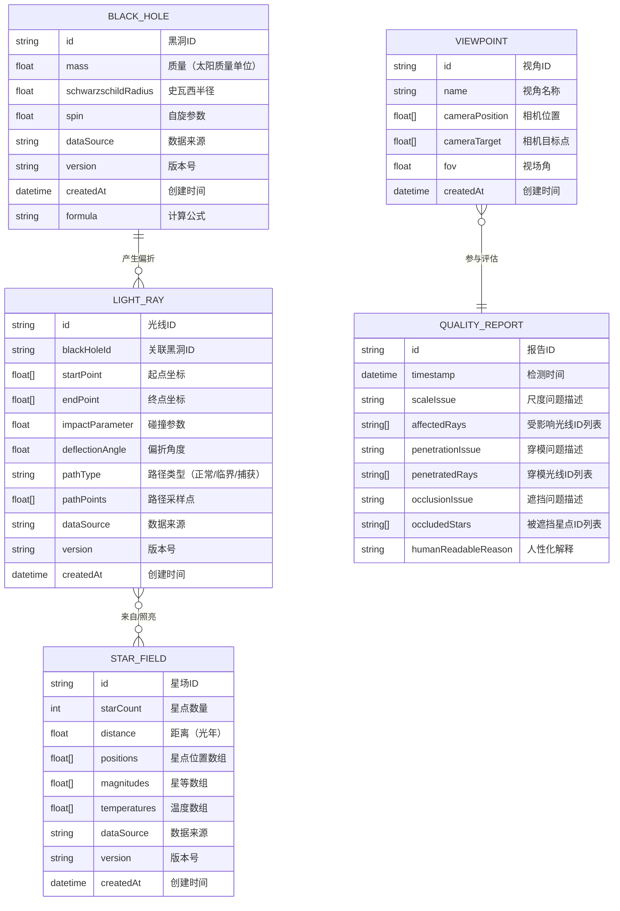

## 1. 架构设计


## 2. 技术描述

- **前端框架**: React@18.2.0 + TypeScript@5.4.0
- **构建工具**: Vite@5.2.0
- **样式方案**: TailwindCSS@3.4.1
- **3D渲染**: three@0.162.0, @react-three/fiber@8.15.19, @react-three/drei@9.99.0, @react-three/postprocessing@2.16.2
- **状态管理**: Zustand@4.5.2
- **截图功能**: html2canvas@1.4.1
- **后端**: 无后端，纯前端应用，所有数据为Mock数据
- **数据存储**: LocalStorage（保存视角、用户配置）

## 3. 路由定义

| 路由 | 用途 |
|------|------|
| / | 主3D场景页，包含所有交互功能 |

本项目为单页应用，仅一个主路由，通过组件状态切换不同面板的显示。

## 4. 数据模型

### 4.1 数据模型定义



### 4.2 TypeScript 类型定义

```typescript
// 黑洞数据模型
interface BlackHole {
  id: string;
  mass: number;
  schwarzschildRadius: number;
  spin: number;
  dataSource: string;
  version: string;
  createdAt: Date;
  formula: string;
}

// 光线路径数据模型
interface LightRay {
  id: string;
  blackHoleId: string;
  startPoint: [number, number, number];
  endPoint: [number, number, number];
  impactParameter: number;
  deflectionAngle: number;
  pathType: 'normal' | 'critical' | 'captured';
  pathPoints: [number, number, number][];
  dataSource: string;
  version: string;
  createdAt: Date;
}

// 星场数据模型
interface Star {
  id: string;
  position: [number, number, number];
  magnitude: number;
  temperature: number;
  isLensed: boolean;
  lensedPosition?: [number, number, number];
}

interface StarField {
  id: string;
  starCount: number;
  distance: number;
  stars: Star[];
  dataSource: string;
  version: string;
  createdAt: Date;
}

// 视角数据模型
interface Viewpoint {
  id: string;
  name: string;
  cameraPosition: [number, number, number];
  cameraTarget: [number, number, number];
  fov: number;
  createdAt: Date;
}

// 质量报告数据模型
interface QualityIssue {
  type: 'scale' | 'penetration' | 'occlusion';
  severity: 'low' | 'medium' | 'high';
  description: string;
  humanReason: string;
  affectedIds: string[];
}

interface QualityReport {
  id: string;
  timestamp: Date;
  issues: QualityIssue[];
  overallStatus: 'pass' | 'warning' | 'error';
}

// 应用状态
interface AppState {
  blackHole: BlackHole;
  lightRays: LightRay[];
  starField: StarField;
  viewpoints: Viewpoint[];
  qualityReport: QualityReport | null;
  visibility: {
    blackHole: boolean;
    lightRays: boolean;
    starField: boolean;
  };
  selectedObject: BlackHole | LightRay | Star | null;
  parameters: {
    blackHoleMass: number;
    rayCount: number;
    observerDistance: number;
    starDensity: number;
  };
}
```

## 5. 核心模块说明

### 5.1 物理计算模块 (`src/physics/`)

- **geodesic.ts**: 测地线方程求解，计算光线在黑洞引力场中的路径
- **lensing.ts**: 引力透镜效应计算，包括放大率、时间延迟
- **constants.ts**: 物理常量（光速、万有引力常数、太阳质量等）

### 5.2 3D组件模块 (`src/components/3d/`)

- **BlackHole3D.tsx**: 黑洞3D组件，包含事件视界、吸积盘
- **LightRays3D.tsx**: 光线路径3D组件，支持动画和交互
- **StarField3D.tsx**: 背景星场3D组件，支持引力偏折
- **Scene.tsx**: 主3D场景，整合所有3D元素
- **GravityLensEffect.tsx**: 后处理shader，实现引力透镜扭曲

### 5.3 UI组件模块 (`src/components/ui/`)

- **ControlPanel.tsx**: 左侧控制面板，参数滑块和筛选开关
- **DetailPanel.tsx**: 右侧明细面板，显示选中对象信息
- **QualityPanel.tsx**: 质量检查报告面板
- **ViewpointManager.tsx**: 视角管理组件
- **ScreenshotModal.tsx**: 截图预览和导出模态框

### 5.4 状态管理 (`src/store/`)

- **useAppStore.ts**: Zustand store，管理所有应用状态
- **persist.ts**: LocalStorage持久化配置

### 5.5 Mock数据 (`src/data/`)

- **blackHoles.ts**: 预设黑洞数据
- **lightRays.ts**: 预设光线路径数据
- **starField.ts**: 预设星场数据
- **viewpoints.ts**: 预设视角数据

### 5.6 质量检查模块 (`src/quality/`)

- **checker.ts**: 质量检查引擎，检测尺度、穿模、遮挡问题
- **reasoning.ts**: 人性化解释生成器
```
