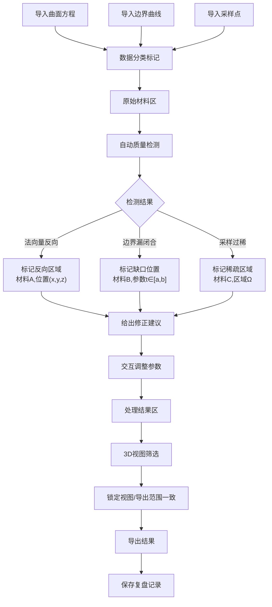

## 1. 产品概述

曲面积分讲台是面向数学教学的交互式3D数学工作台，帮助师生在同一3D画面中观察曲面、法向量与投影区域。

- 核心价值：将抽象的曲面积分概念具象化，通过交互式3D可视化辅助教学理解
- 解决痛点：曲面方程、边界曲线、采样点数据来源分散，错误定位困难，教学演示缺乏可复查证据链
- 目标用户：高校/大学数学教师、理工科学生
- 产品定位：专业数学教学演示与问题诊断工具

## 2. 核心功能

### 2.1 用户角色

| 角色 | 注册方式 | 核心权限 |
|------|-----------|----------|
| 数学教师 | 无需注册 | 完整功能，导入数据、诊断、导出、复盘 |
| 学生 | 无需注册 | 查看3D模型、切换视图 |

### 2.2 功能模块

1. **3D工作台主页面**：3D曲面渲染、法向量可视化、投影区域显示、参数切片交互
2. **数据导入与溯源面板**：多源数据导入、材料分类（原始/处理）
3. **错误诊断与修正建议**：法向量反向检测、边界闭合检测、采样密度检测
4. **导出与筛选**：视图范围锁定、屏幕/导出范围一致性、参数筛选
5. **历史复盘**：操作历史记录、处理决策留痕

### 2.3 页面详情

| 页面名称 | 模块名称 | 功能描述 |
|-----------|----------|--------------|
| 3D工作台主页面 | 3D渲染画布 | 三视口3D曲面渲染，支持旋转/缩放/平移，实时交互 |
| 3D工作台主页面 | 法向量可视化 | 法向量箭头显示，可调节长度/密度，支持高亮取舍 |
| 3D工作台主页面 | 参数切片器 | UV参数切片交互，支持u/v方向独立调节 |
| 3D工作台主页面 | 投影区域 | XY/XZ/YZ平面投影，支持半透明投影区域显示 |
| 数据导入面板 | 数据导入 | 支持JSON/CSV格式导入曲面方程、边界曲线、采样点 |
| 数据导入面板 | 来源追踪 | 显示每份数据的导入时间、来源标记、原始/处理状态 |
| 错误诊断面板 | 法向量检测 | 检测法向量方向一致性，标记反向区域 |
| 错误诊断面板 | 边界检测 | 检测边界曲线闭合性，标记缺口位置 |
| 错误诊断面板 | 采样检测 | 检测采样点密度，标记过稀区域 |
| 错误诊断面板 | 修正建议 | 针对每项错误给出具体补全建议，关联出错材料 |
| 导出面板 | 范围锁定 | 屏幕可见范围与导出范围保持一致 |
| 导出面板 | 筛选器 | 参数范围筛选，同步影响视图与导出 |
| 复盘面板 | 历史记录 | 所有操作步骤时间线，可回溯决策依据 |
| 复盘面板 | 快照 | 每个处理节点自动保存证据快照 |

## 3. 核心流程

用户从导入多源数据开始，系统自动进行质量检测，标记问题来源与位置，用户交互调整参数，最后导出一致范围的结果。

## 4. 用户界面设计

### 4.1 设计风格

- 学术深色主题，以深蓝灰为主色调，青色为法向量高亮色，橙色为错误标记色，紫色为投影区域色。
- 按钮采用极简工业风，扁平化卡片式布局，突出3D画布为视觉中心。
- 字体：标题使用Noto Serif SC（学术衬线），正文使用JetBrains Mono（等宽代码字体）。
- 图标使用Lucide图标库，统一线性风格。

### 4.2 页面设计概述

| 页面名称 | 模块名称 | UI元素 |
|-----------|----------|---------|
| 3D工作台主页面 | 3D渲染画布 | 深色背景，半透明网格地板，三点柔和补光，鼠标悬停高亮 |
| 3D工作台主页面 | 左侧数据面板 | 卡片式材料列表，颜色编码（蓝色=原始，绿色=处理） |
| 3D工作台主页面 | 右侧诊断面板 | 错误卡片带橙色警示图标，可展开查看详情与修正建议 |
| 3D工作台主页面 | 底部控制栏 | 滑块、切换按钮组，参数切片滑动交互 |
| 3D工作台主页面 | 顶部工具栏 | 导入/导出/视图切换/复盘 |
| 参数切片器 | 切片控制面板 | 双滑块UV参数切片，实时联动3D视图 |
| 导出面板 | 范围预览框 | 虚线框标记当前导出范围，与视图同步 |

### 4.3 响应式

- Desktop-first设计，主画布自适应，侧边栏可折叠。
- 移动端切换为上下布局，上画布下面板。

### 4.4 3D场景引导

- **环境**：深色学术氛围，深蓝色渐变背景，微弱网格地面
- **光照**：主光源正上方45°，柔和环境光，曲面边缘光勾勒轮廓
- **相机**：PerspectiveCamera，初始距离自适应包围盒，启用轨道控制
- **交互**：左键旋转、右键平移、滚轮缩放，双击重置视角
- **后处理**：FXAA抗锯齿，轻微Bloom突出法向量箭头
- **性能**：曲面使用BufferGeometry，法向量使用InstancedMesh，采样点使用Points
