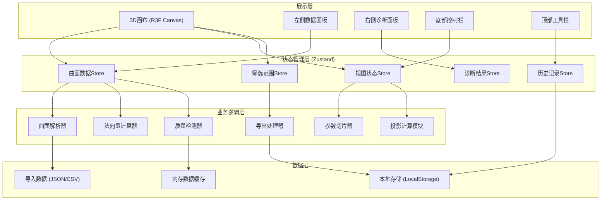
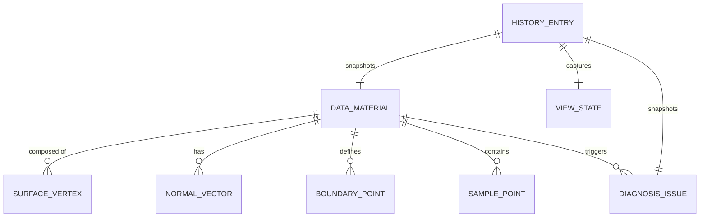
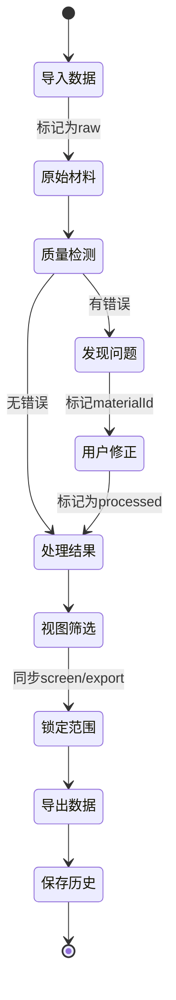

## 1. 架构设计



## 2. 技术描述

- **前端**：React@18 + TypeScript + Vite
- **3D渲染**：three@0.160 + @react-three/fiber@8 + @react-three/drei@9 + @react-three/postprocessing@2
- **状态管理**：zustand@4
- **样式**：tailwindcss@3
- **图标**：lucide-react@0.294
- **数学计算**：mathjs@12
- **后端**：None（纯前端应用）
- **初始化工具**：vite-init

## 3. 目录结构

```
src/
├── components/
│   ├── three/
│   │   ├── SurfaceMesh.tsx        # 曲面网格渲染
│   │   ├── NormalVectors.tsx      # 法向量可视化
│   │   ├── ProjectionPlane.tsx    # 投影区域
│   │   ├── ParameterSlice.tsx     # 参数切片
│   │   ├── SamplePoints.tsx       # 采样点渲染
│   │   ├── BoundaryCurve.tsx      # 边界曲线
│   │   └── Scene.tsx              # 3D场景包装
│   ├── panels/
│   │   ├── DataSourcePanel.tsx    # 数据来源面板
│   │   ├── DiagnosisPanel.tsx     # 诊断面板
│   │   ├── ControlBar.tsx         # 底部控制栏
│   │   ├── Toolbar.tsx            # 顶部工具栏
│   │   ├── ExportPanel.tsx        # 导出面板
│   │   └── ReviewPanel.tsx        # 复盘面板
│   └── ui/
│       ├── Slider.tsx             # 自定义滑块
│       ├── Toggle.tsx             # 开关组件
│       └── MaterialCard.tsx       # 材料卡片
├── stores/
│   ├── useSurfaceStore.ts         # 曲面数据
│   ├── useViewStore.ts            # 视图状态
│   ├── useDiagnosisStore.ts       # 诊断结果
│   ├── useHistoryStore.ts         # 历史记录
│   └── useFilterStore.ts          # 筛选范围
├── hooks/
│   ├── useSurfaceParser.ts        # 曲面解析
│   ├── useNormalCalculator.ts     # 法向量计算
│   ├── useQualityCheck.ts         # 质量检测
│   └── useExport.ts               # 导出逻辑
├── utils/
│   ├── math/
│   │   ├── surface.ts             # 曲面数学工具
│   │   ├── normal.ts              # 法向量计算
│   │   └── geometry.ts            # 几何工具
│   ├── parser/
│   │   ├── jsonParser.ts          # JSON解析
│   │   └── csvParser.ts           # CSV解析
│   └── export/
│       ├── exporter.ts            # 导出处理器
│       └── viewSync.ts            # 视图范围同步
├── types/
│   ├── surface.ts                 # 曲面类型定义
│   ├── diagnosis.ts               # 诊断类型
│   └── history.ts                 # 历史记录类型
├── data/
│   └── demoData.ts                # 演示数据
├── App.tsx
├── main.tsx
└── index.css
```

## 4. 核心类型定义

```typescript
// types/surface.ts
export interface Point3D { x: number; y: number; z: number; }
export interface Vector3D { x: number; y: number; z: number; }
export interface UVPoint { u: number; v: number; }

export type MaterialType = 'surface' | 'boundary' | 'sample';
export type MaterialStatus = 'raw' | 'processed';
export type DataSource = 'imported' | 'generated' | 'edited';

export interface DataMaterial {
  id: string;
  name: string;
  type: MaterialType;
  status: MaterialStatus;
  source: DataSource;
  importedAt: number;
  importedBy?: string;
  equation?: string;
  points?: Point3D[];
  uvRange?: { u: [number, number]; v: [number, number] };
  sampleDensity?: number;
  metadata: Record<string, any>;
}

export interface SurfaceData {
  materials: DataMaterial[];
  vertices: Point3D[];
  normals: Vector3D[];
  uvs: UVPoint[];
  indices: number[];
  boundaryPoints?: Point3D[];
  samplePoints?: Point3D[];
}

// types/diagnosis.ts
export type IssueType = 'normal_reversed' | 'boundary_gap' | 'sample_sparse';
export type Severity = 'warning' | 'error' | 'info';

export interface IssueLocation {
  materialId: string;
  position?: Point3D;
  uvRange?: UVPoint[];
  parameterRange?: [number, number];
  region?: string;
}

export interface DiagnosisIssue {
  id: string;
  type: IssueType;
  severity: Severity;
  message: string;
  location: IssueLocation;
  suggestion: string;
  nextStep: string;
  detectedAt: number;
  resolved?: boolean;
  evidence: {
    before?: any;
    after?: any;
    parameters: Record<string, any>;
  };
}

export interface DiagnosisResult {
  issues: DiagnosisIssue[];
  summary: {
    totalIssues: number;
    byType: Record<IssueType, number>;
    byMaterial: Record<string, number>;
  };
}

// types/history.ts
export interface HistoryEntry {
  id: string;
  timestamp: number;
  action: string;
  description: string;
  parameters: Record<string, any>;
  viewState: {
    cameraPosition: Point3D;
    cameraTarget: Point3D;
    filterRange: any;
  };
  materialsSnapshot: DataMaterial[];
  issuesSnapshot: DiagnosisIssue[];
  note?: string;
}
```

## 5. 数据模型

### 5.1 数据模型定义



### 5.2 状态流转


