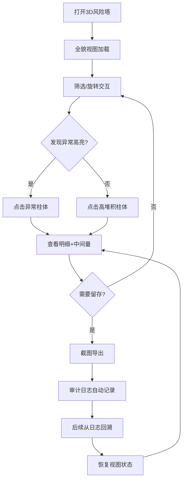

## 1. 产品概述

期权敞口风险塔——面向衍生品风控团队的三维可视化工具，在3D空间中展示客户组合的Delta、Gamma、Vega敞口堆积情况，帮助风控人员快速识别集中度风险与异常头寸，支持旋转交互、到期筛选、异常高亮、点击查看明细、截图导出及审计追踪。

- 目标用户：衍生品风控分析师、交易台风险经理
- 核心价值：将分散的希腊值敞口数据聚合为直观3D塔状视图，缩短风险定位时间；保留关键中间量与操作证据，确保交接复盘可追溯

## 2. 核心功能

### 2.1 用户角色

| 角色 | 使用方式 | 核心权限 |
|------|----------|----------|
| 风控分析师 | 直接使用 | 浏览3D视图、筛选、查看明细、截图、审计日志 |
| 风险经理 | 直接使用 | 同上，可查看审计追踪与历史快照 |

### 2.2 功能模块

1. **3D风险塔主页**：三维敞口柱体可视化、相机旋转缩放、到期桶分层、异常高亮
2. **筛选控制面板**：到期桶筛选、希腊值维度切换、阈值滑块
3. **明细侧边栏**：点击柱体展示头寸明细、中间量计算过程
4. **截图与审计模块**：一键截图导出、操作日志、中间量快照

### 2.3 页面详情

| 页面名称 | 模块名称 | 功能描述 |
|----------|----------|----------|
| 3D风险塔主页 | 三维场景 | Three.js渲染客户敞口柱体，X轴=客户账户，Y轴=希腊值大小，Z轴=到期桶；支持OrbitControls旋转缩放 |
| 3D风险塔主页 | 到期桶分层 | 按到期月份分层显示，不同到期桶用不同颜色区分 |
| 3D风险塔主页 | 异常高亮 | 到期桶错位（头寸到期日与桶归属不匹配）用红色脉冲标记；希腊值符号反转（Delta与标的方向相反）用黄色边框标记 |
| 筛选控制面板 | 到期桶筛选 | 复选框选择显示哪些到期桶 |
| 筛选控制面板 | 希腊值维度 | 切换Delta/Gamma/Vega视图，或三者叠加 |
| 筛选控制面板 | 阈值滑块 | 设置敞口阈值，低于阈值的柱体半透明 |
| 明细侧边栏 | 头寸明细 | 展示选中柱体对应的期权头寸列表（标的、行权价、方向、数量、到期日） |
| 明细侧边栏 | 中间量面板 | 展示该柱体聚合过程中的关键中间量：原始Delta求和、符号检查结果、到期桶归属判定依据 |
| 截图与审计模块 | 截图导出 | 将当前3D视图+筛选状态导出为PNG图片 |
| 截图与审计模块 | 操作日志 | 记录每次筛选、点击、阈值变更操作及当时的筛选上下文 |
| 截图与审计模块 | 快照恢复 | 从审计日志条目回溯到当时的3D视图状态（筛选条件、高亮、选中对象） |

## 3. 核心流程

**主流程**：风控分析师打开页面 → 看到3D风险塔全貌 → 通过筛选面板聚焦特定到期桶/希腊值 → 旋转观察堆积高度 → 点击异常高亮柱体 → 查看明细与中间量 → 截图带走 → 审计日志记录

**异常发现流程**：分析师注意到红色脉冲/黄色边框 → 点击查看明细 → 确认到期桶错位或符号反转原因 → 截图保存证据 → 审计日志保留完整上下文

**交接复盘流程**：新分析师打开审计日志 → 点击历史条目 → 系统恢复当时3D视图状态（筛选+高亮+选中） → 从摘要追溯至明细

## 4. 用户界面设计

### 4.1 设计风格

- **主色调**：深色金融终端风格——背景 #0a0e17（深海蓝黑），柱体渐变（#00d4aa青绿 → #ff6b35橙红 表示低→高风险），异常高亮红色 #ff3355 脉冲，符号反转黄色 #ffd700 边框
- **辅助色**：到期桶色带——12个月份用 12 色饱和度渐变
- **字体**：JetBrains Mono（数据展示）+ Noto Sans SC（中文UI）
- **布局**：左侧筛选面板（260px）+ 中央3D画布（flex-1）+ 右侧明细侧边栏（340px，可折叠）
- **图标**：Lucide图标库
- **风格关键词**：暗色终端、数据密集、精确工具感、风险可视化

### 4.2 页面设计概述

| 页面名称 | 模块名称 | UI元素 |
|----------|----------|--------|
| 3D风险塔主页 | 三维场景 | 深色背景、网格地面、柱体渐变着色、环境光+方向光、后期泛光 |
| 3D风险塔主页 | 柱体悬浮提示 | 鼠标悬停显示客户名+希腊值数值的浮动标签 |
| 筛选控制面板 | 到期桶筛选 | 复选框组，每项带色块标识 |
| 筛选控制面板 | 维度切换 | 三个切换按钮 Delta/Gamma/Vega |
| 筛选控制面板 | 阈值滑块 | 范围滑块+数值输入框 |
| 明细侧边栏 | 头寸列表 | 表格形式，行可点击展开 |
| 明细侧边栏 | 中间量面板 | 折叠卡片，展示计算步骤与中间值 |
| 截图与审计模块 | 截图按钮 | 顶部工具栏相机图标按钮 |
| 截图与审计模块 | 审计时间线 | 底部抽屉式时间线，点击条目恢复状态 |

### 4.3 响应式策略

- 桌面优先（1920×1080为基准）
- 1280px以下：侧边栏可折叠为覆盖层
- 平板竖屏：筛选面板收为顶部工具栏，明细面板底部弹出

### 4.4 3D场景指导

- **环境/HDRI**：无HDRI，纯色深蓝背景 + 网格地面营造终端感
- **灯光**：环境光 0.3 强度 + 前方方向光 0.8 + 侧方补光 0.3
- **相机**：透视相机，初始俯视45°，距离适中；OrbitControls 限制极角防止翻转
- **构图**：X轴排列客户柱体，Z轴排列到期桶层，Y轴为敞口高度；中央为视觉焦点
- **交互**：OrbitControls 旋转/缩放；Raycaster 点击拾取；Hover 高亮
- **后期处理**：UnrealBloomPass 对异常柱体添加泛光效果
- **性能**：柱体使用 InstancedMesh 优化；FRustumCulling 启用
