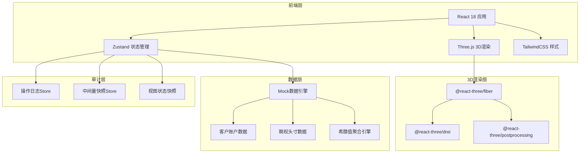
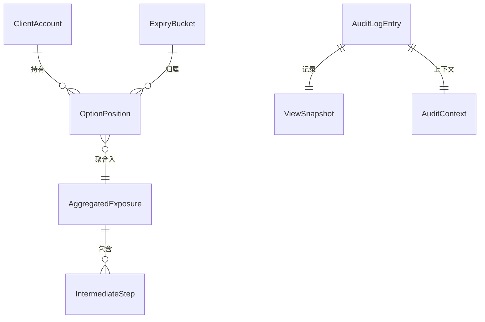

## 1. 架构设计



## 2. 技术说明

- **前端**：React@18 + TailwindCSS@3 + Vite + TypeScript
- **3D渲染**：three + @react-three/fiber + @react-three/drei + @react-three/postprocessing
- **状态管理**：Zustand（多Store拆分）
- **初始化工具**：vite-init
- **后端**：无（纯前端，Mock数据）
- **图标**：lucide-react

## 3. 路由定义

| 路由 | 用途 |
|------|------|
| / | 3D风险塔主页（唯一页面，所有功能集成于此） |

## 4. API定义

无后端API，全部使用前端Mock数据。

### 4.1 数据接口定义

```typescript
interface ClientAccount {
  id: string
  name: string
  code: string
}

interface OptionPosition {
  id: string
  clientId: string
  underlying: string
  strike: number
  direction: "CALL" | "PUT"
  quantity: number
  expiryDate: string
  expiryBucket: string
  delta: number
  gamma: number
  vega: number
  notional: number
  deltaSignReversal: boolean
  bucketMismatch: boolean
}

interface ExpiryBucket {
  id: string
  label: string
  month: string
  color: string
}

interface AggregatedExposure {
  clientId: string
  clientName: string
  bucketId: string
  bucketLabel: string
  delta: number
  gamma: number
  vega: number
  positions: OptionPosition[]
  intermediateSteps: IntermediateStep[]
  hasAnomaly: boolean
  anomalyType: ("BUCKET_MISMATCH" | "SIGN_REVERSAL")[]
}

interface IntermediateStep {
  step: string
  description: string
  inputValues: Record<string, number>
  outputValue: number
  threshold?: number
  reasoning?: string
}

interface AuditLogEntry {
  id: string
  timestamp: number
  action: string
  context: AuditContext
  snapshot: ViewSnapshot
}

interface AuditContext {
  activeGreeks: ("delta" | "gamma" | "vega")[]
  activeBuckets: string[]
  thresholdValue: number
  selectedClientId: string | null
}

interface ViewSnapshot {
  cameraPosition: [number, number, number]
  cameraTarget: [number, number, number]
  filterState: AuditContext
  highlightedIds: string[]
}
```

## 5. 数据模型

### 5.1 数据模型定义



### 5.2 Mock数据规格

- 客户账户：8-12个
- 到期桶：6个（1M, 2M, 3M, 6M, 9M, 12M）
- 每客户每到期桶：2-5个头寸
- 异常注入：2-3个到期桶错位，2-3个符号反转
- 中间量：每个聚合结果保留3-5个计算步骤

## 6. 项目结构

```
src/
├── components/
│   ├── RiskTower3D.tsx          # 3D场景主组件
│   ├── TowerColumn.tsx          # 单个柱体组件
│   ├── TowerGround.tsx          # 地面网格
│   ├── TowerLabels.tsx          # 轴标签
│   ├── AnomalyPulse.tsx         # 异常脉冲动画
│   ├── FilterPanel.tsx          # 筛选控制面板
│   ├── DetailSidebar.tsx        # 明细侧边栏
│   ├── PositionTable.tsx        # 头寸列表
│   ├── IntermediatePanel.tsx    # 中间量面板
│   ├── ScreenshotButton.tsx     # 截图按钮
│   ├── AuditTimeline.tsx        # 审计时间线
│   └── Toolbar.tsx              # 顶部工具栏
├── stores/
│   ├── useFilterStore.ts        # 筛选状态
│   ├── useSelectionStore.ts     # 选中状态
│   ├── useAuditStore.ts         # 审计日志
│   └── useDataStore.ts          # 数据与聚合
├── data/
│   └── mockData.ts              # Mock数据生成
├── utils/
│   ├── aggregator.ts            # 希腊值聚合引擎
│   ├── anomalyDetector.ts       # 异常检测
│   └── screenshot.ts            # 截图工具
├── pages/
│   └── RiskTower.tsx            # 主页面
├── App.tsx
└── main.tsx
```
