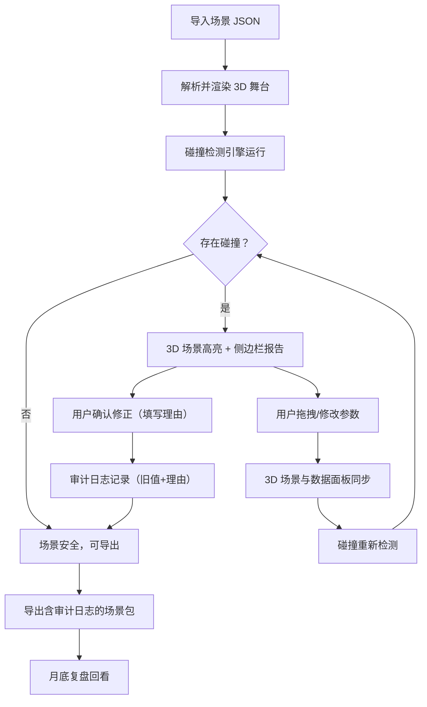

## 1. 产品概述

舞台灯光碰撞预演系统——面向剧场技术组的 3D 实时布光预演工具。在正式布光前，将灯杆、吊点、灯具和演员动线导入统一 3D 舞台空间，自动检测空间碰撞与超载风险，所有参数变更实时同步 3D 场景与侧边数据面板，人工修正全程留痕以支撑月底复盘。

- 目标用户：剧场技术组灯光设计师、舞台监督、机械吊挂工程师
- 核心价值：提前发现灯具穿帮、吊点超载、演员路线碰撞，减少现场返工，保证演出安全

## 2. 核心功能

### 2.1 用户角色

| 角色 | 核心权限 |
|------|----------|
| 灯光设计师 | 创建/编辑灯位、拖拽灯具、查看碰撞结果 |
| 舞台监督 | 查看碰撞报告、修正参数、审批变更、复盘回看 |
| 机械吊挂工程师 | 配置吊点承重、查看超载告警、修正吊点参数 |

### 2.2 功能模块

1. **3D 舞台预演页**：3D 舞台场景、灯杆/吊点/灯具渲染、演员动线、碰撞高亮、灯位拖拽
2. **数据面板侧边栏**：元素属性编辑、碰撞检测报告、审计日志、溯源链接
3. **复盘回看页**：历史修正记录浏览、参数对比、修正理由回看

### 2.3 页面详情

| 页面名称 | 模块名称 | 功能描述 |
|----------|----------|----------|
| 3D 舞台预演页 | 3D 舞台视口 | 渲染舞台台面、灯杆、吊点、灯具、演员动线；支持轨道控制旋转/缩放；碰撞区域红框高亮 |
| 3D 舞台预演页 | 灯位拖拽交互 | 鼠标拖拽灯具/灯杆在 3D 空间移动，实时更新坐标，侧边栏数据同步 |
| 3D 舞台预演页 | 侧边数据面板 | 显示选中元素属性（坐标、型号、承重等）；碰撞检测报告列表；点击溯源跳转来源 |
| 3D 舞台预演页 | 审计日志面板 | 修正操作记录：旧值 → 新值、修正理由、操作时间、操作人 |
| 3D 舞台预演页 | 碰撞检测引擎 | 自动检测灯具穿帮（灯具遮挡观众视线）、吊点超载（灯具总重超限）、演员路线碰撞（动线与灯杆/吊点交叉） |
| 3D 舞台预演页 | 导入导出 | 导入 JSON 场景文件；导出含审计日志的完整场景包；溯源链接保留来源标识 |
| 复盘回看页 | 修正时间线 | 按时间线展示所有人工修正记录，含旧值、新值、理由 |
| 复盘回看页 | 参数对比视图 | 修正前后参数并排对比 |
| 复盘回看页 | 修正理由回看 | 展开修正详情，查看修正理由原文 |

## 3. 核心流程

用户导入场景文件 → 系统解析并渲染 3D 舞台 → 碰撞检测引擎自动运行 → 碰撞结果在 3D 场景中高亮并列入侧边栏报告 → 用户拖拽灯位或修改参数 → 3D 场景与数据面板实时同步 → 碰撞重新检测 → 用户确认修正（填写理由） → 审计日志记录 → 月底复盘回看修正历史

## 4. 用户界面设计

### 4.1 设计风格

- 主色调：深炭黑（#1A1A2E）+ 剧场暗红（#C41E3A）点缀
- 辅助色：钢灰（#4A4A5A）用于面板背景，琥珀黄（#FFB800）用于碰撞警告
- 字体：JetBrains Mono（数据/代码区域）+ Noto Sans SC（中文界面）
- 布局：左侧 3D 视口占主区域（~70%），右侧数据面板侧边栏（~30%）
- 图标风格：线性图标（lucide-react）
- 按钮风格：圆角矩形，悬停时微光效果

### 4.2 页面设计概览

| 页面名称 | 模块名称 | UI 元素 |
|----------|----------|---------|
| 3D 舞台预演页 | 3D 视口 | 深色背景，网格地面，灯具为锥形+光束，碰撞区域红色半透明高亮，吊点为圆环标记，演员动线为虚线曲线 |
| 3D 舞台预演页 | 侧边数据面板 | 钢灰背景卡片，属性字段左对齐，碰撞告警琥珀色标签，溯源链接蓝色下划线 |
| 3D 舞台预演页 | 审计日志 | 时间线布局，旧值删除线+红色，新值绿色，理由斜体灰色 |
| 复盘回看页 | 修正时间线 | 垂直时间线，节点为日期，展开显示修正详情 |
| 复盘回看页 | 参数对比 | 双列对比：左侧旧值红色背景，右侧新值绿色背景 |

### 4.3 响应式

桌面优先设计，最小宽度 1280px。3D 视口自适应缩放，侧边栏可折叠。

### 4.4 3D 场景指引

- 环境：暗场剧院环境，低环境光 + 聚光灯效果
- 灯光设置：环境光微弱（模拟剧场暗场），灯具自带 SpotLight 投射
- 相机：透视相机，默认俯视 45°，轨道控制器自由旋转
- 构图：舞台居中，灯杆在上方横跨，吊点悬挂
- 交互：点击元素高亮选中，拖拽移动灯具，右键旋转视角
- 后处理：灯具光束使用体积光效果（可选）
- 性能预算：灯具数量上限 50，保持 60fps

## 5. 样例冲突数据

系统预置以下冲突样例，确认工具能处理非理想输入：

1. **灯具穿帮**：4 号灯杆 2 号灯具的光束被前排名灯杆遮挡，观众区出现阴影，碰撞类型为"视线遮挡"
2. **吊点超载**：3 号吊点挂载 3 台灯具总重 85kg，吊点额定承重 60kg，超载率 141.7%
3. **演员路线碰撞**：第二场演员从舞台左后方走向右前方动线与 2 号灯杆吊挂区域空间交叉，净空高度不足 2.1m
