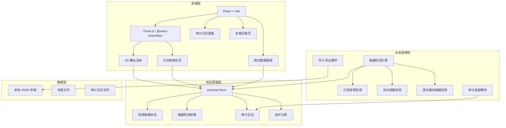

## 1. 架构设计



## 2. 技术说明

- 前端框架：React 18 + TypeScript + Vite
- 3D 渲染：Three.js + @react-three/fiber + @react-three/drei
- 样式：Tailwind CSS 3
- 状态管理：Zustand
- 路由：react-router-dom
- 数据持久化：本地 JSON 文件（导入/导出）
- 无后端服务，纯前端应用

## 3. 路由定义

| 路由 | 用途 |
|------|------|
| `/` | 3D 舞台预演主页面（3D 视口 + 侧边栏） |
| `/review` | 复盘回看页面（修正时间线 + 参数对比） |

## 4. 数据模型

### 4.1 核心数据结构

```typescript
interface StageScene {
  id: string
  name: string
  version: number
  createdAt: string
  updatedAt: string
  source: string
  stage: StagePlatform
  lightBars: LightBar[]
  hangingPoints: HangingPoint[]
  fixtures: Fixture[]
  actorRoutes: ActorRoute[]
  collisions: Collision[]
  auditLogs: AuditLog[]
}

interface StagePlatform {
  width: number
  depth: number
  height: number
  gridUnit: number
}

interface LightBar {
  id: string
  name: string
  position: Vector3
  length: number
  sourceRef: string
}

interface HangingPoint {
  id: string
  name: string
  position: Vector3
  loadCapacity: number
  currentLoad: number
  sourceRef: string
}

interface Fixture {
  id: string
  name: string
  type: FixtureType
  position: Vector3
  targetPosition: Vector3
  beamAngle: number
  weight: number
  attachedTo: string
  sourceRef: string
}

interface ActorRoute {
  id: string
  name: string
  scene: string
  waypoints: Vector3[]
  actorHeight: number
  sourceRef: string
}

interface Collision {
  id: string
  type: "view_obstruction" | "overload" | "route_collision"
  severity: "warning" | "critical"
  involvedElements: string[]
  description: string
  position: Vector3
  resolved: boolean
  resolution?: string
}

interface AuditLog {
  id: string
  timestamp: string
  operator: string
  elementType: string
  elementId: string
  field: string
  oldValue: unknown
  newValue: unknown
  reason: string
}

interface Vector3 {
  x: number
  y: number
  z: number
}

type FixtureType = "spotlight" | "fresnel" | "led_par" | "moving_head"
```

### 4.2 碰撞检测规则

| 碰撞类型 | 检测算法 | 阈值 |
|----------|----------|------|
| 灯具穿帮 | 灯具光束锥体与灯杆包围盒相交检测 | 光束路径上任意遮挡物 |
| 吊点超载 | 吊点挂载灯具总重 / 额定承重 | 超载率 > 100% 为 critical，> 80% 为 warning |
| 演员路线碰撞 | 演员动线胶囊体与灯杆/吊点包围盒相交检测 | 净空高度 < 2.2m 为 critical，< 2.5m 为 warning |

### 4.3 溯源链接

每个场景元素包含 `sourceRef` 字段，格式为 `source://fileId/elementPath`，可点击跳回来源文件中的对应元素。

### 4.4 审计追踪

人工修正时必须填写修正理由，系统自动记录：
- 旧值（完整保留）
- 新值
- 修正理由（操作人填写）
- 时间戳
- 操作人

## 5. 项目结构

```
src/
├── components/
│   ├── stage/               # 3D 舞台相关组件
│   │   ├── StageScene.tsx    # 主3D场景容器
│   │   ├── StagePlatform.tsx # 舞台台面
│   │   ├── LightBar.tsx      # 灯杆
│   │   ├── HangingPoint.tsx  # 吊点
│   │   ├── Fixture.tsx       # 灯具
│   │   ├── ActorRoute.tsx    # 演员动线
│   │   └── CollisionHighlight.tsx # 碰撞高亮
│   ├── panel/               # 侧边栏面板组件
│   │   ├── SidePanel.tsx     # 侧边栏容器
│   │   ├── PropertyEditor.tsx # 属性编辑器
│   │   ├── CollisionReport.tsx # 碰撞报告
│   │   ├── AuditLogPanel.tsx  # 审计日志
│   │   └── SourceLink.tsx    # 溯源链接
│   ├── review/              # 复盘回看组件
│   │   ├── ReviewTimeline.tsx # 修正时间线
│   │   ├── ParamCompare.tsx  # 参数对比
│   │   └── ReasonViewer.tsx  # 理由回看
│   └── ui/                  # 通用UI组件
├── hooks/
│   ├── useCollisionDetection.ts # 碰撞检测hook
│   └── useDragFixture.ts    # 灯位拖拽hook
├── store/
│   └── useStore.ts          # Zustand全局状态
├── utils/
│   ├── collisionEngine.ts   # 碰撞检测引擎
│   ├── importExport.ts      # 导入导出
│   └── sampleData.ts        # 样例冲突数据
├── pages/
│   ├── StagePage.tsx        # 舞台预演主页面
│   └── ReviewPage.tsx       # 复盘回看页面
├── App.tsx
└── main.tsx
```
