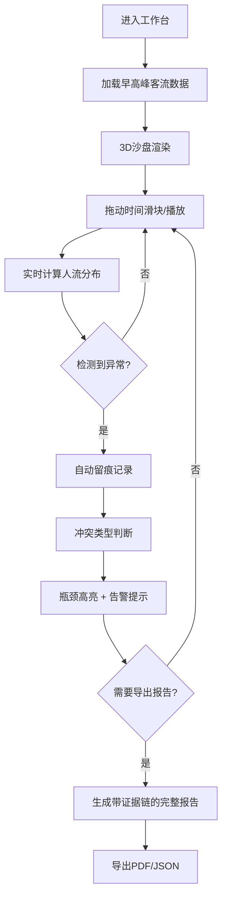
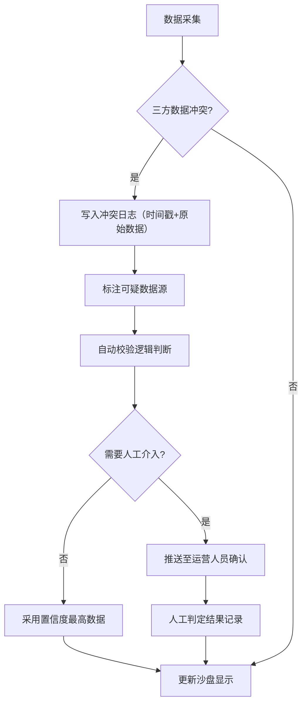

## 1. 产品概述

地铁换乘人流沙盘是一个面向站务中心的3D交互式工作台，用于可视化早高峰时段换乘站的人流分布、扶梯运行、闸机通行与站台容量之间的动态影响。通过三维沙盘实时模拟与冲突检测，帮助运营人员快速识别瓶颈、预判风险并留存决策依据。

- 核心解决问题：早高峰换乘站多因素（扶梯/闸机/站台）耦合复杂，传统监控难以直观呈现因果关联与冲突
- 目标用户：站务中心运营人员、调度管理人员、应急决策人员
- 产品价值：将抽象数据转化为可视沙盘，实现"见即所得"的客流决策支持

## 2. 核心特征

### 2.1 用户角色

| 角色 | 注册方式 | 核心权限 |
|------|----------|----------|
| 站务运营人员 | 内部账号登录 | 3D沙盘浏览、时间轴控制、瓶颈查看、报告导出 |
| 调度管理员 | 管理员账号 | 以上全部 + 参数配置 + 历史记录回溯 |

### 2.2 功能模块

1. **3D人流沙盘主界面**：站厅全景模型、实时人流粒子、扶梯/闸机/站台状态可视化
2. **时间控制模块**：时间滑块、播放/暂停、早高峰时段预设、速度调节
3. **瓶颈检测与高亮**：自动识别拥堵区域、分级高亮显示、冲突点标注
4. **冲突检测与留痕**：站厅/闸机/扶梯数据冲突检测、先留痕再判断机制、处理记录留存
5. **异常报告模块**：客流回流告警、扶梯方向错误、容量超限、一键导出带时间戳的完整报告
6. **简洁功能菜单**：最小化菜单设计，核心功能一键直达

### 2.3 页面详情

| 页面名称 | 模块名称 | 功能描述 |
|----------|----------|----------|
| 主工作台 | 3D沙盘视图 | 可交互3D地铁站厅模型，支持旋转/缩放/平移，人流粒子动态流动，设备状态实时更新 |
| 主工作台 | 时间控制栏 | 底部横向滑块，覆盖早高峰时段（7:00-9:30），支持精确到分钟的时间点定位 |
| 主工作台 | 瓶颈指示面板 | 右侧悬浮面板，实时显示当前瓶颈点列表，点击可跳转至沙盘对应位置 |
| 主工作台 | 冲突留痕面板 | 左下角小面板，显示数据冲突记录，包含冲突类型、涉及设备、处理状态 |
| 主工作台 | 功能菜单 | 左上角精简菜单：[沙盘][时间][报告][设置]，展开后每项不超过3个选项 |
| 报告预览 | 异常报告页 | 弹出式报告预览，包含异常类型、发生时间、影响范围、建议措施、导出按钮 |
| 历史回溯 | 复盘模式 | 支持加载历史记录，复现当时的3D场景与决策痕迹，标注"当时为何如此处理" |

## 3. 核心流程

### 3.1 主操作流程

运营人员进入工作台后，系统默认加载当日早高峰模拟数据。通过时间滑块查看不同时段的客流状态，系统自动检测并高亮瓶颈区域。当出现数据冲突或异常时，先自动记录留痕，再由系统或人工判断处理。发现严重异常时，可一键导出包含完整证据链的分析报告。

### 3.2 冲突处理流程

站厅主信息、闸机数据、扶梯数据三者不一致时，触发"先留痕再判断"机制：

## 4. 用户界面设计

### 4.1 设计风格

**设计方向：科技感暗色调工业风**，契合站务中心专业工作场景

- **主色调**：深空蓝 `#0A1628` 作为背景，营造沉浸感
- **辅助色**：
  - 正常状态：科技青 `#00D4FF`
  - 预警状态：警示黄 `#FFB800`
  - 严重告警：危险红 `#FF3B30`
  - 冲突留痕：标记紫 `#AF52DE`
- **字体**：
  - 标题：`JetBrains Mono` 等宽字体，体现专业精密感
  - 正文：`Noto Sans SC` 确保中文可读性
- **布局风格**：
  - 全屏沉浸式3D场景，UI控件半透明悬浮
  - 核心控件沿边缘排布，不遮挡沙盘主体
  - 面板采用毛玻璃效果（backdrop-filter）
- **交互风格**：
  - 滑块与按钮带细微发光效果
  - 瓶颈高亮采用脉冲闪烁动画
  - 冲突点使用紫色标记+持续抖动提示

### 4.2 页面设计概览

| 页面名称 | 模块名称 | UI元素 |
|----------|----------|--------|
| 主工作台 | 3D沙盘视图 | 暗蓝背景、站厅模型深灰、人流粒子青色发光、扶梯绿色箭头、闸机动态指示灯 |
| 主工作台 | 时间控制栏 | 底部横向滑块、刻度标记（7:00/8:00/9:00/9:30）、播放按钮组、当前时间显示 |
| 主工作台 | 瓶颈指示面板 | 右侧悬浮、按严重程度排序、每项含位置图标/类型标签/拥挤度进度条、点击联动沙盘 |
| 主工作台 | 冲突留痕面板 | 左下角、紫色标记图标、冲突时间、涉及设备列表、"查看详情"按钮 |
| 主工作台 | 功能菜单 | 左上角、横向4个图标按钮、悬停展开文字标签、点击弹出下拉菜单 |
| 报告预览 | 异常报告页 | 居中弹出、标题带时间戳、证据链时间线、数据对比表格、导出按钮组 |

### 4.3 响应式设计

- 桌面端优先设计（1920×1080及以上），适配站务中心大屏显示器
- 支持1280×720最低分辨率，保证控制面板可操作
- 面板支持拖拽调整位置，适应不同操作习惯
- 触控设备支持双指缩放旋转沙盘

### 4.4 3D场景设计

**环境与氛围**：
- 采用地铁站厅写实风格，人造光源模拟，冷白色荧光灯+应急出口绿色指示
- 轻微体积光效果增强空间感，避免过度渲染影响性能
- 后期处理：Bloom发光（人流/告警）、轻微色调映射、抗锯齿

**光照设置**：
- 主光源：顶部矩形面光阵列模拟站厅顶灯
- 辅助光：扶梯底部冷光、闸机指示灯、出口绿色应急灯
- 环境光：低强度半球光，避免纯黑阴影

**相机设置**：
- 默认视角：45°俯视斜角，俯瞰整个站厅
- 支持：轨道控制器（OrbitControls）、限制最小/最大缩放距离、限制俯仰角避免穿模
- 快速视角切换按钮：[全局][站厅][站台][扶梯群][闸机群]

**交互与动画**：
- 人流粒子：使用InstancedMesh实现高性能粒子系统，沿路径流动，密度实时变化
- 扶梯：滚动纹理+方向箭头，速度可调节，方向错误时显示红色
- 闸机：开关门动画，通行计数显示，超限时闪烁红色
- 瓶颈高亮：选中区域边缘发光+呼吸闪烁效果

**性能预算**：
- 三角面总数控制在10万以内
- 人流粒子最多2000个（使用实例化渲染）
- 目标帧率：稳定60fps
- 材质使用PBR简化版，避免过多纹理采样

## 5. 异常检测与报告

### 5.1 异常类型定义

| 异常类型 | 触发条件 | 严重等级 | 高亮颜色 |
|----------|----------|----------|----------|
| 客流回流 | 同一检测点5分钟内双向客流差>30% | 高 | 危险红 `#FF3B30` |
| 扶梯方向错 | 运行方向与预设高峰方向相反 | 高 | 危险红 `#FF3B30` |
| 容量超限 | 区域人数>设计容量×120%持续3分钟 | 高 | 危险红 `#FF3B30` |
| 容量预警 | 区域人数>设计容量×90% | 中 | 警示黄 `#FFB800` |
| 数据冲突 | 站厅/闸机/扶梯数据不一致 | 中 | 标记紫 `#AF52DE` |
| 扶梯停运 | 扶梯停止运行且无检修记录 | 中 | 警示黄 `#FFB800` |

### 5.2 报告内容规范

导出报告必须包含：
1. 报告生成时间戳与覆盖时段
2. 异常事件时间线（按发生顺序）
3. 每个异常的详细信息：类型、位置、持续时间、峰值数据
4. 数据冲突留痕记录（含原始三方数据对比）
5. 瓶颈区域热力图快照
6. 系统自动判定依据与人工处理记录
7. 运营建议措施
