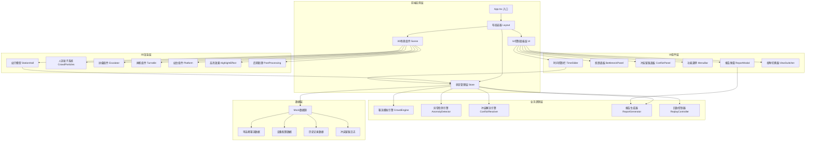
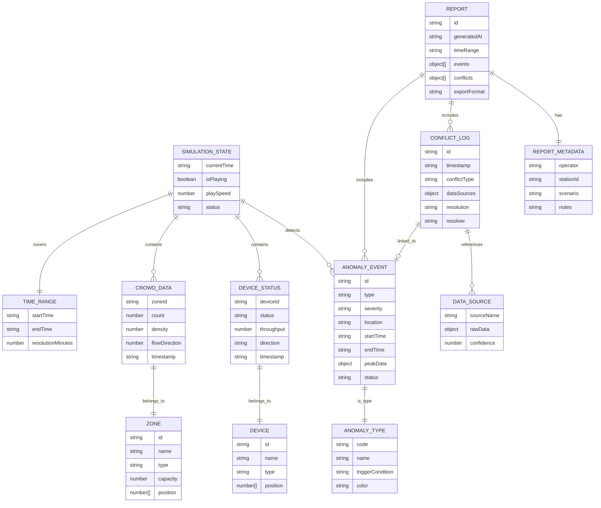

## 1. 架构设计



## 2. 技术栈说明

### 2.1 核心技术选型

| 层级 | 技术选型 | 版本 | 用途说明 |
|------|----------|------|----------|
| 前端框架 | React | 18.x | UI组件化开发 |
| 开发语言 | TypeScript | 5.x | 类型安全保证 |
| 构建工具 | Vite | 5.x | 快速开发构建 |
| 样式方案 | TailwindCSS | 3.x | 原子化CSS，快速UI开发 |
| 3D引擎 | three | 0.160.x | WebGL 3D渲染核心 |
| 3D React封装 | @react-three/fiber | 8.x | Three.js的React声明式封装 |
| 3D工具库 | @react-three/drei | 9.x | 常用3D组件集合（控制器、环境等） |
| 3D后期处理 | @react-three/postprocessing | 2.x | Bloom发光、抗锯齿等后期效果 |
| 状态管理 | zustand | 4.x | 轻量级状态管理，跨组件共享状态 |
| 图标库 | lucide-react | 0.294.x | 简洁一致的图标系统 |
| 数据可视化 | @ant-design/plots | 2.x | 报告中的图表展示（可选） |
| 工具函数 | date-fns | 3.x | 时间格式化与计算 |

### 2.2 技术决策理由

1. **@react-three/fiber + drei**：声明式3D开发，与React生态无缝集成，drei提供OrbitControls、Environment等开箱即用组件
2. **zustand**：轻量无Provider，性能优异，适合3D场景高频状态更新
3. **InstancedMesh**：人流粒子采用实例化网格渲染，2000个粒子仅1个draw call
4. **无后端设计**：全部采用Mock数据，减少外部依赖，保证纯前端可运行
5. **TailwindCSS**：快速实现半透明悬浮面板、毛玻璃效果等UI样式

## 3. 目录结构

```
src/
├── components/              # React组件
│   ├── ui/                  # 通用UI组件
│   │   ├── TimeSlider.tsx   # 时间滑块
│   │   ├── MenuBar.tsx      # 功能菜单
│   │   ├── BottleneckPanel.tsx  # 瓶颈面板
│   │   ├── ConflictPanel.tsx    # 冲突留痕面板
│   │   ├── ReportModal.tsx      # 报告弹窗
│   │   └── ViewSwitcher.tsx     # 视角切换器
│   └── three/               # 3D场景组件
│       ├── Scene.tsx        # 主场景
│       ├── StationHall.tsx  # 站厅模型
│       ├── Escalator.tsx    # 扶梯组件
│       ├── Turnstile.tsx    # 闸机组件
│       ├── Platform.tsx     # 站台组件
│       ├── CrowdParticles.tsx   # 人流粒子系统
│       └── HighlightEffect.tsx  # 高亮效果
├── store/                   # 状态管理
│   ├── useSimulationStore.ts    # 模拟状态
│   ├── useUILayoutStore.ts      # UI布局状态
│   └── useReportStore.ts        # 报告状态
├── engine/                  # 业务引擎
│   ├── CrowdEngine.ts       # 客流模拟引擎
│   ├── AnomalyDetector.ts   # 异常检测引擎
│   └── ConflictResolver.ts  # 冲突解决引擎
├── data/                    # Mock数据
│   ├── passengerFlow.ts     # 客流数据
│   ├── stationConfig.ts     # 站点配置
│   └── mockHistory.ts       # 历史记录
├── types/                   # TypeScript类型定义
│   ├── simulation.ts        # 模拟相关类型
│   ├── devices.ts           # 设备类型
│   └── anomalies.ts         # 异常类型
├── utils/                   # 工具函数
│   ├── timeUtils.ts         # 时间工具
│   ├── reportGenerator.ts   # 报告生成
│   └── exportUtils.ts       # 导出工具
├── App.tsx                  # 应用入口
├── main.tsx                 # React挂载
└── index.css                # 全局样式
```

## 4. 核心数据模型

### 4.1 数据模型ER图



### 4.2 核心类型定义

```typescript
// types/simulation.ts
export interface SimulationState {
  currentTime: string;
  isPlaying: boolean;
  playSpeed: number;
  startTime: string;
  endTime: string;
}

export interface CrowdDataPoint {
  zoneId: string;
  count: number;
  density: number;
  flowIn: number;
  flowOut: number;
  timestamp: string;
}

export interface Zone {
  id: string;
  name: string;
  type: 'concourse' | 'platform' | 'escalator' | 'turnstile' | 'corridor';
  capacity: number;
  position: [number, number, number];
  size: [number, number, number];
}

// types/devices.ts
export interface Escalator {
  id: string;
  name: string;
  position: [number, number, number];
  direction: 'up' | 'down' | 'stopped';
  speed: number;
  expectedDirection?: 'up' | 'down';
}

export interface Turnstile {
  id: string;
  name: string;
  position: [number, number, number];
  status: 'open' | 'closed' | 'fault';
  throughput: number;
  queueLength: number;
}

// types/anomalies.ts
export type AnomalyType = 
  | 'reflow'           // 客流回流
  | 'wrong_direction'  // 扶梯方向错
  | 'over_capacity'    // 容量超限
  | 'capacity_warning' // 容量预警
  | 'data_conflict'    // 数据冲突
  | 'escalator_stop';  // 扶梯停运

export type Severity = 'high' | 'medium' | 'low';

export interface Anomaly {
  id: string;
  type: AnomalyType;
  severity: Severity;
  location: string;
  zoneId: string;
  startTime: string;
  endTime?: string;
  peakData: Record<string, number>;
  status: 'active' | 'resolved' | 'acknowledged';
  evidence: EvidenceItem[];
}

export interface ConflictLog {
  id: string;
  timestamp: string;
  conflictType: string;
  sources: {
    concourse?: object;
    turnstile?: object;
    escalator?: object;
  };
  confidenceScores: {
    concourse: number;
    turnstile: number;
    escalator: number;
  };
  resolution: 'pending' | 'auto_resolved' | 'manual_resolved';
  resolvedBy?: string;
  resolvedAt?: string;
  notes?: string;
}
```

## 5. 路由定义

本项目为单页应用，使用HashRouter实现简单路由（便于静态部署）：

| 路由路径 | 页面/功能 | 说明 |
|----------|----------|------|
| `/` | 主工作台 | 默认路由，3D沙盘+控制面板 |
| `/replay/:recordId` | 复盘模式 | 加载历史记录进行回溯查看 |
| `/report/:reportId` | 报告预览 | 直接预览指定ID的报告 |

## 6. 核心引擎设计

### 6.1 客流模拟引擎 (CrowdEngine)

```typescript
// engine/CrowdEngine.ts
/**
 * 客流模拟核心引擎
 * 基于时间戳计算各区域人流分布，考虑扶梯、闸机的通行能力限制
 */
export class CrowdEngine {
  // 计算指定时间点的全站点人流分布
  computeCrowdDistribution(time: string): Map<string, CrowdDataPoint>;
  
  // 计算区域间的人流转移
  computeFlowBetweenZones(
    fromZone: string, 
    toZone: string, 
    time: string
  ): number;
  
  // 考虑设备限制的修正计算
  applyDeviceConstraints(
    distribution: Map<string, CrowdDataPoint>,
    devices: DeviceStatus[],
    time: string
  ): Map<string, CrowdDataPoint>;
  
  // 检测回流
  detectReflow(
    zoneId: string,
    currentData: CrowdDataPoint,
    historicalData: CrowdDataPoint[]
  ): boolean;
}
```

### 6.2 异常检测引擎 (AnomalyDetector)

```typescript
// engine/AnomalyDetector.ts
/**
 * 异常检测引擎
 * 实时检测各类异常情况，触发告警并生成证据链
 */
export class AnomalyDetector {
  // 检测所有类型异常
  detectAll(
    crowdData: Map<string, CrowdDataPoint>,
    devices: DeviceStatus[],
    time: string,
    history: Anomaly[]
  ): Anomaly[];
  
  // 容量超限检测
  checkOverCapacity(zone: Zone, data: CrowdDataPoint): boolean;
  
  // 扶梯方向错误检测
  checkEscalatorDirection(
    escalator: Escalator, 
    peakHourConfig: PeakHourConfig
  ): boolean;
  
  // 数据冲突检测
  checkDataConflict(
    concourseData: object,
    turnstileData: object,
    escalatorData: object
  ): { hasConflict: boolean; confidence: object };
}
```

### 6.3 冲突解决引擎 (ConflictResolver)

```typescript
// engine/ConflictResolver.ts
/**
 * 冲突解决引擎
 * 实现"先留痕再判断"机制
 */
export class ConflictResolver {
  // 留痕记录冲突
  logConflict(
    type: string,
    sources: object,
    time: string
  ): ConflictLog;
  
  // 自动判断（基于置信度）
  autoResolve(conflict: ConflictLog): ConflictLog;
  
  // 人工判定记录
  manualResolve(
    conflictId: string,
    decision: string,
    operator: string,
    notes: string
  ): ConflictLog;
}
```

## 7. 状态管理设计

### 7.1 模拟状态 Store

```typescript
// store/useSimulationStore.ts
interface SimulationStore {
  // 时间控制
  currentTime: string;
  isPlaying: boolean;
  playSpeed: number;
  
  // 数据状态
  crowdData: Map<string, CrowdDataPoint>;
  deviceStatuses: DeviceStatus[];
  zones: Zone[];
  
  // 异常状态
  activeAnomalies: Anomaly[];
  conflictLogs: ConflictLog[];
  
  // 操作方法
  setTime: (time: string) => void;
  togglePlay: () => void;
  setPlaySpeed: (speed: number) => void;
  stepForward: (minutes: number) => void;
  
  // 冲突处理
  acknowledgeAnomaly: (id: string) => void;
  resolveConflict: (id: string, decision: string, notes: string) => void;
}
```

### 7.2 UI布局状态 Store

```typescript
// store/useUILayoutStore.ts
interface UILayoutStore {
  // 面板显示状态
  showMenu: boolean;
  showBottleneckPanel: boolean;
  showConflictPanel: boolean;
  showReportModal: boolean;
  
  // 3D视角
  cameraTarget: [number, number, number];
  highlightZoneId: string | null;
  selectedDeviceId: string | null;
  
  // 视角预设
  setViewPreset: (preset: 'overview' | 'concourse' | 'platform' | 'escalators' | 'turnstiles') => void;
  focusOnZone: (zoneId: string) => void;
}
```

## 8. 性能优化策略

| 优化点 | 技术方案 | 预期效果 |
|--------|----------|----------|
| 人流粒子渲染 | InstancedMesh + 顶点动画 | 2000粒子仅1draw call |
| 3D模型面数 | 低多边形建模 + 法线贴图 | 总面数<10万 |
| 状态更新 | zustand 选择器分片订阅 | 避免全量重渲染 |
| 频繁计算 | Web Worker 离线计算 | 主线程不阻塞，保持60fps |
| 后期处理 | 条件渲染，低性能设备可关闭 | 帧率自适应 |
| 纹理资源 | 压缩纹理 + 纹理图集 | 显存占用减少50% |
