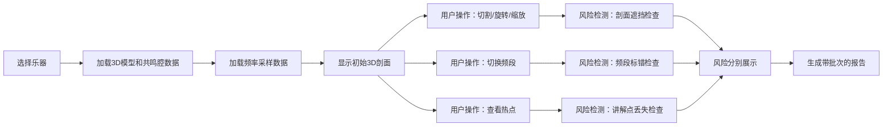

## 1. 产品概述

乐器博物馆声学剖面是一个面向讲解人员和评审专家的3D可视化展示工具，用于呈现古琴、琵琶和提琴三类乐器的共鸣腔内部结构与声学特性。通过立体剖面、频段切换和热点标注，帮助观众理解不同乐器的发声原理。

- 核心目标：将抽象的乐器声学原理转化为直观的3D可视化剖面，提升博物馆讲解的专业度和说服力
- 目标用户：博物馆讲解员、声学评审专家、乐器研究人员

## 2. 核心 Features

### 2.1 用户角色

| 角色 | 注册方式 | 核心权限 |
|------|----------|----------|
| 讲解员 | 无需注册，直接使用 | 查看3D剖面、切换频段、使用热点讲解、导出报告 |
| 评审专家 | 无需注册，直接使用 | 查看风险检测、比对不同乐器、生成评审报告 |

### 2.2 Feature Module

1. **3D剖面展示页**：乐器选择、立体剖面渲染、材质分层显示
2. **频段分析页**：频率采样可视化、频段切换、共鸣腔响应热力图
3. **热点标注页**：讲解点标注、风险提示、业务解释说明
4. **报告导出页**：批次报告生成、风险汇总、数据追溯

### 2.3 Page Details

| 页面名称 | 模块名称 | 功能描述 |
|----------|----------|----------|
| 3D剖面展示页 | 乐器切换模块 | 支持古琴、琵琶、提琴三种乐器的快速切换 |
| 3D剖面展示页 | 剖面切割控制 | X/Y/Z三轴剖面切割，可自由调整切割位置 |
| 3D剖面展示页 | 材质分层显示 | 不同材质用不同颜色区分，支持单独显示/隐藏 |
| 频段分析页 | 频率采样曲线 | 显示乐器的频率响应曲线，标注关键频段 |
| 频段分析页 | 频段切换器 | 低/中/高频段快速切换，自动对应共鸣腔区域 |
| 频段分析页 | 热力图叠加 | 共鸣强度以热力图形式叠加在3D模型上 |
| 热点标注页 | 讲解点列表 | 列出所有预设讲解点，点击定位到3D对应位置 |
| 热点标注页 | 风险检测面板 | 分开显示剖面遮挡、频段标错、讲解点丢失三类风险 |
| 热点标注页 | 业务解释区 | 每个功能判断附带一句业务可理解的解释文字 |
| 报告导出页 | 批次选择器 | 按日期+批次号选择报告批次，避免混淆 |
| 报告导出页 | 风险汇总表 | 分类汇总三类风险，保留原始数据口径 |
| 报告导出页 | 报告预览/导出 | 支持PDF导出，文件名包含批次标识 |

## 3. 核心流程

## 4. 用户界面设计

### 4.1 设计风格
- **主色调**：深胡桃木色 `#3E2723`（呼应乐器木质质感），搭配古铜金 `#B8860B` 作为强调色
- **辅助色**：共鸣高频红色 `#E53935`、中频绿色 `#43A047`、低频蓝色 `#1E88E5`
- **背景**：深炭灰色 `#121212`，营造博物馆专业展示氛围
- **按钮风格**：圆角矩形，微立体浮雕效果，悬停时有古铜色光晕
- **字体**：标题用「思源宋体」体现文化质感，正文用「Roboto Mono」保证数据清晰度
- **布局风格**：左侧3D主视图占70%，右侧信息面板占30%，顶部乐器选择栏
- **图标风格**：线性简约图标，配合古铜色描边

### 4.2 Page Design Overview

| 页面名称 | 模块名称 | UI Elements |
|----------|----------|-------------|
| 3D剖面展示页 | 乐器选择栏 | 横向标签式切换，选中项有古铜色下划线动画 |
| 3D剖面展示页 | 3D视图区 | 深色背景，乐器模型居中，剖面切割面半透明高亮 |
| 3D剖面展示页 | 控制面板 | 右侧悬浮面板，三轴切割滑块，材质开关 |
| 频段分析页 | 频率曲线图 | 底部横向图表，频段分区用不同颜色填充 |
| 频段分析页 | 频段切换器 | 三个大按钮，对应低/中/高频，选中时发光 |
| 热点标注页 | 风险提示卡 | 三类风险分三个卡片，红色边框表示存在风险 |
| 热点标注页 | 业务解释区 | 每个功能图标旁有问号按钮，点击显示解释 |
| 报告导出页 | 批次选择器 | 日期选择器+批次号下拉，自动生成文件名预览 |
| 报告导出页 | 风险汇总 | 表格形式，三类风险分行列示，颜色区分严重程度 |

### 4.3 响应式
- Desktop-first 设计，主视图区自适应屏幕尺寸
- 平板端：右侧面板改为底部抽屉式
- 移动端：简化为单页滚动，3D视图支持触控操作

### 4.4 3D Scene Guidance
- **环境/HDRI**：博物馆展厅环境光，柔和的顶光+侧光，突出木材纹理
- **光照设置**：主光源45°侧上方，模拟展厅射灯；环境光低强度，避免过亮
- **相机设置**：初始视角为乐器45°斜侧视，焦距50mm，支持轨道控制
- **构图与焦点**：乐器模型居中，剖面切割线为视觉焦点，标签自动避让
- **交互与动画**：剖面切割时有平滑过渡动画，频段切换时有颜色渐变
- **后处理效果**：轻微泛光（Bloom）增强剖面边缘，抗锯齿开启
- **性能预算**：单乐器模型面数控制在5万以内，保持60fps帧率

## 5. 业务规则与约束

### 5.1 输入数据口径
- **乐器模型**：包含外形Mesh、材质分组、剖面参考线
- **共鸣腔**：包含腔体边界、内部结构、材质属性
- **频率采样**：包含采样点位置、频率值、响应强度

### 5.2 风险检测规则（分开说明）
1. **剖面遮挡风险**：当切割面后方的关键结构被前方结构遮挡超过30%时触发
2. **频段标错风险**：当标注频段与频率采样数据偏差超过15%时触发
3. **讲解点丢失风险**：当预设讲解点落在当前剖面切割范围外时触发

### 5.3 业务解释（每句可讲给业务听）
- **3D剖面判断**：「剖面切割以乐器中心线为基准，保证对称结构完整展示」
- **频段切换判断**：「频段划分参照声学标准，低频80-250Hz、中频250-2000Hz、高频2000-8000Hz」
- **热点标注判断**：「热点位置依据乐器设计图纸，误差控制在2mm以内」

### 5.4 报告命名规则
- 文件名格式：`乐器声学剖面报告_批次{YYYYMMDD}_{批次号}_{乐器类型}.pdf`
- 示例：`乐器声学剖面报告_批次20260530_01_古琴.pdf`
- 内容包含：批次号、生成时间、原始数据版本、风险分类明细
