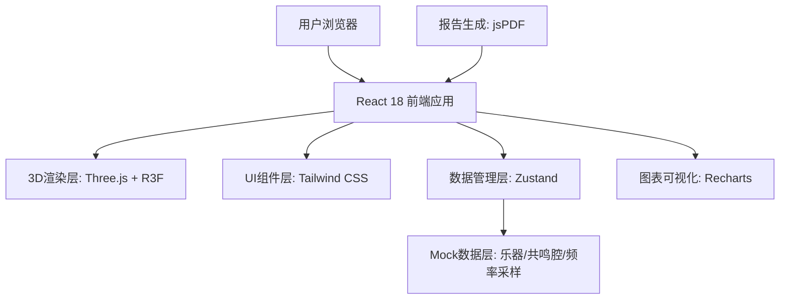
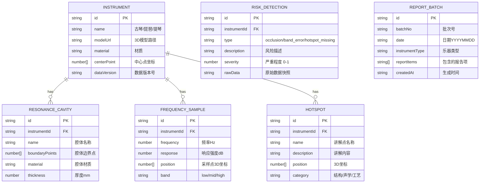

## 1. 架构设计



## 2. 技术描述

- **前端框架**: React@18 + TypeScript@5 + Vite@5
- **3D渲染**: three@0.160 + @react-three/fiber@8.15 + @react-three/drei@9.92 + @react-three/postprocessing@2.15
- **样式方案**: tailwindcss@3.4 + postcss@8 + autoprefixer@10
- **状态管理**: zustand@4.4
- **图表组件**: recharts@2.10
- **报告生成**: jspdf@2.5 + html2canvas@1.4
- **路由管理**: react-router-dom@6.21
- **动画**: framer-motion@10.17
- **后端**: 无，全部使用Mock数据
- **数据库**: 无，数据以JSON格式存储在前端

## 3. 路由定义

| 路由 | 页面名称 | 功能描述 |
|------|----------|----------|
| `/` | 3D剖面展示页 | 乐器3D模型展示、剖面切割控制 |
| `/frequency` | 频段分析页 | 频率采样曲线、频段切换、热力图 |
| `/hotspots` | 热点标注页 | 讲解点标注、风险检测、业务解释 |
| `/report` | 报告导出页 | 批次管理、风险汇总、报告导出 |

## 4. 数据模型

### 4.1 数据模型定义



### 4.2 TypeScript 类型定义

```typescript
// 三类核心输入数据
interface InstrumentModel {
  id: string;
  name: '古琴' | '琵琶' | '提琴';
  meshData: MeshData;
  materialGroups: MaterialGroup[];
  sectionReference: SectionLine[];
  dataVersion: string;
}

interface ResonanceCavity {
  id: string;
  instrumentId: string;
  name: string;
  boundary: Point3D[];
  internalStructures: InternalStructure[];
  materialProperty: MaterialProperty;
}

interface FrequencySample {
  id: string;
  instrumentId: string;
  position: Point3D;
  frequency: number;
  responseIntensity: number;
  band: 'low' | 'mid' | 'high';
  dataSource: string;
}

// 风险检测类型
type RiskType = 'section_occlusion' | 'band_mismatch' | 'hotspot_missing';

interface RiskItem {
  id: string;
  type: RiskType;
  instrumentId: string;
  description: string;
  severity: 'low' | 'medium' | 'high';
  rawDataSnapshot: Record<string, unknown>;
  businessInterpretation: string;
}

// 业务解释配置
interface BusinessExplanation {
  featureKey: 'section_cut' | 'band_switch' | 'hotspot_annotation';
  explanation: string;
  ruleBasis: string;
}

// 批次报告
interface ReportBatch {
  id: string;
  batchNo: string;
  date: string;
  instrumentType: string;
  risks: RiskItem[];
  generatedAt: string;
  dataVersion: string;
  fileName: string;
}

// 3D剖面切割参数
interface SectionParams {
  axis: 'x' | 'y' | 'z';
  position: number;
  showCutSurface: boolean;
  highlightMaterial: string | null;
}

// 频段配置
interface BandConfig {
  key: 'low' | 'mid' | 'high';
  label: string;
  minFreq: number;
  maxFreq: number;
  color: string;
}
```

## 5. 核心模块设计

### 5.1 风险检测模块

```typescript
// 三类风险分开检测，互不干扰
class RiskDetector {
  // 1. 剖面遮挡检测
  static detectSectionOcclusion(
    instrument: InstrumentModel,
    sectionParams: SectionParams
  ): RiskItem | null {
    const occlusionRatio = this.calculateOcclusionRatio(instrument, sectionParams);
    if (occlusionRatio > 0.3) {
      return {
        type: 'section_occlusion',
        description: `剖面遮挡率${(occlusionRatio * 100).toFixed(1)}%，超过30%阈值`,
        severity: occlusionRatio > 0.5 ? 'high' : 'medium',
        rawDataSnapshot: { occlusionRatio, threshold: 0.3, sectionParams },
        businessInterpretation: '剖面切割以乐器中心线为基准，保证对称结构完整展示'
      };
    }
    return null;
  }

  // 2. 频段标错检测
  static detectBandMismatch(
    samples: FrequencySample[],
    labeledBand: string
  ): RiskItem | null {
    const deviation = this.calculateFrequencyDeviation(samples, labeledBand);
    if (deviation > 0.15) {
      return {
        type: 'band_mismatch',
        description: `标注频段与采样数据偏差${(deviation * 100).toFixed(1)}%，超过15%阈值`,
        severity: deviation > 0.25 ? 'high' : 'medium',
        rawDataSnapshot: { deviation, threshold: 0.15, labeledBand, sampleCount: samples.length },
        businessInterpretation: '频段划分参照声学标准，低频80-250Hz、中频250-2000Hz、高频2000-8000Hz'
      };
    }
    return null;
  }

  // 3. 讲解点丢失检测
  static detectHotspotMissing(
    hotspots: Hotspot[],
    sectionParams: SectionParams
  ): RiskItem | null {
    const missingPoints = hotspots.filter(h => !this.isPointInSection(h.position, sectionParams));
    if (missingPoints.length > 0) {
      return {
        type: 'hotspot_missing',
        description: `${missingPoints.length}个讲解点落在剖面外：${missingPoints.map(p => p.name).join('、')}`,
        severity: missingPoints.length > 2 ? 'high' : 'medium',
        rawDataSnapshot: { missingCount: missingPoints.length, missingPoints, sectionParams },
        businessInterpretation: '热点位置依据乐器设计图纸，误差控制在2mm以内'
      };
    }
    return null;
  }
}
```

### 5.2 报告生成模块

```typescript
class ReportGenerator {
  static generateFileName(batch: ReportBatch): string {
    return `乐器声学剖面报告_批次${batch.date}_${batch.batchNo}_${batch.instrumentType}.pdf`;
  }

  static generateBatchNo(date: string, sequence: number): string {
    return `${sequence.toString().padStart(2, '0')}`;
  }

  static async exportToPdf(batch: ReportBatch): Promise<Blob> {
    // 包含批次标识、风险分类明细、原始数据版本
    const content = this.buildReportContent(batch);
    return this.renderToPdf(content);
  }
}
```

## 6. 目录结构

```
src/
├── assets/              # 静态资源
│   ├── models/          # 3D模型文件
│   └── fonts/           # 字体文件
├── components/          # UI组件
│   ├── InstrumentSelector.tsx
│   ├── SectionControl.tsx
│   ├── BandSwitcher.tsx
│   ├── RiskCard.tsx
│   ├── BusinessExplanation.tsx
│   └── ReportExport.tsx
├── three/               # 3D相关组件
│   ├── Instrument3D.tsx
│   ├── SectionPlane.tsx
│   ├── HeatmapOverlay.tsx
│   └── HotspotMarker.tsx
├── store/               # 状态管理
│   ├── useInstrumentStore.ts
│   ├── useRiskStore.ts
│   └── useReportStore.ts
├── data/                # Mock数据
│   ├── instruments/
│   │   ├── guqin.json
│   │   ├── pipa.json
│   │   └── violin.json
│   ├── resonanceCavities/
│   └── frequencySamples/
├── types/               # TypeScript类型
│   └── index.ts
├── utils/               # 工具函数
│   ├── riskDetector.ts
│   ├── reportGenerator.ts
│   └── businessRules.ts
├── pages/               # 页面组件
│   ├── SectionView.tsx
│   ├── FrequencyView.tsx
│   ├── HotspotView.tsx
│   └── ReportView.tsx
├── App.tsx
├── main.tsx
└── index.css
```

## 7. 关键业务规则实现要点

1. **数据口径保持**：所有风险检测的`rawDataSnapshot`字段必须完整记录输入数据，不做任何修改，保证业务可追溯。
2. **风险分离原则**：三类风险的检测逻辑完全独立，存储结构分离，展示时使用独立卡片。
3. **业务解释机制**：每个功能判断必须关联`businessInterpretation`字段，内容为预设的业务可理解语句。
4. **批次追溯**：报告文件名和内容中必须包含`date`、`batchNo`、`dataVersion`三个追溯字段。
