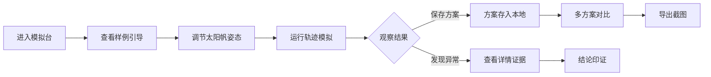

## 1. 产品概述

太阳帆姿态模拟台是面向航天兴趣课的Web3D教学工具，通过3D可视化交互让学生调节太阳帆角度，直观观察光压对航天器轨迹的影响，支持方案保存与对比分析。

- 核心目标：让学生通过交互理解太阳帆姿态与光压、轨迹的物理关系
- 目标用户：航天兴趣课学生与教师
- 价值：将抽象的航天物理概念转化为可交互、可验证的3D可视化体验

## 2. 核心特性

### 2.1 用户角色

| 角色 | 注册方式 | 核心权限 |
|------|----------|----------|
| 学生用户 | 无需注册，浏览器本地存储 | 调节姿态、模拟运行、保存方案、截图导出 |
| 教师用户 | 无需注册 | 查看预设样例、指导学生操作 |

### 2.2 功能模块

1. **3D姿态控制面板**：太阳帆3D模型、姿态角调节滑块、太阳方向指示
2. **轨迹模拟区**：轨迹动画播放、时间轴控制、物理参数实时显示
3. **方案管理区**：方案列表、筛选对比、方案详情查看
4. **证据详情面板**：姿态角记录、光压方向、轨迹数据、结论印证
5. **样例引导区**：预设可运行样例、操作说明、新手引导

### 2.3 页面详情

| 页面名称 | 模块名称 | 功能描述 |
|----------|----------|----------|
| 主页面 | 3D视口 | 可旋转、缩放的3D场景，包含太阳、航天器、太阳帆、轨迹线 |
| 主页面 | 姿态控制 | 三个欧拉角滑块（α/β/γ），实时更新太阳帆姿态 |
| 主页面 | 模拟控制 | 开始/暂停/重置按钮，时间速度调节 |
| 主页面 | 方案列表 | 已保存方案卡片，支持按名称/日期筛选 |
| 主页面 | 详情面板 | 点击方案查看：姿态角数据、光压方向、轨迹特征、结论记录 |
| 主页面 | 截图导出 | 一键导出当前3D场景截图 |
| 主页面 | 样例引导 | 预设3组典型样例，包含操作步骤说明 |

## 3. 核心流程

### 3.1 学习操作流程

学生进入页面 → 查看新手引导 → 加载样例方案 → 调节太阳帆角度 → 运行模拟观察轨迹 → 保存当前方案 → 对比多组方案 → 导出截图用于报告

### 3.2 错误场景验证流程

设置错误角度单位 → 设置反向光压方向 → 运行模拟 → 观察轨迹发散与延迟 → 查看详情面板中的时序记录 → 验证结论一致性

## 4. 用户界面设计

### 4.1 设计风格

- **主色调**：深空蓝 (#0a1628) + 太阳橙 (#ff9500) + 科技青 (#00d4ff)
- **辅助色**：轨迹绿 (#00ff88)、警告红 (#ff3b30)、数据紫 (#af52de)
- **按钮风格**：圆角矩形，渐变边框，悬停发光效果
- **字体**：标题用 Orbitron（科技感字体），正文用 Inter
- **布局风格**：深色科技风，左侧控制面板 + 中央3D视口 + 右侧方案面板
- **视觉元素**：星空背景、网格地面、光晕效果、数据可视化图表

### 4.2 页面设计概览

| 页面名称 | 模块名称 | UI元素 |
|----------|----------|--------|
| 主页面 | 3D视口 | 全屏深色背景、星空粒子效果、可交互3D模型、动态轨迹线 |
| 主页面 | 控制面板 | 半透明玻璃态卡片、带刻度的滑块、实时数值显示 |
| 主页面 | 方案列表 | 卡片式布局、悬停放大效果、筛选标签页 |
| 主页面 | 详情面板 | 分层信息架构、时序数据图表、证据标签高亮 |
| 主页面 | 引导区 | 折叠式新手教程、步骤指示器、样例快速加载按钮 |

### 4.3 响应式

- Desktop-first 设计，中央3D视口自适应
- 平板端：面板可折叠收起
- 移动端：简化为单面板+全屏3D模式，触摸优化交互

### 4.4 3D场景指南

- **环境**：深空黑色背景 + 动态星空粒子 + 太阳光源光晕
- **光照**：主光源模拟太阳光（暖色平行光），环境光模拟宇宙微光
- **相机**：透视相机，默认轨道控制模式，支持环绕、缩放、平移
- **构图**：太阳在左上方，航天器初始位置在中心，轨迹向右侧延伸
- **交互**：点击航天器显示详情，拖拽旋转视角，滚轮缩放
- **动画**：太阳帆旋转过渡动画、轨迹绘制动画、光压粒子效果
- **后处理**：轻微泛光效果、色彩分级、抗锯齿
- **性能**：模型面数控制在1万面以内，轨迹线使用BufferGeometry

## 5. 特殊功能要求

### 5.1 证据链完整性

- 3D姿态控制的每一次调节都记录时间戳
- 轨迹动画与参数面板实时同步
- 详情面板展示完整时序：姿态变更 → 光压计算 → 轨迹变化
- 结论区域自动标注："一致" / "不一致" / "需补充证据"

### 5.2 错误场景可视化

- 角度单位错误标识（° / rad 切换高亮）
- 光压方向反向时显示红色警告箭头
- 轨迹发散时线条变粗变红，延迟到达点闪烁提示
- 时序图中明确标注事件先后顺序

### 5.3 样例数据

预设3组典型样例：
1. **基准样例**：正确姿态，圆形轨道
2. **姿态偏离样例**：30°倾角，螺旋推进轨道
3. **错误组合样例**：角度单位混淆 + 光压反向，演示发散延迟现象
