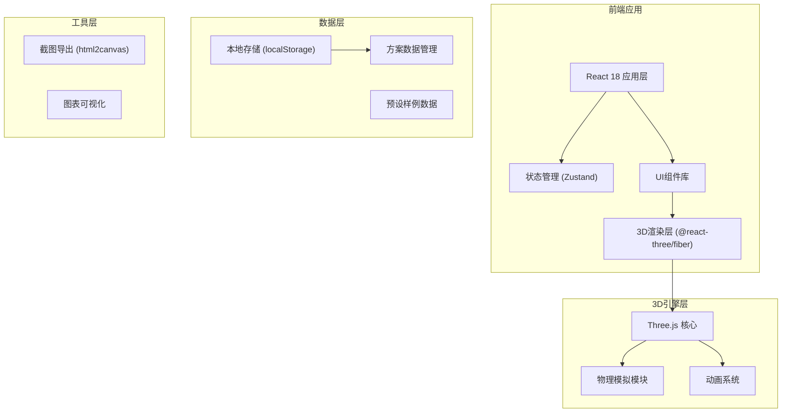

## 1. 架构设计



## 2. 技术描述

- **前端框架**: React@18 + TypeScript + Vite@5
- **3D引擎**: three@0.160 + @react-three/fiber@8 + @react-three/drei@9 + @react-three/postprocessing@2
- **样式方案**: TailwindCSS@3
- **状态管理**: Zustand@4
- **图标**: lucide-react@0.294
- **图表**: recharts@2
- **截图导出**: html2canvas@1

## 3. 目录结构

```
src/
├── components/
│   ├── layout/
│   │   ├── ControlPanel.tsx      # 左侧控制面板
│   │   ├── SchemePanel.tsx     # 右侧方案面板
│   │   └── GuidePanel.tsx      # 引导面板
│   ├── three/
│   │   ├── SolarSystem.tsx     # 3D场景主组件
│   │   ├── Sun.tsx             # 太阳模型
│   │   ├── Spacecraft.tsx      # 航天器与太阳帆
│   │   ├── TrajectoryLine.tsx # 轨迹线
│   │   └── Starfield.tsx      # 星空背景
│   ├── ui/
│   │   ├── Slider.tsx        # 自定义滑块
│   │   ├── Button.tsx          # 按钮组件
│   │   └── Card.tsx            # 卡片组件
│   └── DetailPanel.tsx           # 详情面板
├── store/
│   └── useSimulationStore.ts   # 模拟状态管理
│   └── useSchemeStore.ts       # 方案状态管理
├── physics/
│   └── solarSailPhysics.ts  # 太阳帆物理计算
├── data/
│   └── presets.ts              # 预设样例
├── utils/
│   ├── screenshot.ts           # 截图工具
│   └── formatters.ts         # 格式化工具
├── types/
│   └── index.ts              # 类型定义
├── App.tsx
├── main.tsx
└── index.css
```

## 4. 核心类型定义

```typescript
// 姿态角
interface Attitude {
  alpha: number;     // 俯仰角
  beta: number;   // 偏航角
  gamma: number; // 滚转角
  unit: 'deg' | 'rad';
}

// 光压参数
interface RadiationPressure {
  direction: Vector3;
  magnitude: number;
  isReversed: boolean;
}

// 轨迹点
interface TrajectoryPoint {
  position: Vector3;
  velocity: Vector3;
  timestamp: number;
}

// 模拟方案
interface SimulationScheme {
  id: string;
  name: string;
  createdAt: Date;
  attitude: Attitude;
  radiationPressure: RadiationPressure;
  trajectory: TrajectoryPoint[];
  conclusion: 'consistent' | 'inconsistent' | 'needs-evidence';
  evidenceLog: EvidenceItem[];
}

// 证据项
interface EvidenceItem {
  timestamp: number;
  type: 'attitude-change' | 'pressure-calc' | 'trajectory-event';
  description: string;
  data: any;
}
```

## 5. 物理模拟模块设计

### 5.1 光压计算公式

```
光压加速度 = (2 * 光强 * 帆面积 * cos²(入射角) / (c * 质量)
```

- 入射角 = 太阳帆法线与太阳方向的夹角
- c = 光速 (3e8 m/s
- 考虑反射系数 = 0.92 (近似值用于教学演示)

### 5.2 轨迹积分

使用 Verlet 积分算法，时间步长可调节
