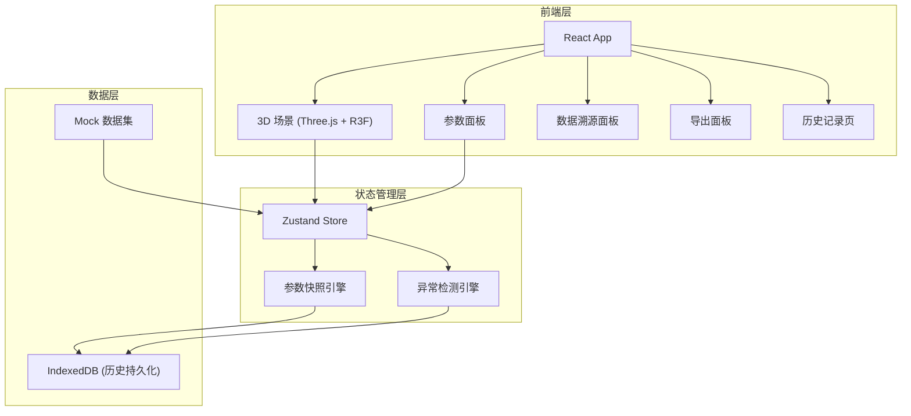
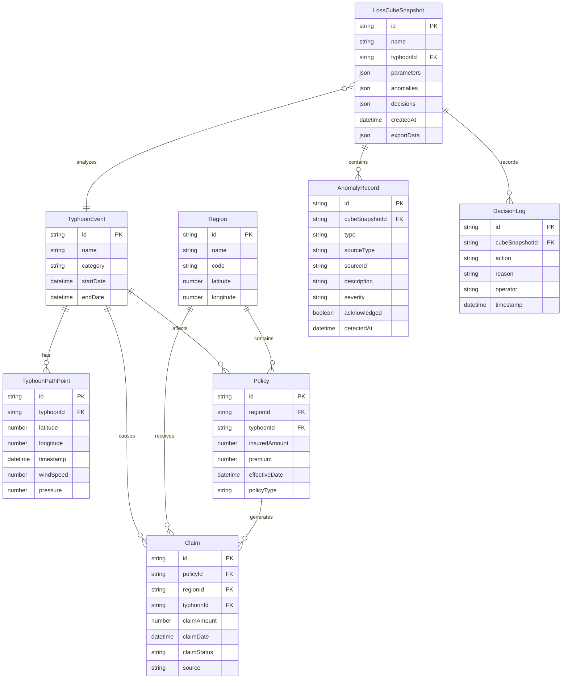

## 1. 架构设计



## 2. 技术说明

- **前端**: React@18 + TailwindCSS@3 + Vite
- **初始化工具**: Vite (npm create vite@latest)
- **3D 渲染**: Three.js + @react-three/fiber + @react-three/drei + @react-three/postprocessing
- **状态管理**: Zustand (轻量、支持持久化中间件)
- **持久化**: IndexedDB (通过 idb 库)，保证重启后历史记录与导出数据一致
- **后端**: 无 (纯前端应用，使用 Mock 数据集)
- **数据库**: IndexedDB (浏览器端持久化存储)
- **图表**: Recharts (侧边面板的赔付曲线图等)
- **导出**: 纯前端生成 JSON/CSV，通过 Blob 下载

## 3. 路由定义

| 路由 | 用途 |
|------|------|
| `/` | 损失立方主页面：3D 可视化 + 参数面板 + 时间轴 + 钻取 + 导出 |
| `/history` | 历史记录页面：历史立方列表 + 对比 + 审计追溯 |

## 4. 数据模型

### 4.1 数据模型定义



### 4.2 数据定义语言

**IndexedDB 存储 (idb 库操作)**

**Object Store: typhoonEvents**
- keyPath: `id`
- 索引: `name`, `startDate`

**Object Store: typhoonPathPoints**
- keyPath: `id`
- 索引: `typhoonId`, `timestamp`

**Object Store: regions**
- keyPath: `id`
- 索引: `code`

**Object Store: policies**
- keyPath: `id`
- 索引: `regionId`, `typhoonId`

**Object Store: claims**
- keyPath: `id`
- 索引: `policyId`, `regionId`, `typhoonId`, `claimDate`

**Object Store: lossCubeSnapshots**
- keyPath: `id`
- 索引: `typhoonId`, `createdAt`

**Object Store: anomalyRecords**
- keyPath: `id`
- 索引: `cubeSnapshotId`, `type`, `sourceType`

**Object Store: decisionLogs**
- keyPath: `id`
- 索引: `cubeSnapshotId`, `timestamp`

## 5. 核心状态设计 (Zustand Store)

```typescript
interface CubeParameters {
  typhoonId: string
  timeRange: [number, number]
  regionIds: string[]
  claimThreshold: number
  showTyphoonPath: boolean
  showPolicyDistribution: boolean
  showClaims: boolean
}

interface LossCubeState {
  parameters: CubeParameters
  activeSnapshotId: string | null
  selectedRegionId: string | null
  timeSlicePosition: number | null
  anomalies: AnomalyRecord[]
  decisions: DecisionLog[]
  setParameters: (params: Partial<CubeParameters>) => void
  setTimeSlice: (position: number | null) => void
  selectRegion: (regionId: string | null) => void
  acknowledgeAnomaly: (id: string) => void
  addDecision: (action: string, reason: string) => void
  saveSnapshot: () => Promise<string>
  loadSnapshot: (id: string) => Promise<void>
  exportReport: () => Promise<ExportResult>
}
```

## 6. 异常检测引擎规则

| 异常类型 | 检测规则 | 严重级别 | 处理策略 |
|----------|----------|----------|----------|
| 路径时间错位 | 路径点时间戳不在台风事件时间范围内 | 高 | 标记错位点，阻止该时间点聚合，保留原始数据 |
| 地区聚合冲突 | 同一地区同一时间点存在多个聚合结果 | 中 | 展示所有候选值，由精算师选择，记录决策原因 |
| 极端赔付遮蔽 | 单笔赔付超过该地区总赔付的 50% | 高 | 分离极端值单独展示，不纳入常规聚合，保留在溯源链 |
| 数据源缺失 | 3D 视图中的数据点无法追溯到原始来源 | 高 | 阻止展示，标记为数据源缺失 |
| 时间轴间隙 | 时间切片中存在无数据覆盖的间隙 | 低 | 标记间隙区域，提示用户注意 |
