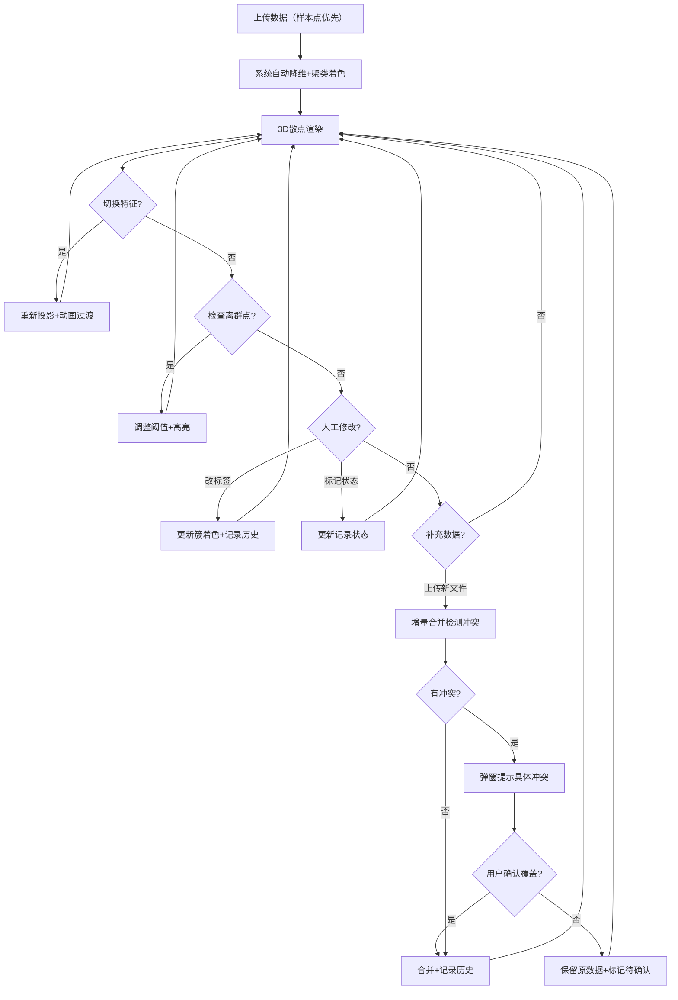

## 1. 产品概述

高维聚类投影舱是一款面向数据课教学与同行评审的3D交互式高维聚类可视化工具。核心解决"高维数据降维后簇的含义难以直觉理解"问题，让教师切换投影特征即可观察簇边界如何变化，让学生和评审者看清每个样本点为何归属于当前簇、离群点为何偏离。

- 目标用户：数据科学课程教师、学生、科研同行评审者
- 核心价值：通过3D投影 + 特征筛选 + 离群高亮三联动，让高维聚类的"为什么"变得可见可解释

## 2. 核心功能

### 2.1 用户角色

| 角色 | 进入方式 | 核心权限 |
|------|----------|----------|
| 讲解者（教师） | 直接访问 | 上传数据、切换特征、修改标签、导出快照 |
| 评审者（同事/学生） | 直接访问 | 查看投影、筛选特征、标注待确认/退回、查看历史 |

### 2.2 功能模块

1. **投影舱主页面**：3D散点场景、特征筛选面板、离群高亮面板、记录状态列表、操作历史时间线

### 2.3 页面详情

| 页面名称 | 模块名称 | 功能描述 |
|----------|----------|----------|
| 投影舱主页面 | 3D散点场景 | Three.js渲染高维数据降维后的3D散点；支持旋转/缩放/平移；颜色按簇标签映射；悬浮显示样本ID与原始特征值；点击样本可手动改簇标签 |
| 投影舱主页面 | 特征筛选面板 | 列出所有特征列及勾选状态；已选3个特征映射到XYZ轴（可拖拽调序）；切换特征时3D散点实时重投影，簇边界动画过渡；显示当前投影解释力指标（如方差占比） |
| 投影舱主页面 | 离群高亮面板 | 自动检测离群点（基于距簇中心距离/Z-score）；离群点以脉冲光环+醒目边框高亮；可调离群阈值滑块；离群点列表显示ID、所属簇、偏离值；点击列表项镜头飞向该点 |
| 投影舱主页面 | 数据增量加载区 | 拖拽上传CSV/JSON；样本点可先到，特征列和聚类标签后面补；增量合并规则：已有样本保留原有标签判断，新特征列追加到特征池，新标签列提示"是否覆盖已有标签？"；具体错误提示如"标签列'cluster_v2'与已有'cluster'在样本#47,#108上冲突，请确认覆盖范围" |
| 投影舱主页面 | 记录状态列表 | 每条数据批次记录显示状态徽章：已处理（绿）、待确认（黄）、需退回补材料（红）；退回时必须填写原因，如"特征列'income'含32%缺失值，请补齐或标注缺失策略"；支持筛选与排序 |
| 投影舱主页面 | 操作历史时间线 | 记录所有人工修改：改标签、调特征、调阈值、改状态；每条记录含时间戳、操作者、操作类型、变更前后值；支持回滚到任意历史节点 |

## 3. 核心流程

**教学讲解流程**：教师上传数据 → 系统自动降维投影+聚类着色 → 教师切换特征组合观察簇边界变化 → 高亮离群点讲解偏离原因 → 学生可自行操作探索

**评审确认流程**：评审者查看投影 → 发现标签存疑 → 标记"待确认" → 填写疑问说明 → 教师收到反馈 → 修改后标记"已处理"或退回要求补材料

**增量数据流程**：首次上传样本点 → 补充特征列 → 补充聚类标签 → 系统合并时检测冲突 → 冲突时弹窗提示具体冲突样本与列名 → 用户确认后合并

## 4. 用户界面设计

### 4.1 设计风格

- **主题**：深空科技风（Deep Space Tech）— 深蓝黑底色配荧光青与琥珀色高亮，模拟太空舱投影仪的沉浸感
- **主色**：深蓝黑 #0a0e1a（背景）、荧光青 #00f5d4（簇着色主色、交互高亮）、琥珀色 #f5a623（离群/警告）
- **辅色**：冰白 #e8edf5（文本）、暗灰蓝 #1a2332（面板底色）、簇调色板采用8色可辨识方案
- **按钮风格**：圆角6px、微发光边框、悬浮时发光增强
- **字体**：标题用 Space Grotesk 700（科技感），正文用 DM Sans 400/500（可读性）
- **布局风格**：左侧特征筛选面板（280px）、中间3D场景（弹性填充）、右侧离群+记录面板（320px）、底部历史时间线（可折叠200px）
- **图标风格**：Lucide线性图标，荧光青色

### 4.2 页面设计概览

| 页面名称 | 模块名称 | UI元素 |
|----------|----------|--------|
| 投影舱主页面 | 3D散点场景 | 深色背景、发光粒子点、簇颜色图例悬浮于左上、悬浮信息卡（样本ID+特征值）、点击弹出标签编辑气泡 |
| 投影舱主页面 | 特征筛选面板 | 暗色面板、特征列表带勾选框+拖拽手柄、XYZ轴映射指示器、投影解释力进度条、特征搜索框 |
| 投影舱主页面 | 离群高亮面板 | 阈值滑块、离群点计数徽章、离群点列表（ID+簇+偏离值）、脉冲动画高亮 |
| 投影舱主页面 | 数据增量加载区 | 拖拽上传区（虚线边框）、合并冲突弹窗（冲突详情表）、加载进度条 |
| 投影舱主页面 | 记录状态列表 | 状态徽章（绿/黄/红圆点+文字）、筛选下拉、退回原因输入弹窗 |
| 投影舱主页面 | 操作历史时间线 | 时间线竖线+节点、操作类型图标、变更前后对比（删除线+新值）、回滚按钮 |

### 4.3 响应式

- 桌面优先设计（1440px+最佳）
- 1280px以下：右侧面板可折叠为抽屉
- 平板以下（<768px）：面板全部折叠为底部抽屉，3D场景全屏

### 4.4 3D场景指引

- **环境**：深空背景，微弱星点粒子营造纵深感
- **灯光**：环境光（低强度冷白）+ 两个方向光（微弱暖白），避免过亮遮盖点颜色
- **相机**：透视相机，初始45度俯角，OrbitControls支持旋转/缩放/平移，限制最近距离防穿透
- **构图**：散点居中，轴标签在边缘，图例悬浮左上
- **交互**：悬浮高亮+信息卡、点击选中+编辑气泡、双击飞向点、滚轮缩放
- **动画**：切换特征时点位置平滑插值过渡（600ms ease-in-out）、离群点脉冲光环（1.5s循环）
- **后处理**：轻微Bloom效果让发光点更醒目、可选FXAA抗锯齿
