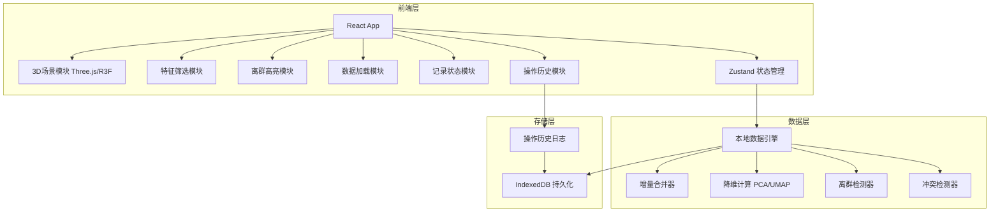
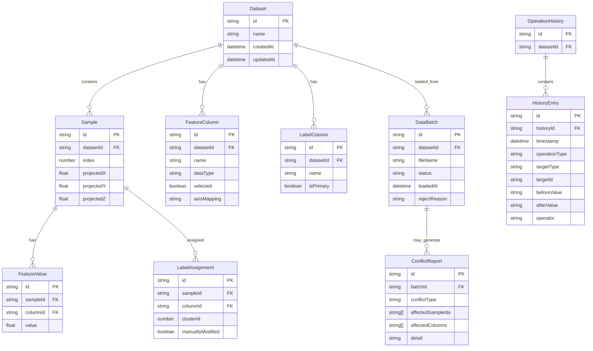

## 1. 架构设计



## 2. 技术说明

- **前端**：React@18 + TypeScript + Tailwind CSS@3 + Vite
- **初始化工具**：vite-init（react-ts模板）
- **3D渲染**：Three.js + @react-three/fiber + @react-three/drei + @react-three/postprocessing
- **状态管理**：Zustand（多slice：数据、投影、选择、历史、记录状态）
- **数据处理**：ml-pca（PCA降维）、ml-knn（可选近邻计算）、umap-js（UMAP降维）
- **持久化**：IndexedDB（via idb库）存储数据集、历史记录
- **后端**：无（纯前端，数据本地处理）

## 3. 路由定义

| 路由 | 用途 |
|------|------|
| / | 投影舱主页面（3D散点+所有面板） |

## 4. 数据模型

### 4.1 数据模型定义



### 4.2 核心类型定义（TypeScript）

```typescript
type BatchStatus = "processed" | "pending" | "rejected"

interface DataBatch {
  id: string
  datasetId: string
  fileName: string
  status: BatchStatus
  loadedAt: string
  rejectReason?: string
}

interface ConflictReport {
  id: string
  batchId: string
  conflictType: "label_mismatch" | "outlier_occlusion" | "parameter_loss" | "schema_mismatch"
  affectedSampleIds: string[]
  affectedColumns: string[]
  detail: string
}

interface HistoryEntry {
  id: string
  historyId: string
  timestamp: string
  operationType: "label_change" | "feature_toggle" | "threshold_adjust" | "status_change" | "data_merge" | "rollback"
  targetType: string
  targetId: string
  beforeValue: string
  afterValue: string
  operator: string
}
```

## 5. 关键算法

### 5.1 增量合并策略
- 样本点先到时：创建Sample记录，FeatureValue和LabelAssignment留空
- 补充特征列时：新增FeatureColumn，为已有Sample填充FeatureValue（无值标记null）
- 补充标签列时：新增LabelColumn，检测与已有标签列在相同样本上的冲突；冲突时生成ConflictReport并弹窗提示具体样本ID和列名
- **核心原则**：新数据不覆盖已有的人工判断（manuallyModified=true的LabelAssignment不会被自动覆盖）

### 5.2 离群检测
- 基于选定特征计算每个样本到其簇中心的马氏距离
- Z-score标准化后，超过阈值的标记为离群点
- 阈值默认2.0，用户可通过滑块调整（范围1.0-4.0）

### 5.3 降维投影
- PCA：用于快速线性投影，显示各主成分方差占比
- 可选3个特征直接映射XYZ轴（无需降维，真实特征值）
- 切换特征时，散点位置通过线性插值平滑过渡

## 6. 性能策略

- 3D场景使用InstancedMesh渲染，支持10万+散点流畅交互
- 降维计算在Web Worker中执行，避免阻塞UI
- IndexedDB异步读写，数据量大时分页加载
- 仅渲染视锥内的点标签，超出范围省略
