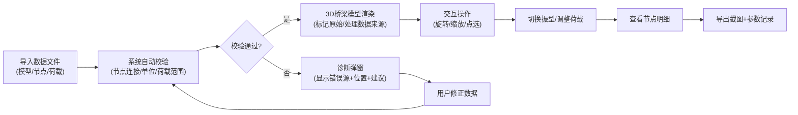

# 桥梁振型演示器 - 产品需求文档

## 1. 产品概述

桥梁振型演示器是一款面向土木工程教学的Web3D交互工具，帮助学生直观理解桥梁不同振型特性与车辆荷载的力学响应关系。

- 核心目标：将抽象的结构动力学概念转化为可视化的3D交互体验
- 目标用户：土木工程教师、桥梁工程专业学生、结构力学学习者
- 核心价值：提升教学效率，降低理解门槛，提供可追溯的教学证据

## 2. 核心功能

### 2.1 用户角色

| 角色 | 登录方式 | 核心权限 |
|------|----------|----------|
| 教师用户 | 无需登录 | 导入模型数据、调整参数、导出截图、查看错误溯源 |
| 学生用户 | 无需登录 | 浏览3D模型、切换振型、调整荷载、查看节点明细 |

### 2.2 功能模块

1. **3D桥梁演示区**：桥梁模型渲染、振型动画、荷载可视化
2. **参数控制面板**：振型筛选、荷载滑块、动画控制、单位切换
3. **数据导入区**：模型文件导入、节点数据导入、荷载数据导入
4. **溯源与诊断区**：原始材料标记、错误定位、修复建议
5. **导出功能区**：场景截图、参数记录、明细导出

### 2.3 页面详情

| 页面名称 | 模块名称 | 功能描述 |
|----------|----------|----------|
| 主演示页 | 3D视图区 | 可旋转/缩放桥梁模型，点击节点/构件查看明细，振型动画实时播放 |
| 主演示页 | 左侧控制面板 | 振型选择器（1-10阶）、频率显示、动画播放/暂停/速度调节 |
| 主演示页 | 右侧荷载控制 | 车辆荷载滑块（0-100吨）、荷载位置调节、多车道切换 |
| 主演示页 | 底部导入区 | 文件拖拽上传、原始/处理数据标签切换、导入历史记录 |
| 主演示页 | 诊断弹窗 | 错误类型标识、触发源文件定位、具体错误位置、下一步操作建议 |
| 主演示页 | 截图功能 | 一键截取当前3D视图、自动叠加参数水印、下载图片 |

## 3. 核心流程

用户从导入数据开始，经过3D可视化交互，最终获得教学演示结果和可追溯的诊断记录。

## 4. 用户界面设计

### 4.1 设计风格

- **主色调**：工程蓝 (#165DFF) - 代表专业、可靠
- **辅助色**：警示橙 (#FF7D00) - 用于错误提示；确认绿 (#00B42A) - 用于正常状态
- **中性色**：深灰 (#1D2129) 背景、浅灰 (#F2F3F5) 面板、纯白 (#FFFFFF) 卡片
- **按钮风格**：直角矩形、2px描边、点击时有明确的按压反馈
- **字体**：主字体使用 Noto Sans SC（专业清晰），数字使用 JetBrains Mono（等宽易读）
- **布局风格**：功能分区明确的模块化布局，左侧控制、中间3D、右侧数据、底部导入
- **图标风格**：线性图标，2px描边，保持工程软件的专业感

### 4.2 页面设计概览

| 页面名称 | 模块名称 | UI元素 |
|----------|----------|--------|
| 主演示页 | 3D视图区 | 深色背景、网格地面、桥梁模型高亮选中、振型变形放大效果、荷载动态指示线 |
| 主演示页 | 控制面板 | 半透明磨砂玻璃面板、振型按钮组、滑动条带刻度、数字输入框带单位 |
| 主演示页 | 导入区 | 拖拽区域边框动画、文件卡片带来源标记、时间戳记录、原始/处理状态标签 |
| 主演示页 | 诊断区 | 错误卡片带颜色编码、可展开的详细信息、"定位到3D视图"按钮、建议列表 |

### 4.3 响应式设计

- **桌面优先**：针对教学场景的大屏幕显示器优化（1920×1080起步）
- **平板适配**：控制面板可折叠收起，最大化3D视图区域
- **触摸优化**：支持触屏手势旋转/缩放，按钮尺寸适配触摸操作

### 4.4 3D场景设计

- **环境**：深灰色渐变背景，避免视觉干扰，突出桥梁模型
- **光照**：三光源配置（主光+补光+轮廓光），确保桥梁各面都有清晰的立体感
- **相机**：默认等轴测视角，支持轨道控制（旋转/平移/缩放），有碰撞检测防止穿模
- **振型动画**：变形幅度放大10-100倍以便观察，使用正弦波平滑动画，节点位移用颜色映射（蓝→红表示位移大小）
- **后处理**：轻微的抗锯齿和环境光遮蔽，提升模型立体感但不过度装饰
- **性能**：控制模型面数在5万面以内，确保60fps流畅运行

