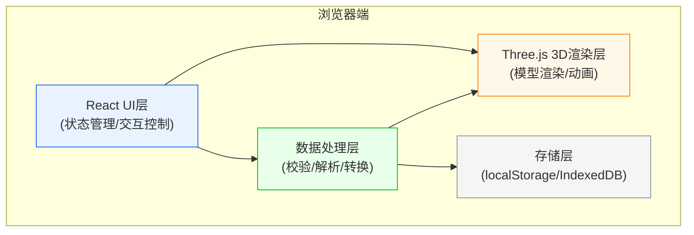
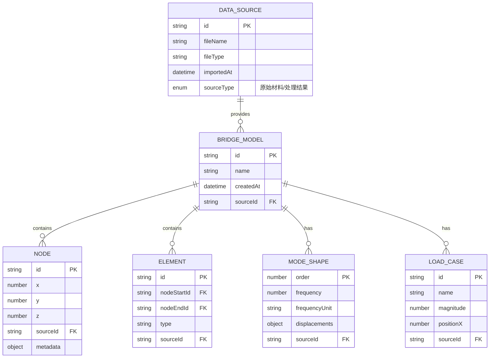

# 桥梁振型演示器 - 技术架构文档

## 1. 架构设计

本项目采用纯前端架构，所有计算和渲染均在浏览器端完成，无需后端服务，便于教师在任何环境下使用。



## 2. 技术选型说明

| 技术栈 | 选型理由 |
|--------|----------|
| **React 18** | 组件化开发，便于UI状态与3D场景状态同步 |
| **TypeScript** | 强类型保障，减少工程计算类bug |
| **Vite** | 快速开发构建，支持热更新 |
| **Three.js** | 成熟的Web3D引擎，性能稳定 |
| **@react-three/fiber** | React声明式Three.js绑定，代码更易维护 |
| **@react-three/drei** | 常用3D组件库（轨道控制、截图等） |
| **Tailwind CSS 3** | 快速构建专业UI界面 |
| **Zustand** | 轻量级状态管理，管理3D场景与UI的共享状态 |
| **html2canvas** | 支持带UI水印的截图导出 |

**设计决策**：
- 不使用后端：教学工具强调离线可用性和便携性
- 纯前端计算：振型数据预计算或简单插值，避免复杂的有限元计算
- 数据溯源：每个数据对象附带来源信息（文件名、时间戳、原始/处理标记）

## 3. 核心状态模型

### 3.1 数据模型定义



### 3.2 状态管理结构

```typescript
interface BridgeState {
  // 3D场景状态
  scene: {
    isPlaying: boolean;
    animationSpeed: number;
    deformationScale: number;
    selectedNodeId: string | null;
    selectedElementId: string | null;
  };
  
  // 振型状态
  modeShape: {
    currentOrder: number;
    availableModes: number[];
    frequencyUnit: 'Hz' | 'rad/s';
  };
  
  // 荷载状态
  load: {
    magnitude: number;
    position: number;
    lane: number;
    isVisible: boolean;
  };
  
  // 数据溯源
  dataSources: DataSource[];
  validationErrors: ValidationError[];
  
  // 操作方法
  actions: {
    selectMode: (order: number) => void;
    setLoad: (params: Partial<LoadState>) => void;
    importData: (file: File, sourceType: 'original' | 'processed') => Promise<void>;
    takeScreenshot: () => void;
    locateError: (errorId: string) => void;
  };
}

interface ValidationError {
  id: string;
  type: 'node_connection' | 'frequency_unit' | 'load_boundary';
  severity: 'error' | 'warning';
  sourceId: string;
  sourceFileName: string;
  location: {
    nodeId?: string;
    elementId?: string;
    lineNumber?: number;
  };
  message: string;
  suggestion: string;
  humanReason: string;
}
```

## 4. 核心模块设计

### 4.1 数据校验模块

**职责**：导入数据时自动检测常见错误

| 错误类型 | 检测逻辑 | 人性化提示示例 |
|----------|----------|----------------|
| 节点错连 | 检查单元两端节点是否存在于节点列表中，检查距离异常的连接 | "第15号单元连接了节点42和节点87，但这两个节点相距52米，超过正常梁段长度，可能是导入时节点编号不匹配" |
| 频率单位错 | 检查频率值范围，一阶频率通常在0.5~5Hz之间 | "第1阶振型频率显示为120，看起来像是用了rad/s而不是Hz（桥梁一阶频率通常不会这么高），建议确认单位" |
| 荷载越界 | 检查荷载位置是否在桥梁范围内，荷载值是否超出合理范围 | "车辆荷载设置在X=156m处，但桥梁总长只有120m，荷载位置跑到桥外面了" |

### 4.2 3D渲染模块

**组件结构**：
- `BridgeScene` - 主场景容器
- `BridgeMesh` - 桥梁主体模型（梁体、桥墩）
- `Nodes` - 可交互节点
- `ModeShapeDeformer` - 振型变形控制器
- `LoadIndicator` - 荷载可视化指示器
- `SelectionHighlighter` - 选中对象高亮

### 4.3 溯源追踪设计

每个数据对象附加 `_source` 属性：
```typescript
interface SourceInfo {
  sourceId: string;
  fileName: string;
  importedAt: Date;
  sourceType: 'original' | 'processed';
  processingHistory?: {
    operation: string;
    timestamp: Date;
    operator?: string;
  }[];
}
```

## 5. 项目目录结构

```
src/
├── components/
│   ├── ui/                    # UI基础组件
│   │   ├── Panel.tsx
│   │   ├── Slider.tsx
│   │   └── FileDropZone.tsx
│   ├── three/                 # 3D组件
│   │   ├── BridgeScene.tsx
│   │   ├── BridgeMesh.tsx
│   │   ├── Nodes.tsx
│   │   └── LoadIndicator.tsx
│   ├── ControlPanel.tsx       # 左侧控制面板
│   ├── LoadPanel.tsx          # 右侧荷载面板
│   ├── ImportPanel.tsx        # 底部导入面板
│   ├── DetailPanel.tsx        # 节点明细面板
│   └── DiagnosticPanel.tsx    # 诊断面板
├── store/
│   └── useBridgeStore.ts      # Zustand状态管理
├── utils/
│   ├── dataParser.ts          # 数据解析器
│   ├── validator.ts           # 数据校验器
│   ├── modeShape.ts           # 振型计算工具
│   └── screenshot.ts          # 截图工具
├── types/
│   └── index.ts               # TypeScript类型定义
├── data/
│   └── demoBridge.ts          # 演示用桥梁数据
├── App.tsx
└── main.tsx
```

## 6. 性能优化要点

1. **3D渲染优化**：
   - 使用 InstancedMesh 渲染重复构件（如箍筋、螺栓）
   - 振型变形使用顶点着色器计算，避免CPU开销
   - 合理设置相机远裁剪面，减少绘制对象

2. **数据处理优化**：
   - 大文件分片解析，避免阻塞UI
   - WebWorker处理数据校验和计算

3. **状态更新优化**：
   - Zustand 按需订阅，避免不必要的重渲染
   - 3D场景与UI状态分离更新

