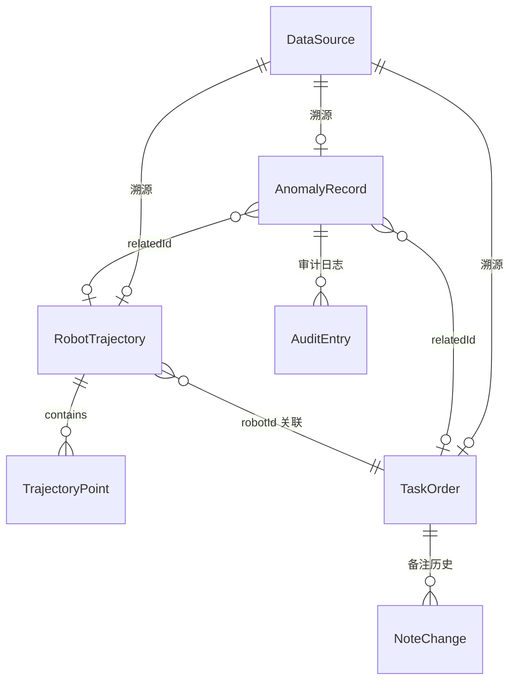

## 1. 架构设计

```mermaid
flowchart TB
    subgraph "前端层"
        "3D 渲染引擎" --- "数据面板"
        "3D 渲染引擎" --- "参数同步总线"
        "数据面板" --- "参数同步总线"
    end
    subgraph "数据层"
        "样例数据集" --- "数据清洗引擎"
        "数据清洗引擎" --- "正常数据存储"
        "数据清洗引擎" --- "异常数据存储"
        "数据清洗引擎" --- "审计日志存储"
    end
    subgraph "状态管理层"
        "Zustand Store" --- "3D 渲染引擎"
        "Zustand Store" --- "数据面板"
        "Zustand Store" --- "参数同步总线"
    end
    "样例数据集" --> "Zustand Store"
    "正常数据存储" --> "Zustand Store"
    "异常数据存储" --> "Zustand Store"
```

## 2. 技术说明

- **前端**：React@18 + TypeScript + TailwindCSS@3 + Vite
- **3D 引擎**：Three.js + @react-three/fiber + @react-three/drei + @react-three/postprocessing
- **状态管理**：Zustand
- **初始化工具**：vite-init (react-ts 模板)
- **后端**：无（纯前端，数据为静态样例）
- **数据源**：内嵌 TypeScript 样例数据集

## 3. 路由定义

| 路由 | 用途 |
|------|------|
| / | 3D 路径云主视图 + 侧边数据面板（单页应用） |

## 4. 数据模型

### 4.1 核心类型定义

```typescript
interface RobotTrajectory {
  id: string
  robotId: string
  points: TrajectoryPoint[]
  status: 'normal' | 'supplementary' | 'withdrawn' | 'duplicate'
  source: DataSource
}

interface TrajectoryPoint {
  x: number
  y: number
  z: number
  timestamp: number
  batteryLevel: number
  taskId?: string
}

interface Shelf {
  id: string
  position: [number, number, number]
  size: [number, number, number]
  zoneCode: string
}

interface TaskOrder {
  id: string
  robotId: string
  type: 'pick' | 'place' | 'transfer'
  startTime: number
  endTime?: number
  status: 'normal' | 'supplementary' | 'withdrawn' | 'duplicate'
  source: DataSource
  note?: string
  noteHistory?: NoteChange[]
}

interface DataSource {
  file: string
  line: number
  rawValue?: string
}

interface NoteChange {
  timestamp: number
  oldValue: string
  newValue: string
}

interface AnomalyRecord {
  id: string
  type: 'path_through_shelf' | 'battery_drop' | 'time_misalignment' | 'missing_field'
  severity: 'critical' | 'warning' | 'info'
  description: string
  relatedId: string
  source: DataSource
  status: 'pending' | 'confirmed' | 'rejected'
  auditLog: AuditEntry[]
}

interface AuditEntry {
  timestamp: number
  operator: string
  action: 'confirm' | 'reject' | 'note'
  detail: string
}

interface HeatmapConfig {
  gridSize: number
  threshold: number
  opacity: number
}

interface BatteryConfig {
  lowThreshold: number
  dropThreshold: number
}

interface FilterState {
  statusFilter: ('normal' | 'supplementary' | 'withdrawn' | 'duplicate')[]
  robotIds: string[]
  timeRange: [number, number]
}
```

### 4.2 数据实体关系



## 5. 模块划分

### 5.1 文件结构

```
src/
├── components/
│   ├── scene/                  # 3D 场景组件
│   │   ├── WarehouseScene.tsx  # 主场景容器
│   │   ├── ShelfMesh.tsx       # 货架网格
│   │   ├── TrajectoryCloud.tsx # 轨迹云渲染
│   │   ├── HeatmapOverlay.tsx  # 热力叠加层
│   │   ├── BatteryMarkers.tsx  # 电量标记
│   │   └── PathAnomalyMarkers.tsx # 穿架警示
│   ├── panel/                  # 侧边面板组件
│   │   ├── SidePanel.tsx       # 面板容器
│   │   ├── TaskFilter.tsx      # 任务筛选器
│   │   ├── TaskTable.tsx       # 任务明细表
│   │   ├── AnomalyList.tsx     # 异常清单
│   │   ├── PendingQueue.tsx    # 待确认队列
│   │   ├── SourceCard.tsx      # 溯源卡片
│   │   └── AuditLog.tsx        # 审计日志
│   └── ui/                     # 通用 UI
│       ├── Slider.tsx
│       ├── Badge.tsx
│       └── Timeline.tsx
├── hooks/
│   ├── useDataEngine.ts        # 数据清洗引擎
│   └── useAnomalyDetector.ts   # 异常检测逻辑
├── store/
│   └── useStore.ts             # Zustand 全局状态
├── data/
│   ├── trajectories.ts         # 轨迹样例数据
│   ├── shelves.ts              # 货架样例数据
│   └── tasks.ts                # 任务样例数据
├── utils/
│   ├── anomalyDetector.ts      # 异常检测算法
│   ├── dataCleaner.ts          # 数据清洗
│   └── heatmap.ts              # 热力计算
└── pages/
    └── Dashboard.tsx           # 主页面
```

## 6. 参数同步机制

所有可调参数（热力阈值、电量阈值、时间窗口、筛选条件）存储在 Zustand Store 中。3D 场景组件和数据面板组件通过订阅 Store 实现实时同步：

- 滑杆变更 → Store 更新 → 3D 场景重渲染 + 侧边栏数字更新
- 筛选器变更 → Store 更新 → 3D 轨迹显隐 + 明细表过滤
- 异常确认/驳回 → Store 更新 → 3D 标记变化 + 审计日志追加
