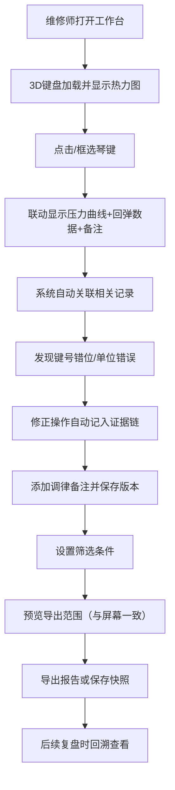

## 1. 产品概述

钢琴键盘力反馈3D工作台是为钢琴维修师设计的专业工具，用于可视化、记录和分析每个琴键的下压力、回弹时间和调律备注。系统通过3D交互界面实现琴键数据的联动展示，支持证据保留、数据筛选和范围一致性导出，解决维修交接中的信息断层问题。

## 2. 核心功能

### 2.1 用户角色

| 角色 | 注册方式 | 核心权限 |
|------|----------|----------|
| 钢琴维修师 | 本地应用 | 查看3D键盘、编辑力反馈数据、添加备注、导出报告 |
| 技术主管 | 本地应用 | 审核数据、查看历史版本、复盘分析 |

### 2.2 功能模块

1. **3D键盘工作台**：可交互的3D钢琴键盘，支持旋转、缩放、琴键选择，实时显示力度热力图
2. **数据明细面板**：选中琴键的压力曲线、回弹时间、调律备注的详细展示
3. **智能关联系统**：根据琴键编号、压力曲线特征、回弹时间自动关联相关维修记录
4. **证据保留模块**：记录键号错位、压力单位错误等人工核查痕迹，保留备注版本历史
5. **筛选与导出**：多维度筛选器，屏幕可见范围与导出范围严格一致
6. **历史复盘**：时间轴浏览历史快照，支持回溯查看当时的数据和处理理由

### 2.3 页面详情

| 页面名称 | 模块名称 | 功能描述 |
|----------|----------|----------|
| 主工作台 | 3D键盘视图 | 88键钢琴3D模型，力度热力着色，支持旋转/缩放/点选 |
| 主工作台 | 数据联动面板 | 选中琴键后显示压力曲线图、回弹时间轴、调律备注区 |
| 主工作台 | 智能关联栏 | 自动识别并展示相关琴键和历史维修记录 |
| 主工作台 | 证据时间线 | 记录键号错位修正、单位转换、备注变更等操作痕迹 |
| 主工作台 | 筛选工具栏 | 按音域、压力范围、问题类型筛选，实时更新3D视图 |
| 历史复盘页 | 快照时间轴 | 按日期浏览历史版本，对比查看数据变化和处理理由 |
| 导出预览页 | 范围确认面板 | 可视化当前筛选范围，确认后导出PDF/Excel报告 |

## 3. 核心流程

## 4. 用户界面设计

### 4.1 设计风格
- **主色调**：深炭灰 #1A1A1E 作为背景，配钢琴白 #F5F5F3 和琴键黑 #0D0D0D
- **强调色**：热力渐变色（蓝→绿→黄→红）表示压力强度，专业橙 #FF6B35 用于操作按钮
- **按钮风格**：微立体圆角按钮，悬停时有微妙的按压反馈动画
- **字体**：标题使用 Cormorant Garamond（优雅衬线），正文使用 JetBrains Mono（等宽易读）
- **布局风格**：左侧3D主视图占65%，右侧联动面板35%，底部证据时间线
- **图标风格**：线性简约图标，与专业工具调性一致

### 4.2 页面设计概览

| 页面名称 | 模块名称 | UI元素 |
|----------|----------|--------|
| 主工作台 | 3D键盘视图 | 暗色系场景，聚光照明，琴键按下动画，热力色渐变 |
| 主工作台 | 数据联动面板 | 卡片式布局，曲线图实时更新，备注区支持富文本 |
| 主工作台 | 证据时间线 | 垂直时间轴，彩色标记点，悬停显示详情弹窗 |
| 历史复盘页 | 快照时间轴 | 水平滑动时间轴，缩略图预览，点击加载完整快照 |

### 4.3 响应式
- 桌面端优先设计，支持1920×1080及以上分辨率
- 侧边面板可折叠以扩大3D视图区域
- 触摸设备支持双指缩放和单指旋转操作

### 4.4 3D场景指引
- **环境**：深色专业工作室环境，柔和的环境光配合定向主光源
- **光照**：三点布光系统，突出琴键的立体感和材质质感
- **相机**：默认45度俯视角度，支持轨道控制，限制合理的俯仰角度
- **交互**：琴键点击有按下动画和音效反馈，选中状态有光晕效果
- **后处理**：轻微泛光和环境光遮蔽，增强专业感和深度
