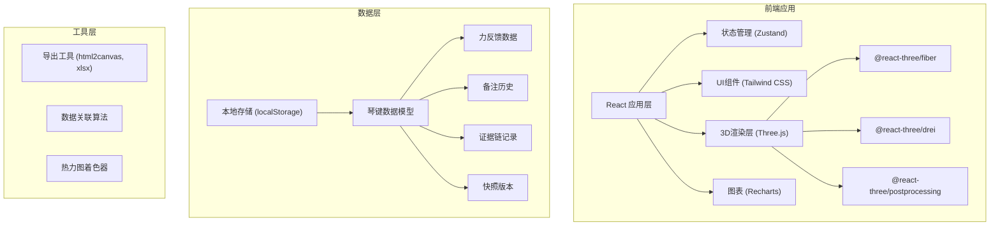
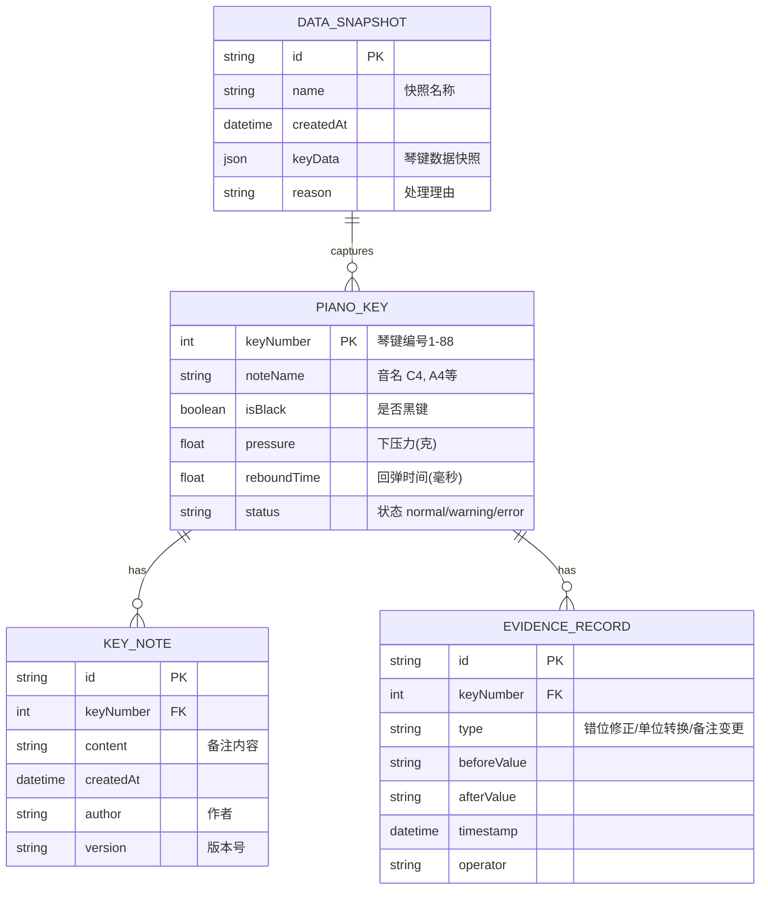

## 1. 架构设计



## 2. 技术描述

- **前端框架**: React@18 + TypeScript + Vite
- **3D引擎**: three@^0.160.0 + @react-three/fiber@^8.15.0 + @react-three/drei@^9.92.0
- **后处理**: @react-three/postprocessing@^2.15.0
- **样式方案**: tailwindcss@3.4.0
- **状态管理**: zustand@^4.4.0
- **图表库**: recharts@^2.10.0
- **导出功能**: html2canvas, xlsx
- **数据存储**: localStorage + IndexedDB（本地Mock数据）

## 3. 路由定义

| 路由 | 用途 |
|------|------|
| / | 主工作台 - 3D键盘视图 + 数据联动面板 |
| /history | 历史复盘页 - 快照时间轴浏览 |
| /export | 导出预览页 - 范围确认与导出 |

## 4. 数据模型

### 4.1 数据模型定义



### 4.2 TypeScript 类型定义

```typescript
// 琴键数据
interface PianoKeyData {
  keyNumber: number;
  noteName: string;
  isBlack: boolean;
  pressure: number;
  reboundTime: number;
  status: 'normal' | 'warning' | 'error';
  pressureCurve: number[];
}

// 备注记录
interface KeyNote {
  id: string;
  keyNumber: number;
  content: string;
  createdAt: Date;
  author: string;
  version: string;
}

// 证据记录
interface EvidenceRecord {
  id: string;
  keyNumber: number;
  type: 'key_mismatch' | 'unit_conversion' | 'note_change';
  beforeValue: string;
  afterValue: string;
  timestamp: Date;
  operator: string;
}

// 数据快照
interface DataSnapshot {
  id: string;
  name: string;
  createdAt: Date;
  keyData: PianoKeyData[];
  reason: string;
}

// 筛选条件
interface FilterCriteria {
  keyRange: [number, number];
  pressureRange: [number, number];
  reboundRange: [number, number];
  status: string[];
}
```

## 5. 核心组件结构

```
src/
├── components/
│   ├── piano3d/
│   │   ├── PianoKeyboard.tsx      # 3D钢琴键盘主组件
│   │   ├── PianoKey.tsx           # 单个琴键组件
│   │   └── HeatmapShader.ts       # 热力图着色器
│   ├── panels/
│   │   ├── DataPanel.tsx          # 数据明细面板
│   │   ├── PressureChart.tsx      # 压力曲线图
│   │   ├── EvidenceTimeline.tsx   # 证据时间线
│   │   └── RelatedKeys.tsx        # 智能关联栏
│   ├── toolbar/
│   │   ├── FilterToolbar.tsx      # 筛选工具栏
│   │   └── ExportModal.tsx        # 导出预览模态框
│   └── history/
│       └── SnapshotTimeline.tsx   # 快照时间轴
├── store/
│   └── usePianoStore.ts           # Zustand状态管理
├── utils/
│   ├── keyUtils.ts                # 琴键工具函数
│   ├── correlation.ts             # 数据关联算法
│   └── exportUtils.ts             # 导出工具
├── data/
│   └── mockData.ts                # Mock数据
└── types/
    └── index.ts                   # 类型定义
```
