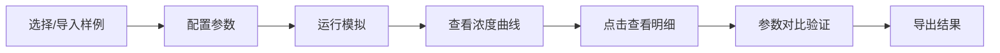

## 1. 产品概述

微分方程药量模拟工具是一款为药学教师设计的交互式血药浓度模拟平台，通过可视化方式展示药物在体内的积累和衰减过程，帮助学生理解给药间隔对血药浓度的影响。

- 核心目的：教学演示，让学生直观理解药代动力学原理
- 解决问题：抽象的微分方程难以直观理解，缺乏交互式教学工具
- 目标用户：药学教师、学生及科研人员

## 2. 核心功能

### 2.1 用户角色

| 角色 | 注册方式 | 核心权限 |
|------|----------|----------|
| 教师用户 | 无需注册，直接使用 | 导入样例、参数配置、查看图表、下载结果 |
| 学生用户 | 无需注册，直接使用 | 查看模拟结果、点击明细、理解药代过程 |

### 2.2 功能模块

1. **参数配置面板**：药物参数输入、给药方案设置、阈值配置
2. **样例管理**：内置经典药例、自定义样例导入、样例保存
3. **浓度曲线图**：实时血药浓度可视化、多剂量叠加展示、阈值线标注
4. **明细详情**：点击时间点查看浓度数据、参数对比分析、结论验证
5. **结果导出**：CSV数据下载、图表图片导出、模拟报告生成

### 2.3 页面详情

| 页面名称 | 模块名称 | 功能描述 |
|----------|----------|----------|
| 主页面 | 参数配置区 | 输入半衰期、给药剂量、间隔时间、模拟时长等参数 |
| 主页面 | 样例选择区 | 下拉选择内置样例，支持JSON文件导入 |
| 主页面 | 曲线图展示区 | Chart.js绘制血药浓度随时间变化曲线 |
| 主页面 | 明细面板 | 点击曲线显示该时间点的详细数据和分析 |
| 主页面 | 导出控制区 | 下载CSV数据、保存图表图片 |

## 3. 核心流程

用户选择或导入样例 → 配置药物参数和给药方案 → 运行微分方程求解 → 查看浓度曲线和阈值标注 → 点击曲线查看明细数据 → 对比参数验证结论 → 导出模拟结果

## 4. 用户界面设计

### 4.1 设计风格

- **主色调**：深青色 #0F766E（专业、科学感）
- **辅助色**：琥珀色 #D97706（强调、警示）、蓝绿色 #0EA5E9（数据曲线）
- **字体**：使用 Geist Sans 现代无衬线字体，标题加粗，正文清晰易读
- **布局**：左右分栏布局，左侧参数配置，右侧图表展示
- **交互**：悬停放大效果、平滑过渡动画、点击高亮反馈

### 4.2 页面设计概览

| 页面名称 | 模块名称 | UI元素 |
|----------|----------|--------|
| 主页面 | 参数配置区 | 卡片式容器、带图标的输入框、滑块控件、实时计算 |
| 主页面 | 曲线图区 | 带网格的Canvas图表、悬停数据提示、可点击的曲线点 |
| 主页面 | 明细面板 | 可展开的抽屉式面板、数据表格、结论高亮 |
| 主页面 | 导出区 | 图标按钮、下载状态提示 |

### 4.3 响应性

- Desktop-first 设计，优先保障桌面端教学演示体验
- 平板端自动调整为上下布局
- 移动端简化参数配置，聚焦图表展示
- 所有交互元素支持触摸操作

### 4.4 特殊业务规则展示

1. **剂量-半衰期结论不一致**：在详情面板中用醒目标识显示给药间隔作为补充证据
2. **单位混用+间隔为零**：按时间先后顺序展示浓度越界事件，带时间戳标记
3. **方程求解结论印证**：阈值标注线与参数对比表格联动，数值一致高亮显示
