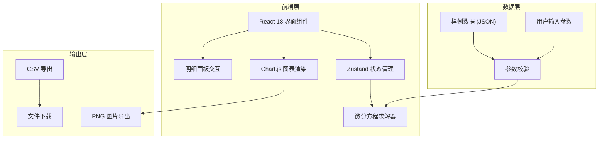

## 1. 架构设计



## 2. 技术描述

- **前端框架**：React@18 + TypeScript + Vite
- **状态管理**：Zustand（轻量级，适合单页应用）
- **图表库**：Chart.js + react-chartjs-2（交互式曲线图）
- **样式方案**：Tailwind CSS 3（原子化CSS）
- **图标库**：Lucide React
- **数学计算**：原生 JavaScript 实现微分方程数值解法（欧拉法/龙格-库塔法）
- **数据导出**：CSV 纯文本生成 + Canvas 图片导出
- **后端**：无后端，纯前端应用，所有计算在浏览器端完成

## 3. 路由定义

| 路由 | 用途 |
|------|------|
| / | 主应用页面，包含所有功能模块 |

## 4. 核心数据模型

### 4.1 药物参数类型定义

```typescript
interface DrugParams {
  id: string;
  name: string;
  halfLife: number;           // 半衰期 (小时)
  volumeOfDistribution: number; // 分布容积 (L)
  therapeuticMin: number;     // 最低有效浓度 (mg/L)
  therapeuticMax: number;     // 最高安全浓度 (mg/L)
  unit: 'mg/L' | 'μg/mL' | 'ng/mL';
}

interface DosingRegimen {
  dose: number;               // 单次给药剂量 (mg)
  interval: number;           // 给药间隔 (小时)
  dosesCount: number;         // 给药次数
  startTime: number;          // 首次给药时间
}

interface SimulationResult {
  time: number;               // 时间点 (小时)
  concentration: number;      // 血药浓度
  isDosingPoint: boolean;     // 是否为给药点
  isAboveMax: boolean;        // 是否超过上限
  isBelowMin: boolean;        // 是否低于下限
  eventType?: 'dosing' | 'peak' | 'trough' | 'cross_threshold';
}

interface SimulationConclusion {
  steadyStateConcentration: number;
  timeToReachSteadyState: number;
  peakConcentration: number;
  troughConcentration: number;
  hasConcentrationIssue: boolean;
  issueDescription: string;
  evidence: {
    type: 'interval' | 'unit_mismatch' | 'threshold_cross';
    timestamp: number;
    value: number;
    description: string;
  }[];
}
```

## 5. 微分方程求解算法

### 5.1 一室模型微分方程

```
dC/dt = -k * C + (D/V) * δ(t - τ)
其中:
- C: 血药浓度
- k: 消除速率常数 (= ln2/t½)
- D: 给药剂量
- V: 分布容积
- δ: Dirac delta 函数 (脉冲给药)
- τ: 给药时间点
```

### 5.2 数值解法

采用四阶龙格-库塔法 (RK4) 进行数值积分，确保计算精度。每次给药脉冲后更新浓度值：`C = C + D/V`。

## 6. 项目目录结构

```
src/
├── components/
│   ├── ParameterPanel.tsx      # 参数配置面板
│   ├── ConcentrationChart.tsx  # 浓度曲线图
│   ├── DetailPanel.tsx         # 明细详情面板
│   ├── SampleManager.tsx       # 样例管理
│   └── ExportControls.tsx      # 导出控制
├── hooks/
│   ├── useSimulation.ts        # 模拟计算hook
│   └── useExport.ts            # 导出功能hook
├── store/
│   └── simulationStore.ts      # Zustand状态管理
├── utils/
│   ├── odeSolver.ts            # 微分方程求解器
│   ├── pharmacokinetics.ts     # 药代动力学公式
│   └── validation.ts           # 参数校验
├── data/
│   └── samples.ts              # 内置样例数据
├── types/
│   └── simulation.ts           # 类型定义
└── App.tsx                     # 主应用组件
```
