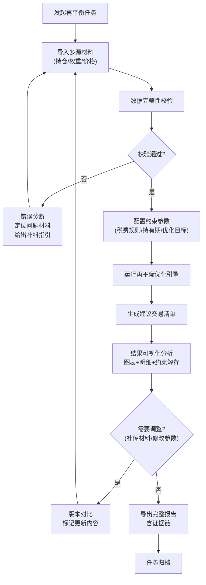
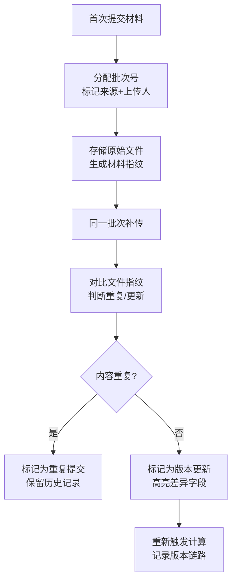

## 1. 产品概述

投资组合税后再平衡工具，为投顾团队提供专业化调仓决策支持。核心解决传统权重再平衡忽略税费成本、亏损抵扣、持有期等实际约束的问题，帮助团队在合规前提下最大化税后收益。

- **核心价值**：将隐性税费成本显性化，提供可追溯的决策证据链，支持多材料版本管理
- **目标用户**：投资顾问、投研团队、合规审查人员
- **市场价值**：降低调仓操作风险，提升客户税后真实收益，强化投顾专业服务能力

## 2. 核心特性

### 2.1 用户角色

| 角色 | 注册方式 | 核心权限 |
|------|----------|----------|
| 投顾用户 | 内部账号 | 导入数据、运行计算、查看结果、导出报告 |
| 投研主管 | 内部账号 | 全部权限 + 版本审批、模板管理 |
| 合规审查 | 内部账号 | 只读权限、证据链追溯、审计日志 |

### 2.2 功能模块

1. **工作台首页**：计算任务概览、快速导入、常用模板
2. **数据导入中心**：多来源材料导入、版本管理、原始材料留存
3. **再平衡计算**：约束配置、优化引擎运行、实时进度
4. **结果分析**：图表对比、明细钻取、约束解释、证据链
5. **错误诊断**：数据校验、问题定位、补料指引
6. **报告导出**：多格式下载、版本对比、审计留存

### 2.3 页面详情

| 页面名称 | 模块名称 | 功能描述 |
|-----------|-------------|---------------------|
| 工作台首页 | 任务看板 | 进行中/已完成任务列表，一键发起新计算 |
| 工作台首页 | 快速导入 | 拖拽上传持仓、权重、价格三类材料 |
| 工作台首页 | 常用模板 | 保存的参数配置快速复用 |
| 数据导入中心 | 材料上传 | 支持CSV/Excel，区分持仓表/目标权重/买卖价 |
| 数据导入中心 | 版本管理 | 同一批次补传自动标记，显示更新内容 |
| 数据导入中心 | 原始材料区 | 原文留存、上传人、时间戳、材料来源标记 |
| 再平衡配置 | 约束设置 | 税费规则、亏损抵扣规则、持有期要求、最小交易量 |
| 再平衡配置 | 优化目标 | 最小化税费/最大化税后收益/跟踪误差最小 |
| 计算结果页 | 持仓对比图 | 当前持仓vs目标持仓vs建议持仓权重对比 |
| 计算结果页 | 税费瀑布图 | 印花税、佣金、资本利得税、亏损抵扣逐层分解 |
| 计算结果页 | 交易明细表 | 每笔买卖的数量、价格、税费、持有期、盈亏 |
| 计算结果页 | 约束解释面板 | 每条建议的决策依据、取舍权衡说明 |
| 计算结果页 | 证据链追溯 | 点击任意数值可追溯至原始材料和计算过程 |
| 错误诊断页 | 校验报告 | 税费漏算项、权重不闭合差额、亏损抵扣异常 |
| 错误诊断页 | 问题定位 | 高亮哪份材料、哪条记录触发问题 |
| 错误诊断页 | 补料指引 | 下一步需要补充的数据、格式要求 |
| 版本对比页 | 差异分析 | 两次提交的材料差异、结果差异、更新原因 |
| 报告导出 | 下载中心 | Excel/CSV/PDF格式，包含完整计算过程 |

## 3. 核心流程

### 主业务流程

### 材料版本管理流程

## 4. 用户界面设计

### 4.1 设计风格

**设计方向**：专业严谨的金融工作台风格，以数据为中心，克制的视觉语言，强调可追溯性和可信度。

- **主色调**：深 slate 灰 (#0f172a) 作为主背景，代表专业和稳重
- **强调色**：精准的 emerald 绿 (#10b981) 表示盈利/合规，深 rose 红 (#e11d48) 表示亏损/风险，amber 橙 (#f59e0b) 表示警告
- **数据色阶**：使用 5 阶蓝绿色系表示数值梯度，避免彩虹色
- **字体**：专业等宽字体 JetBrains Mono 用于数值展示，Inter 用于正文，确保数字对齐易读
- **布局**：严格的网格系统，固定列宽表格，数据密度优先，避免大面积留白
- **交互**：悬停显示计算溯源，点击展开证据链，所有修改留有操作日志

### 4.2 页面设计概要

| 页面名称 | 模块名称 | UI元素 |
|-----------|-------------|-------------|
| 工作台首页 | 任务看板 | 卡片式任务列表，状态标签（计算中/待补料/已完成），进度条，操作按钮 |
| 数据导入中心 | 材料上传 | 分区拖拽区，材料类型标签，上传时间线，版本号徽章 |
| 数据导入中心 | 原始材料区 | 数据表格，来源水印，原始值与处理值双列对比，不可编辑状态 |
| 再平衡配置 | 参数面板 | 分组表单，滑块+数值输入双控件，默认值提示，约束说明 |
| 计算结果页 | 图表区 | 双栏布局，左权重对比条形图，右税费瀑布图，支持数据点钻取 |
| 计算结果页 | 交易明细 | 固定表头表格，斑马纹，行展开显示计算过程，颜色编码盈亏 |
| 计算结果页 | 约束解释 | 侧边抽屉，决策树结构，每步显示"原因→约束→取舍→结果" |
| 计算结果页 | 证据链 | 弹窗模态框，面包屑导航（原始材料→中间计算→最终结果），可复制 |
| 错误诊断页 | 问题列表 | 严重性分级图标，问题描述，定位链接，建议操作按钮 |
| 版本对比页 | 差异视图 | 双列并排，diff高亮（新增绿/删除红/修改橙），变化量标注 |
| 报告导出 | 下载中心 | 文件列表，格式选择，预览按钮，下载进度 |

### 4.3 响应式设计

- **桌面端优先**：1440px 基准设计，支持 1920px+ 扩展显示更多数据列
- **平板适配**：1024px 折叠次要侧边栏，表格支持横向滚动
- **触控优化**：最小点击区域 44x44px，关键操作按钮底部悬浮
- **打印友好**：专门的打印样式，移除交互元素，确保数据表格完整分页

## 5. 核心业务规则

### 5.1 税费计算规则

| 税费类型 | 计算基础 | 税率 | 抵扣规则 |
|----------|----------|------|----------|
| 印花税 | 卖出成交金额 | 0.1% | 不可抵扣 |
| 交易佣金 | 买卖成交金额 | 0.03%（最低5元） | 不可抵扣 |
| 资本利得税 | 卖出盈利部分 | 20% | 可与当年亏损抵扣 |
| 红利税 | 现金分红金额 | 持有期<1月:20%, 1月-1年:10%, >1年:免征 | 不可抵扣 |

### 5.2 亏损抵扣规则

- 当年 realized loss 优先抵扣当年 realized gain
- 不足抵扣部分可结转至下一年，最长结转 5 年
-  wash sale 规则：卖出亏损 30 天内买回相同标的，亏损不可抵扣
- 抵扣顺序：短期亏损抵扣短期盈利，长期亏损抵扣长期盈利

### 5.3 持有期规则

- 买入日至卖出日计算持有天数
- 持有期 < 30 天：禁止卖出（除非客户特殊授权）
- 持有期 30-365 天：短期资本利得税率
- 持有期 > 365 天：长期资本利得税率，红利税免征
