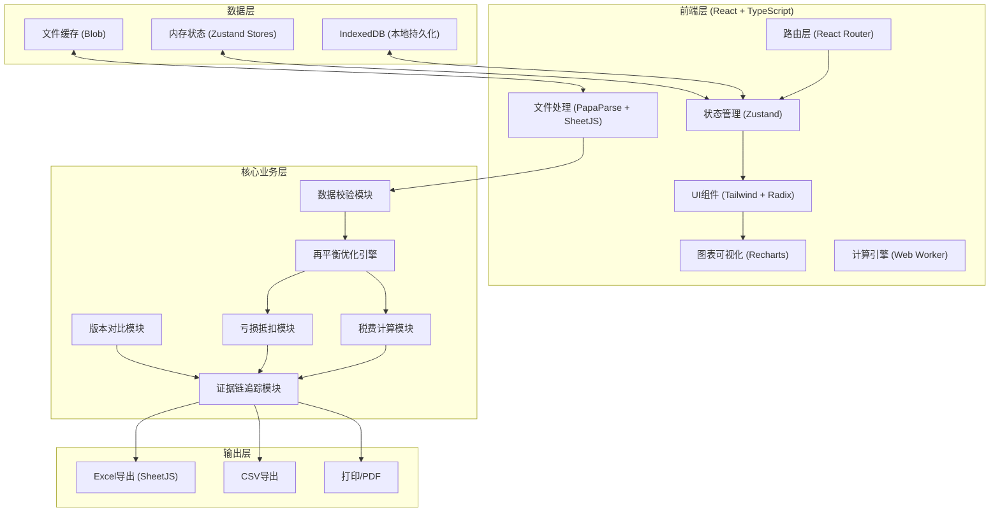
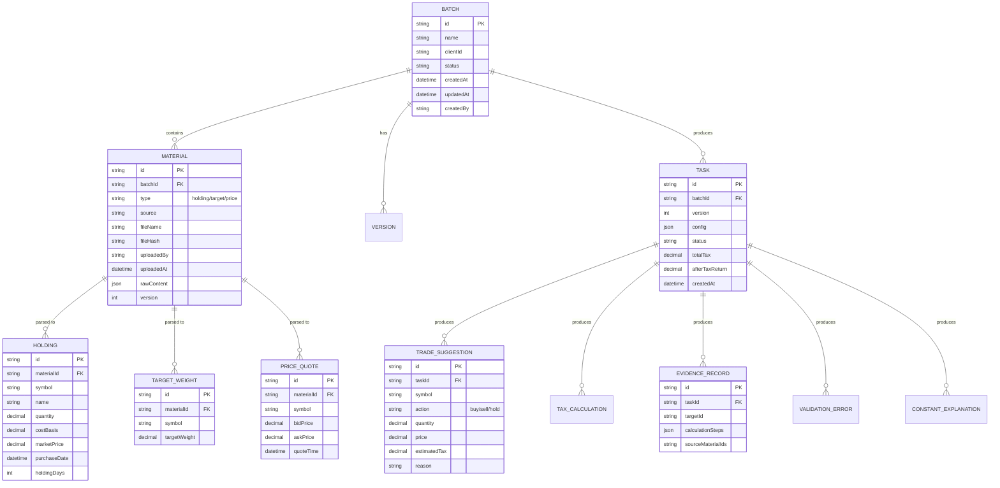

## 1. 架构设计



## 2. 技术选型说明

- **前端框架**：React@18 + TypeScript@5 + Vite@5
- **路由管理**：react-router-dom@6
- **状态管理**：zustand@4（轻量级，支持时间旅行调试，便于证据追溯）
- **UI组件库**：TailwindCSS@3 + Radix UI（无样式组件，便于定制专业金融风格）
- **图表库**：Recharts@2（React原生，支持复杂交互和钻取）
- **文件处理**：
  - papaParse@5（CSV解析）
  - xlsx@0.18（Excel读写）
  - crypto-js@4（文件指纹生成，用于版本对比）
- **图标**：lucide-react@0.294
- **本地存储**：IndexedDB（存储大量历史数据和原始文件）
- **计算优化**：Web Worker（避免复杂优化算法阻塞UI）

**无后端设计**：所有计算在前端完成，确保敏感客户数据不出本地，符合合规要求。

## 3. 路由定义

| 路由路径 | 页面组件 | 功能说明 |
|---------|----------|---------|
| `/` | Dashboard | 工作台首页，任务看板 |
| `/import` | ImportCenter | 数据导入中心 |
| `/import/:batchId` | ImportDetail | 单批次材料详情，原始材料区 |
| `/configure/:batchId` | RebalanceConfig | 再平衡参数配置 |
| `/result/:batchId` | ResultAnalysis | 计算结果分析页 |
| `/result/:batchId/evidence` | EvidenceChain | 证据链追溯视图 |
| `/diagnose/:batchId` | ErrorDiagnosis | 错误诊断和补料指引 |
| `/compare/:batchId/:versionId` | VersionCompare | 版本对比 |
| `/export/:batchId` | ExportCenter | 报告导出中心 |
| `/templates` | TemplateManager | 常用模板管理 |

## 4. 核心数据模型

### 4.1 数据模型定义



### 4.2 TypeScript 类型定义

```typescript
// 材料类型
export type MaterialType = 'holding' | 'target' | 'price';

export interface Material {
  id: string;
  batchId: string;
  type: MaterialType;
  source: string;
  fileName: string;
  fileHash: string;
  uploadedBy: string;
  uploadedAt: Date;
  rawContent: string;
  version: number;
  isDuplicate?: boolean;
  diffFromPrevious?: Record<string, any>;
}

// 持仓数据
export interface Holding {
  id: string;
  materialId: string;
  symbol: string;
  name: string;
  quantity: number;
  costBasis: number;
  marketPrice: number;
  purchaseDate: Date;
  holdingDays: number;
  unrealizedGain: number;
  unrealizedGainPct: number;
}

// 目标权重
export interface TargetWeight {
  id: string;
  materialId: string;
  symbol: string;
  targetWeight: number;
}

// 买卖报价
export interface PriceQuote {
  id: string;
  materialId: string;
  symbol: string;
  bidPrice: number;
  askPrice: number;
  quoteTime: Date;
}

// 再平衡配置
export interface RebalanceConfig {
  taxRules: TaxRules;
  lossOffsetRules: LossOffsetRules;
  holdingPeriodRules: HoldingPeriodRules;
  optimizationTarget: 'minimize_tax' | 'maximize_after_tax' | 'minimize_tracking_error';
  constraints: {
    minTradeValue: number;
    maxTurnoverPct: number;
    allowShortTermSell: boolean;
    washSaleProtection: boolean;
  };
}

// 税费规则
export interface TaxRules {
  stampDutyRate: number;
  commissionRate: number;
  commissionMin: number;
  shortTermCapitalGainsRate: number;
  longTermCapitalGainsRate: number;
  dividendTaxRates: {
    lessThan30Days: number;
    between30And365Days: number;
    moreThan365Days: number;
  };
}

// 亏损抵扣规则
export interface LossOffsetRules {
  enabled: boolean;
  carryForwardYears: number;
  washSaleProtectionDays: number;
  offsetOrder: 'short_first' | 'long_first';
  priorYearLosses: number;
}

// 持有期规则
export interface HoldingPeriodRules {
  minHoldingDays: number;
  shortTermThresholdDays: number;
  longTermThresholdDays: number;
}

// 交易建议
export interface TradeSuggestion {
  id: string;
  taskId: string;
  symbol: string;
  name: string;
  action: 'buy' | 'sell' | 'hold';
  quantity: number;
  price: number;
  estimatedValue: number;
  estimatedCommission: number;
  estimatedStampDuty: number;
  estimatedCapitalGainsTax: number;
  estimatedTotalTax: number;
  netProceeds: number;
  holdingDays: number;
  reason: string;
  constraints: string[];
  evidenceId: string;
}

// 校验错误
export interface ValidationError {
  id: string;
  severity: 'error' | 'warning' | 'info';
  category: 'tax' | 'weight' | 'loss_offset' | 'data_integrity';
  materialId: string;
  materialType: MaterialType;
  rowIndex?: number;
  fieldName?: string;
  message: string;
  currentValue?: any;
  expectedValue?: any;
  fixSuggestion: string;
  requiredData?: {
    description: string;
    format: string;
    example: string;
  };
}

// 计算证据链
export interface EvidenceRecord {
  id: string;
  taskId: string;
  targetType: 'trade' | 'tax' | 'holding';
  targetId: string;
  calculationSteps: CalculationStep[];
  sourceMaterialIds: string[];
}

export interface CalculationStep {
  order: number;
  operation: string;
  formula: string;
  inputs: Record<string, {
    value: number;
    source: string;
    materialId?: string;
    rowIndex?: number;
  }>;
  result: number;
  timestamp: Date;
}
```

## 5. 核心算法模块

### 5.1 再平衡优化引擎

**算法目标**：在满足约束条件下，找到最优交易方案

```
输入：
  - 当前持仓 H = {(s, q, c, p, d)}  (symbol, quantity, cost, price, purchase date)
  - 目标权重 W = {(s, w)}
  - 买卖报价 P = {(s, bid, ask)}
  - 约束配置 C

约束：
  1. 持有期约束：d < min_days → 禁止卖出（除非授权）
  2. 权重闭合约束：Σw ≈ 1.0 (±0.001)
  3. wash sale 约束：30天内卖出亏损后禁止买回
  4. 最小交易金额约束：单笔交易 ≥ min_value
  5. 换手率约束：总交易额 ≤ turnover_pct * 总资产

目标函数（三选一）：
  1. 最小化税费：min Σ(tax_i)
  2. 最大化税后收益：max Σ(return_i - tax_i)
  3. 最小化跟踪误差：min Σ(|w_i - w_target_i|)

算法：
  1. 预计算每只股票的边际税率
  2. 使用贪心算法优先调整边际税率最低的持仓
  3. 使用局部搜索优化（2-opt）改进解的质量
  4. 记录每步决策的约束依据，生成解释文本
```

### 5.2 税费计算模块

```typescript
function calculateTax(
  trade: Trade,
  holding: Holding,
  config: RebalanceConfig
): TaxResult {
  // 1. 持有期判断
  const holdingDays = calculateHoldingDays(holding.purchaseDate, today);
  
  // 2. 交易佣金
  const commission = max(
    trade.value * config.taxRules.commissionRate,
    config.taxRules.commissionMin
  );
  
  // 3. 印花税（仅卖出）
  const stampDuty = trade.action === 'sell' 
    ? trade.value * config.taxRules.stampDutyRate 
    : 0;
  
  // 4. 资本利得税
  const realizedGain = (trade.price - holding.costBasis) * trade.quantity;
  const cgtRate = holdingDays > config.holdingPeriodRules.longTermThresholdDays
    ? config.taxRules.longTermCapitalGainsRate
    : config.taxRules.shortTermCapitalGainsRate;
  const capitalGainsTax = realizedGain > 0 ? realizedGain * cgtRate : 0;
  
  // 5. 亏损抵扣
  const lossOffset = applyLossOffset(
    realizedGain,
    holdingDays,
    config.lossOffsetRules
  );
  
  // 6. 记录计算步骤
  recordEvidence(trade.id, [
    { operation: '持有期计算', formula: 'T - T0', inputs: {...}, result: holdingDays },
    { operation: '佣金计算', formula: 'max(价值 × 费率, 最低)', inputs: {...}, result: commission },
    { operation: '印花税计算', formula: '卖出价值 × 税率', inputs: {...}, result: stampDuty },
    { operation: '利得税计算', formula: '盈利 × 税率', inputs: {...}, result: capitalGainsTax },
    { operation: '亏损抵扣', formula: 'min(亏损, 可抵扣额)', inputs: {...}, result: lossOffset },
  ]);
  
  return { commission, stampDuty, capitalGainsTax, lossOffset, totalTax };
}
```

### 5.3 版本对比模块

```typescript
function compareVersions(
  materialsV1: Material[],
  materialsV2: Material[]
): VersionDiff {
  const result: VersionDiff = {
    isDuplicate: true,
    changes: [],
    updatedMaterials: [],
  };
  
  for (const material of materialsV2) {
    const prev = materialsV1.find(m => m.type === material.type);
    if (!prev) {
      result.isDuplicate = false;
      result.changes.push({ type: 'added', materialType: material.type });
      result.updatedMaterials.push(material);
      continue;
    }
    
    // 对比文件指纹
    if (material.fileHash !== prev.fileHash) {
      result.isDuplicate = false;
      
      // 解析内容对比每行差异
      const diff = diffMaterialContent(prev.rawContent, material.rawContent);
      result.changes.push({
        type: 'modified',
        materialType: material.type,
        fieldChanges: diff.fieldChanges,
        rowChanges: diff.rowChanges,
      });
      result.updatedMaterials.push(material);
    }
  }
  
  return result;
}
```

## 6. 目录结构

```
src/
├── components/           # 可复用组件
│   ├── layout/          # 布局组件
│   ├── ui/              # 基础UI组件 (Table, Card, Button等)
│   ├── charts/          # 图表组件
│   ├── import/          # 导入相关组件
│   ├── result/          # 结果展示组件
│   ├── diagnose/        # 诊断相关组件
│   └── export/          # 导出相关组件
├── hooks/               # 自定义Hooks
│   ├── useWorker.ts     # Web Worker封装
│   ├── useEvidence.ts   # 证据链查询
│   └── useValidation.ts # 数据校验
├── pages/               # 页面组件
│   ├── Dashboard.tsx
│   ├── ImportCenter.tsx
│   ├── RebalanceConfig.tsx
│   ├── ResultAnalysis.tsx
│   ├── ErrorDiagnosis.tsx
│   └── VersionCompare.tsx
├── store/               # Zustand状态管理
│   ├── batchStore.ts
│   ├── materialStore.ts
│   ├── taskStore.ts
│   └── configStore.ts
├── utils/               # 工具函数
│   ├── tax/             # 税费计算
│   ├── optimization/    # 优化算法
│   ├── validation/      # 数据校验
│   ├── parser/          # 文件解析
│   ├── evidence/        # 证据链生成
│   ├── version/         # 版本对比
│   └── export/          # 导出工具
├── types/               # TypeScript类型定义
│   └── index.ts
├── workers/             # Web Workers
│   └── rebalance.worker.ts
├── mock/                # Mock数据
│   └── sampleData.ts
├── App.tsx
├── main.tsx
└── router.tsx

shared/                  # 前后端共享类型
└── types.ts

api/                     # 后端（可选，用于数据同步）
└── index.ts
```

## 7. 性能优化策略

1. **计算密集型任务使用Web Worker**：再平衡优化算法在Worker中运行，避免阻塞UI
2. **虚拟滚动**：持仓和交易明细表格使用虚拟滚动，支持万级数据流畅展示
3. **IndexedDB持久化**：历史数据和原始文件本地存储，避免重复解析
4. **增量更新**：材料补传时仅重新计算受影响部分
5. **记忆化计算**：使用 React.memo + useMemo 避免不必要的重渲染
6. **懒加载**：非核心模块动态导入，减少首屏加载时间
