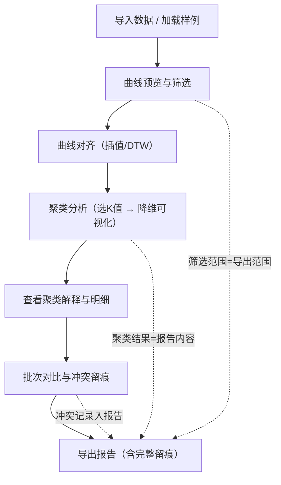

## 1. 产品概述

材料强度异常聚类分析工具，面向物理实验室研究人员，用于对拉伸测试后的异常曲线按断裂形态和设备批次进行分组聚类。解决手动分类效率低、批次混淆难追溯、异常判断无依据等问题，让实验人员能自主导入数据、查看聚类图表、点开明细、下载带完整留痕的分析报告。

- 目标用户：物理实验室材料测试研究人员
- 核心价值：将异常曲线聚类从"经验判断"升级为"数据驱动+留痕可追溯"

## 2. 核心功能

### 2.1 用户角色

| 角色 | 使用方式 | 核心权限 |
|------|----------|----------|
| 实验人员 | 无需注册，直接使用 | 导入数据、查看分析、导出报告 |

### 2.2 功能模块

1. **数据总览页**：数据导入、样例加载、曲线预览、筛选条件设置
2. **聚类分析页**：曲线对齐、聚类可视化、聚类解释、明细查看
3. **批次对比页**：批次分组对比、冲突留痕、报告导出

### 2.3 页面详情

| 页面名称 | 模块名称 | 功能描述 |
|----------|----------|----------|
| 数据总览页 | 数据导入区 | 支持CSV/Excel上传拉伸曲线数据，含样品批次和设备编号字段；提供样例数据一键加载 |
| 数据总览页 | 曲线预览区 | 上传后以缩略图方式展示全部曲线，高亮异常曲线，显示批次和设备标签 |
| 数据总览页 | 筛选面板 | 按批次、设备编号、异常类型筛选；筛选范围与导出范围保持一致 |
| 聚类分析页 | 曲线对齐区 | 对不同长度曲线进行归一化/重采样对齐，支持线性插值和动态时间规整(DTW)两种模式 |
| 聚类分析页 | 聚类图表区 | 以散点图(PCA/t-SNE降维)展示聚类结果，可切换K值，hover显示曲线缩略图 |
| 聚类分析页 | 聚类解释区 | 每个簇的统计摘要：平均断裂强度、典型形态描述、异常特征指标 |
| 聚类分析页 | 明细面板 | 点击某个簇或某条曲线，展开完整应力-应变曲线、批次信息、设备信息、冲突标注 |
| 批次对比页 | 批次分组表 | 按批次/设备分组汇总异常分布，组间对比柱状图 |
| 批次对比页 | 冲突留痕表 | 曲线形态与批次/设备标注矛盾时的冲突记录，含冲突类型、建议判断、原始数据 |
| 批次对比页 | 报告导出区 | 一键导出分析报告（含筛选条件、聚类结果、冲突记录、对齐参数、异常点标记） |

## 3. 核心流程

用户从导入数据开始，经过曲线对齐和聚类分析，到批次对比和冲突留痕，最后导出完整报告。关键约束：屏幕显示范围与导出范围必须一致。

## 4. 用户界面设计

### 4.1 设计风格

- 主色调：深钢蓝(#1B2A4A) + 琥珀橙(#E8913A)强调色，工业仪器风格
- 辅助色：冷灰(#3A4A5C)背景、浅蓝(#4A90D9)数据点、警告红(#D94A4A)异常标记
- 按钮风格：圆角4px，hover时微上移+阴影，主按钮钢蓝实色，次按钮描边
- 字体：JetBrains Mono用于数据/代码区域，Noto Sans SC用于中文正文
- 布局风格：左侧窄导航+右侧主内容区，图表区域占70%宽度，右侧面板30%
- 图标风格：线性图标，2px描边，与工业风一致

### 4.2 页面设计概览

| 页面名称 | 模块名称 | UI元素 |
|----------|----------|--------|
| 数据总览页 | 数据导入区 | 拖拽上传区域、样例按钮、上传进度条、字段映射提示 |
| 数据总览页 | 曲线预览区 | 多曲线缩略图网格、异常高亮边框、hover放大、批次/设备标签角标 |
| 数据总览页 | 筛选面板 | 多选下拉（批次/设备）、异常类型复选框、已选条件标签、结果计数 |
| 聚类分析页 | 曲线对齐区 | 对齐模式切换（插值/DTW）、对齐前后对比动画、参数滑块 |
| 聚类分析页 | 聚类图表区 | 散点图主图、K值滑块、簇颜色图例、hover缩略图弹窗 |
| 聚类分析页 | 聚类解释区 | 簇卡片列表、统计指标条形图、形态描述文字 |
| 聚类分析页 | 明细面板 | 侧滑面板、完整曲线图、元数据表、冲突标注徽章 |
| 批次对比页 | 批次分组表 | 分组汇总表、组间对比柱状图、异常占比饼图 |
| 批次对比页 | 冲突留痕表 | 冲突列表、冲突类型图标、建议判断标签、可展开原始数据 |
| 批次对比页 | 报告导出区 | 导出按钮（CSV/JSON）、范围提示（当前筛选条件）、导出预览 |

### 4.3 响应式设计

桌面优先设计，最小支持1280px宽度。在窄屏下右侧面板折叠为底部抽屉，图表保持可读性。

### 4.4 3D场景指引

不适用
