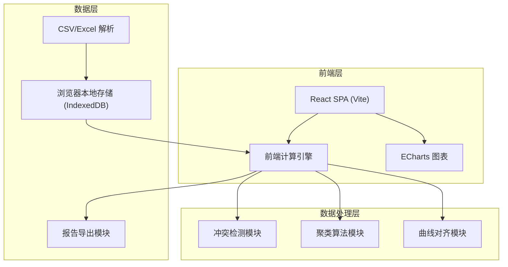
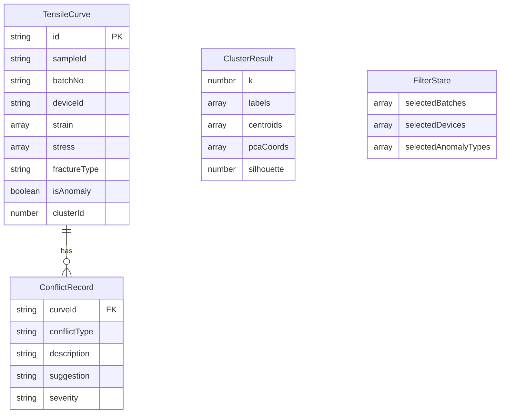

## 1. 架构设计



纯前端架构，所有计算在浏览器端完成，无需后端服务。

## 2. 技术说明

- 前端框架：React@18 + TypeScript + Vite
- 样式方案：Tailwind CSS@3
- 图表库：ECharts@5（散点图、折线图、柱状图、饼图）
- 数学计算：ml-matrix（PCA降维）、ml-kmeans（K-Means聚类）
- 曲线对齐：自定义实现线性插值 + 动态时间规整(DTW)
- 数据解析：PapaParse（CSV）、SheetJS（Excel）
- 数据存储：IndexedDB（Dexie.js）
- 报告导出：jsPDF（PDF报告）、SheetJS（CSV/Excel导出）
- 初始化工具：Vite

## 3. 路由定义

| 路由 | 用途 |
|------|------|
| / | 数据总览页：导入数据、曲线预览、筛选 |
| /cluster | 聚类分析页：对齐、聚类、明细 |
| /batch | 批次对比页：对比、冲突留痕、导出 |

## 4. API定义

无后端API。所有数据在浏览器本地处理。

### 4.1 核心数据类型

```typescript
interface TensileCurve {
  id: string
  sampleId: string
  batchNo: string
  deviceId: string
  strain: number[]
  stress: number[]
  fractureType?: string
  isAnomaly: boolean
  alignedStrain?: number[]
  alignedStress?: number[]
  clusterId?: number
}

interface ClusterResult {
  k: number
  labels: number[]
  centroids: number[][]
  pcaCoords: number[][]
  silhouette: number
  explanations: ClusterExplanation[]
}

interface ConflictRecord {
  curveId: string
  conflictType: 'batch_mismatch' | 'device_anomaly' | 'curve_batch_conflict'
  description: string
  curveJudgment: string
  metaJudgment: string
  suggestion: string
  severity: 'warning' | 'error'
}

interface AnalysisReport {
  filterState: FilterState
  curves: TensileCurve[]
  clusterResult: ClusterResult
  conflicts: ConflictRecord[]
  alignmentParams: AlignmentParams
  exportTime: string
}
```

## 5. 服务端架构图

不适用（纯前端应用）

## 6. 数据模型

### 6.1 数据模型定义



### 6.2 数据定义

应用使用IndexedDB持久化数据，无需SQL DDL。样例数据以内置JSON形式提供。
