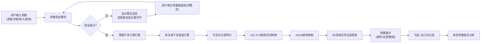

## 1. 产品概述

面向高中/大学物理教学的交互式3D薄膜干涉实验工作台，让学生通过调节薄膜厚度、折射率、入射角等参数，直观观察反射光颜色变化，理解薄膜干涉的物理原理。

- 解决传统教学中只能看静态示意图、无法直观感受参数变化对干涉结果影响的问题
- 目标用户：物理教师、中学生、大学理工科低年级学生
- 核心价值：将抽象的波动光学概念转化为可交互、可验证的可视化体验

## 2. 核心特性

### 2.1 用户角色
| 角色 | 注册方式 | 核心权限 |
|------|----------|----------|
| 教师用户 | 无需注册，直接使用 | 完整的实验参数调节、数据对比、结果导出 |
| 学生用户 | 无需注册，直接使用 | 参数调节、现象观察、预设实验加载 |

### 2.2 功能模块
1. **3D实验工作台**：薄膜结构可视化、光线传播路径动画、干涉结果实时渲染
2. **参数控制台**：薄膜厚度、折射率、入射角、波长范围、介质环境参数输入
3. **计算引擎**：多光束干涉计算、光谱积分、CIE颜色空间转换
4. **验证系统**：参数合法性检查、单位校验、物理边界条件约束
5. **结果面板**：反射光颜色展示、光谱曲线图、干涉级次分析
6. **对比实验室**：多组参数对比、差异量化分析
7. **版本追踪**：计算模型版本、参数来源记录、结果可追溯

### 2.3 页面详情
| 页面名称 | 模块名称 | 功能描述 |
|---------|----------|----------|
| 主工作台 | 3D场景区 | 薄膜分层结构展示、入射/反射光线路径、实时颜色渲染、鼠标拖拽旋转视角 |
| 主工作台 | 参数控制区 | 滑块+数值输入双模式、单位切换（度/弧度）、参数锁定/解锁 |
| 主工作台 | 计算结果区 | 反射色样展示、光谱曲线、干涉强度公式、关键计算数值 |
| 主工作台 | 验证提示区 | 参数警告、错误说明、影响分析、修正建议 |
| 对比实验室 | 参数对比区 | 最多4组参数并排对比、差异高亮、结果柱状图 |
| 版本信息 | 溯源面板 | 计算引擎版本、物理模型说明、引用来源、数据导出 |

## 3. 核心流程

## 4. 用户界面设计

### 4.1 设计风格
- **主色调**：深科技蓝 (#0A1929) 作为背景，搭配光谱渐变色作为强调色
- **辅助色**：光学红 (#FF4D4D)、干涉绿 (#4DFF9E)、薄膜蓝 (#4D9EFF)
- **按钮风格**：扁平+微立体边框，hover时有辉光效果，禁用状态半透明
- **字体**：展示字体用 Orbitron (科技感)，正文字体用 JetBrains Mono (等宽易读)
- **布局风格**：三栏不对称布局，左侧参数控制，中间3D主场景，右侧结果分析
- **视觉效果**：光线粒子效果、薄膜渐变透明、光谱彩虹渐变、数据可视化图表

### 4.2 页面设计概览
| 页面名称 | 模块名称 | UI元素 |
|---------|----------|--------|
| 主工作台 | 3D场景区 | 玻璃基板+薄膜层+空气层的分层3D模型，入射光/反射光动画光线，实时颜色渲染在薄膜表面，背景为星空粒子 |
| 主工作台 | 参数控制区 | 垂直排列的滑块组，每个滑块带数值输入框、单位切换按钮、物理范围提示 |
| 主工作台 | 结果区 | 大尺寸颜色样块、光谱曲线图（D3.js）、计算公式（KaTeX渲染）、关键数值卡片 |
| 主工作台 | 警告区 | 黄色/红色警告卡片，带感叹号图标，明确列出"影响的计算环节"和"建议修正值" |
| 对比实验室 | 对比区 | 横向可滚动卡片组，每组含参数摘要、颜色样块、差异百分比 |

### 4.3 响应式
- 桌面端优先（1280px+）：三栏完整布局
- 平板端（768-1279px）：上下布局，上半部分3D场景，下半部分标签页切换参数/结果
- 移动端（<768px）：单列布局，简化3D交互，保留核心计算功能

### 4.4 3D场景指引
- **环境**：深色科技风背景，微弱星空粒子，无HDRI（避免影响颜色观察）
- **光照**：三盏点光源模拟实验室环境，主光冷白色，补光蓝色调，确保薄膜颜色准确呈现
- **相机**：PerspectiveCamera，初始位置45度侧视角，支持OrbitControls拖拽旋转、滚轮缩放
- **构图**：薄膜模型位于场景中心，光线从左上方入射，反射光向右上方传播
- **交互**：鼠标悬停薄膜层显示厚度信息，点击参数自动聚焦到对应3D结构
- **动画**：光线沿路径流动动画，波长对应颜色，干涉相长/相消位置有光强闪烁
- **后处理**：Bloom效果增强光线辉光，轻微色差模拟真实光学现象，不做过度后处理保证颜色准确性
