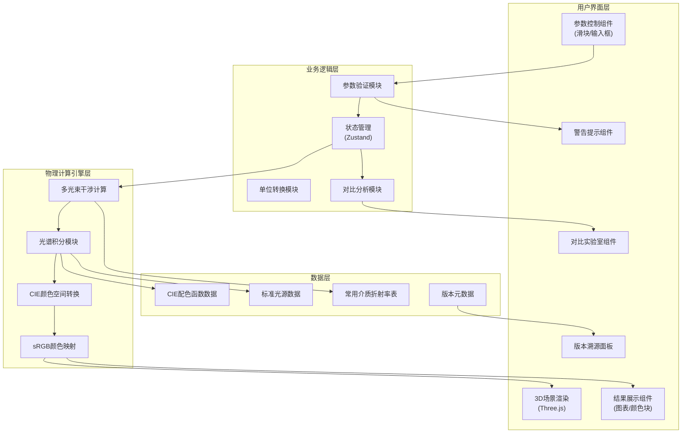

## 1. 架构设计



## 2. 技术描述

- **前端框架**: React@18 + TypeScript + Vite
- **3D渲染**: three@0.160 + @react-three/fiber@8.15 + @react-three/drei@9.92
- **后处理**: @react-three/postprocessing@2.15
- **状态管理**: zustand@4.4
- **图表**: recharts@2.10
- **数学公式**: react-katex@3.0
- **样式**: tailwindcss@3.4 + postcss
- **物理计算**: 原生TypeScript实现，无外部依赖
- **数据**: 内置CIE 1931配色函数、D65标准光源、常用介质折射率表

## 3. 路由定义

| 路由 | 页面组件 | 功能说明 |
|------|----------|----------|
| / | Workbench | 主工作台页面，包含3D场景、参数控制、结果展示 |
| /compare | CompareLab | 对比实验室，多组参数对比分析 |
| /about | About | 版本信息、计算模型说明、引用来源 |

## 4. 核心数据结构

```typescript
// 薄膜干涉计算参数
interface FilmParams {
  thickness: number;           // 薄膜厚度 (nm)
  refractiveIndex: number;     // 薄膜折射率
  incidentAngle: number;       // 入射角 (弧度)
  angleUnit: 'degree' | 'radian'; // 角度单位
  wavelengthRange: {           // 波长范围
    min: number;               // 最小波长 (nm)
    max: number;               // 最大波长 (nm)
  };
  substrateN: number;          // 基板折射率
  ambientN: number;            // 环境介质折射率
  polarization: 's' | 'p' | 'unpolarized'; // 偏振态
}

// 验证警告
interface ValidationWarning {
  id: string;
  level: 'error' | 'warning' | 'info';
  field: keyof FilmParams;
  message: string;
  affectedCalculations: string[];  // 受影响的计算环节
  suggestion: string;
}

// 计算结果
interface CalculationResult {
  params: FilmParams;
  spectrum: SpectrumPoint[];       // 光谱数据
  reflectedColor: RGB;             // 反射光颜色
  xyz: XYZ;                        // CIE-XYZ值
  dominantWavelength: number;      // 主波长
  colorTemperature: number;        // 相关色温
  interferenceOrder: number;       // 干涉级次
  opticalPathDiff: number;         // 光程差
  timestamp: number;
  engineVersion: string;
}

// 对比组
interface ComparisonGroup {
  id: string;
  name: string;
  params: FilmParams;
  result: CalculationResult;
  createdAt: number;
}

// 版本元数据
interface VersionMeta {
  engineVersion: string;
  modelName: string;
  modelDescription: string;
  references: Reference[];
  lastUpdated: string;
}

interface Reference {
  id: string;
  title: string;
  authors: string;
  year: number;
  source: string;
}
```

## 5. 物理计算模型说明

### 5.1 多光束干涉公式
采用菲涅耳系数的多光束干涉模型，考虑薄膜上下表面的多次反射：

$$
r = \frac{r_{12} + r_{23} e^{-i\delta}}{1 + r_{12} r_{23} e^{-i\delta}}
$$

其中相位差 $\delta = \frac{4\pi}{\lambda} n_2 d \cos\theta_2$

### 5.2 光谱积分
使用CIE 1931标准观察者配色函数 $\bar{x}(\lambda), \bar{y}(\lambda), \bar{z}(\lambda)$ 进行光谱积分：

$$
X = k \int_{\lambda_{min}}^{\lambda_{max}} S(\lambda) R(\lambda) \bar{x}(\lambda) d\lambda
$$
$$
Y = k \int_{\lambda_{min}}^{\lambda_{max}} S(\lambda) R(\lambda) \bar{y}(\lambda) d\lambda
$$
$$
Z = k \int_{\lambda_{min}}^{\lambda_{max}} S(\lambda) R(\lambda) \bar{z}(\lambda) d\lambda
$$

### 5.3 颜色映射
XYZ → sRGB 转换采用IEC 61966-2-1标准矩阵，并进行gamma校正。

## 6. 参数验证规则

| 参数 | 合法范围 | 错误影响 | 验证时机 |
|------|----------|----------|----------|
| 薄膜厚度 | 0-10000 nm | 超出范围导致干涉级次计算错误、相位差溢出 | 实时 |
| 折射率 | 1.0-5.0 | 全反射条件判断错误、菲涅耳系数计算失真 | 实时 |
| 入射角 | 0-89° (0-1.55 rad) | 90°时折射角计算发散、光程差公式失效 | 实时 |
| 波长范围 | 380-780 nm | 超出可见光范围导致颜色映射无意义 | 提交时 |
| 波长差 (max-min) | ≥50 nm | 范围过窄导致光谱积分结果不稳定 | 提交时 |

## 7. 性能优化策略

1. **计算节流**: 参数拖拽时使用requestAnimationFrame节流，避免高频重复计算
2. **光谱采样**: 默认5nm步长，高精度模式下1nm步长
3. **Web Worker**: 将干涉计算和光谱积分移至Web Worker，避免阻塞UI
4. **3D场景优化**: 薄膜使用InstancedMesh，光线使用LineSegments，动态LOD
5. **状态持久化**: 参数配置自动保存至localStorage，支持刷新恢复

## 8. 版本追踪机制

- 计算引擎版本号遵循语义化版本 (MAJOR.MINOR.PATCH)
- 每次计算结果携带engineVersion字段
- 版本更新日志记录物理模型修改和计算精度变化
- 提供"结果复现"功能：输入历史参数和引擎版本，重现旧版计算结果
