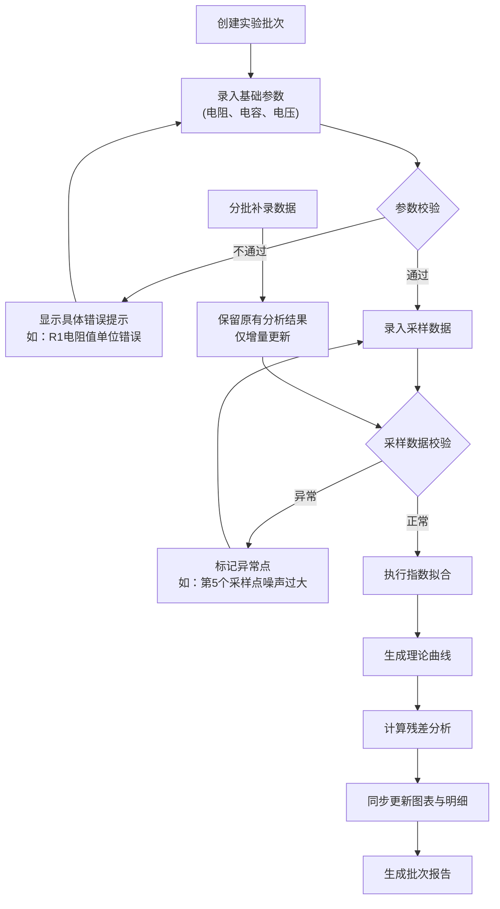
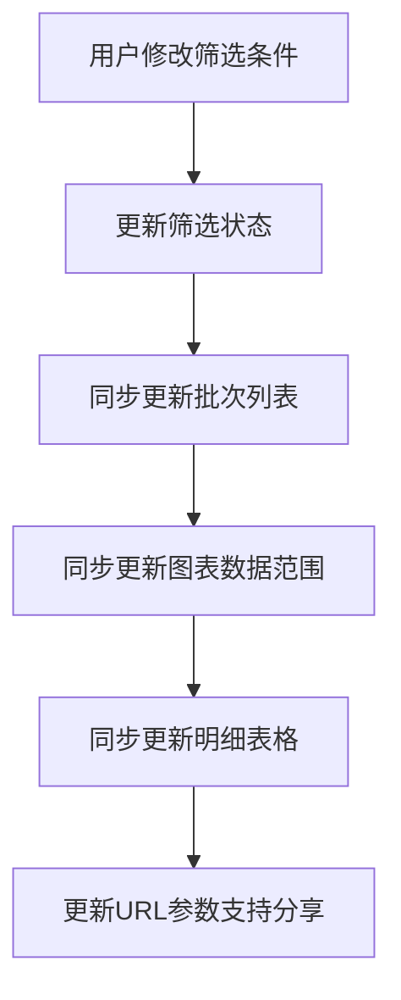

## 1. 产品概述

RC电路充放电记录系统是面向电子课师生的实验数据分析工具，解决实验数据与理论曲线对比、分批数据录入、参数校验和批次报告生成等核心问题。通过将实验数据采集、指数拟合、残差分析、历史追溯等功能一体化，帮助师生高效完成RC电路实验的数据分析与报告输出。

## 2. 核心功能

### 2.1 用户角色
| 角色 | 使用场景 | 核心需求 |
|------|----------|----------|
| 学生 | 记录实验数据、分析拟合结果、生成实验报告 | 数据录入便捷、错误提示清晰、图表直观、报告自动生成 |
| 教师 | 检查学生实验数据、对比多批次结果、验证实验正确性 | 数据可追溯、参数校验严格、批次区分明确 |

### 2.2 功能模块
1. **批次管理页**：实验批次列表、批次筛选、新建/编辑批次
2. **数据录入页**：基础参数录入、采样数据录入、分批补录支持、实时校验
3. **数据分析页**：实验曲线+理论曲线对比图、残差分析图、指数拟合参数、参数校验结果
4. **历史记录页**：修改历史追溯、人工修改标记、数据版本对比
5. **报告导出页**：批次化报告生成、预览、下载

### 2.3 页面详情
| 页面名称 | 模块名称 | 功能描述 |
|-----------|-------------|---------------------|
| 批次管理 | 批次列表 | 展示所有实验批次，支持按日期、学生、电阻/电容规格筛选 |
| 批次管理 | 批次卡片 | 显示批次编号、关键参数、完成状态、最近修改时间 |
| 数据录入 | 基础参数区 | 电阻值、电容值、初始电压、电源电压、时间单位选择 |
| 数据录入 | 采样数据表 | 时间-电压采样点录入，支持批量导入、手动编辑 |
| 数据录入 | 分批补录区 | 区分已录入/待补录字段，补录时保留原有分析结果 |
| 数据录入 | 实时校验区 | 即时显示参数错误、数据异常，提示具体到材料/对象 |
| 数据分析 | 拟合曲线图 | 实验数据点、理论拟合曲线、置信区间同图展示 |
| 数据分析 | 残差分析图 | 显示拟合残差分布，标记异常采样点 |
| 数据分析 | 参数分析区 | 展示时间常数τ、拟合优度R²、各参数对结果的影响权重 |
| 历史记录 | 修改时间线 | 按时间顺序展示所有修改，标记人工修改与自动计算 |
| 历史记录 | 版本对比 | 支持两个版本的数据和分析结果对比 |
| 报告导出 | 报告预览 | 在线预览包含批次信息的完整报告 |
| 报告导出 | 批量导出 | 支持单批次或多批次报告打包下载 |

## 3. 核心流程

### 3.1 实验数据处理主流程

### 3.2 筛选同步流程

## 4. 用户界面设计

### 4.1 设计风格
- **主色调**：科技蓝 #165DFF，代表电子工程的专业感
- **辅助色**：警示橙 #FF7D00（数据警告）、成功绿 #00B42A（校验通过）、错误红 #F53F3F（严重错误）
- **中性色**：深灰 #1D2129、中灰 #4E5969、浅灰 #C9CDD4、背景 #F2F3F5
- **字体**：标题使用 Space Grotesk，正文使用 Inter，数字使用 JetBrains Mono
- **按钮风格**：圆角 6px，轻微阴影，hover 状态有微妙缩放和颜色加深
- **布局风格**：卡片式布局，清晰的信息层级，左侧导航+右侧内容区
- **图标风格**：线性图标，统一 24px 尺寸，颜色与语义匹配

### 4.2 页面设计概述
| 页面名称 | 模块名称 | UI元素 |
|-----------|-------------|-------------|
| 批次管理 | 顶部筛选栏 | 下拉选择器、日期范围、搜索框、重置按钮 |
| 批次管理 | 批次卡片网格 | 卡片阴影、状态标签、关键参数预览、操作按钮 |
| 数据录入 | 参数表单 | 分组字段集、单位下拉、实时校验图标、错误提示气泡 |
| 数据录入 | 数据表格 | 可编辑单元格、异常行高亮、批量操作工具栏 |
| 数据分析 | 主图表区 | 双Y轴图表、图例交互、数据点悬浮提示、缩放控制 |
| 数据分析 | 残差图 | 小型图表、异常点红色标记、基准线高亮 |
| 数据分析 | 参数面板 | 卡片式参数展示、影响度热力条、公式显示区 |
| 历史记录 | 时间线 | 垂直时间线、修改人标签、修改内容对比、人工修改星标 |
| 报告导出 | 预览区 | 报告缩略图、页码导航、打印样式预览 |

### 4.3 响应式设计
- **桌面端（≥1280px）**：三栏布局（导航+参数区+图表区），充分利用横向空间
- **平板端（768px-1279px）**：两栏布局，图表区域自适应
- **移动端（<768px）**：单栏堆叠，标签页切换不同功能区，表格支持横向滚动

### 4.4 数据可视化设计
- **主图表**：实验点用蓝色圆点，理论曲线用橙色实线，95%置信区间用半透明橙色填充
- **残差图**：残差用柱状图，零基准线用虚线，超过±2σ的点用红色高亮
- **参数影响度**：水平条形图，颜色从绿色（影响小）渐变到红色（影响大）
- **动画效果**：曲线绘制有渐进动画，数据筛选有平滑过渡，错误提示有轻微抖动效果

## 5. 关键业务规则

### 5.1 分批数据录入规则
- 电阻、电容、电压采样可分别在不同时间录入
- 已完成的分析结果在补录时不会被自动覆盖，标记为"待更新"
- 用户可选择"使用新数据重新分析"或"保留原有分析"
- 每次补录都会在历史记录中生成一条变更记录

### 5.2 参数校验规则
- **时间单位错误**：检测到采样间隔与时间单位不匹配时，提示"第3-8个采样点时间单位可能错误，建议检查是否将ms误写为s"
- **初始电压漏填**：提示"请填写初始电压V₀，当前使用默认值0V可能导致拟合偏差"
- **采样噪声过大**：计算相邻点电压变化率，超过阈值时提示"第12个采样点噪声过大（ΔV=0.85V），建议检查接线或重新测量"
- **所有错误提示必须包含具体的材料标识（如R1、C2）或数据位置（如第5个采样点）**

### 5.3 批次报告规则
- 文件名格式：`RC实验报告_{学生姓名}_{批次编号}_{日期}.pdf`
- 报告页眉必须包含：批次编号、实验日期、学生姓名、电阻/电容规格
- 报告内容包含：实验参数表、拟合曲线图、残差图、拟合参数表、历史修改记录
- 批次编号格式：`RC-{年月日}-{序号}`，如 `RC-20240530-003`

### 5.4 历史记录规则
- 所有字段修改都记录：修改前值、修改后值、修改时间、修改人
- 人工修改与系统自动计算用不同图标区分
- 支持撤销到任意历史版本
- 导出报告时自动包含最近5条关键修改记录
