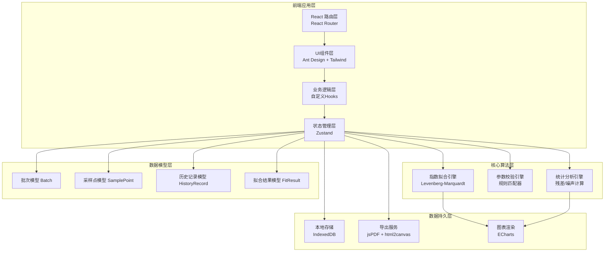
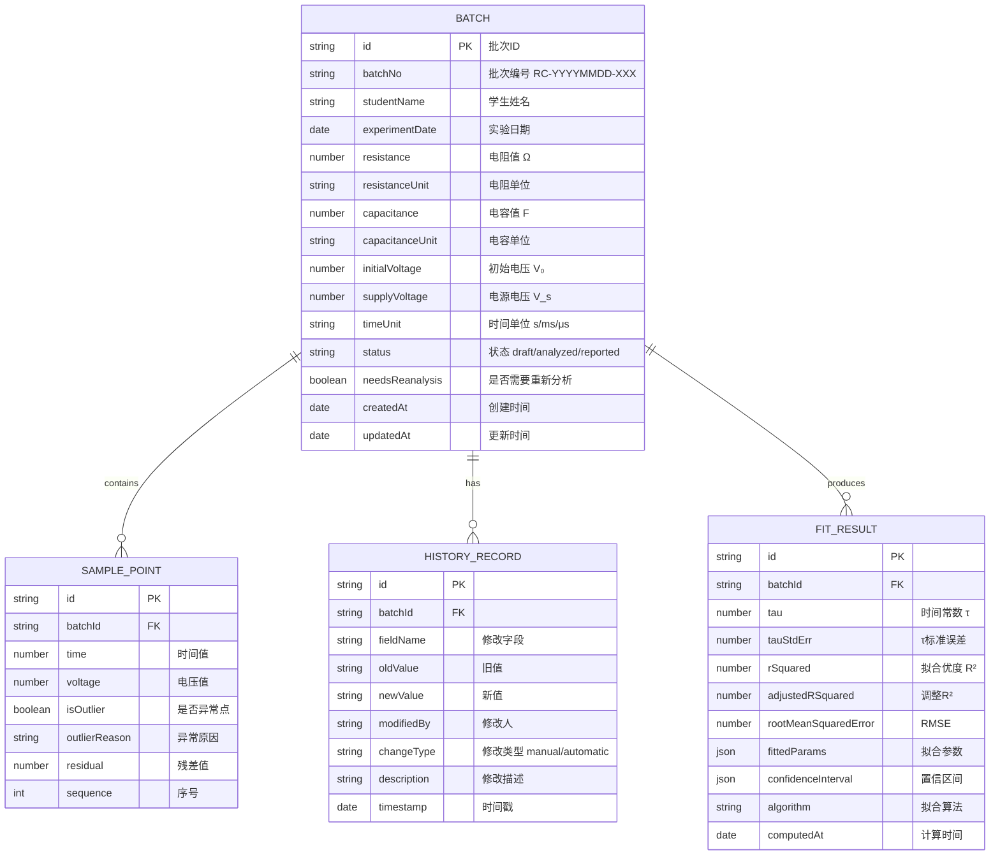

## 1. 架构设计



## 2. 技术描述

- **前端框架**：React@18 + TypeScript@5
- **构建工具**：Vite@5
- **样式方案**：Tailwind CSS@3 + Ant Design@5
- **状态管理**：Zustand@4（轻量级，避免Redux繁琐）
- **路由**：React Router@6
- **图表库**：ECharts@5（功能强大，支持复杂图表交互）
- **数值计算**：math.js（矩阵运算、最小二乘法）
- **数据导出**：jsPDF + html2canvas（PDF报告生成）
- **本地存储**：IndexedDB（存储大量实验数据）
- **表单处理**：react-hook-form@7 + zod（表单验证）
- **日期处理**：dayjs
- **图标**：@ant-design/icons

## 3. 路由定义

| 路由 | 页面组件 | 用途 |
|-------|---------|------|
| / | Redirect to /batches | 首页重定向 |
| /batches | BatchListPage | 批次列表管理页 |
| /batches/:id | BatchDetailPage | 批次详情（数据录入+分析） |
| /batches/:id/data | DataEntryPage | 数据录入页 |
| /batches/:id/analysis | AnalysisPage | 数据分析页 |
| /batches/:id/history | HistoryPage | 历史记录页 |
| /batches/:id/report | ReportPage | 报告预览导出页 |

## 4. 数据模型

### 4.1 数据模型定义



### 4.2 TypeScript 类型定义

```typescript
// 批次状态
type BatchStatus = 'draft' | 'analyzed' | 'reported';

// 修改类型
type ChangeType = 'manual' | 'automatic';

// 时间单位
type TimeUnit = 's' | 'ms' | 'μs';

// 电阻单位
type ResistanceUnit = 'Ω' | 'kΩ' | 'MΩ';

// 电容单位
type CapacitanceUnit = 'F' | 'μF' | 'nF' | 'pF';

// 批次模型
interface Batch {
  id: string;
  batchNo: string;
  studentName: string;
  experimentDate: string;
  resistance: number | null;
  resistanceUnit: ResistanceUnit;
  capacitance: number | null;
  capacitanceUnit: CapacitanceUnit;
  initialVoltage: number | null;
  supplyVoltage: number | null;
  timeUnit: TimeUnit;
  status: BatchStatus;
  needsReanalysis: boolean;
  createdAt: string;
  updatedAt: string;
}

// 采样点模型
interface SamplePoint {
  id: string;
  batchId: string;
  time: number;
  voltage: number;
  isOutlier: boolean;
  outlierReason: string | null;
  residual: number | null;
  sequence: number;
}

// 历史记录模型
interface HistoryRecord {
  id: string;
  batchId: string;
  fieldName: string;
  oldValue: string | null;
  newValue: string | null;
  modifiedBy: string;
  changeType: ChangeType;
  description: string;
  timestamp: string;
  version: number;
}

// 拟合结果模型
interface FitResult {
  id: string;
  batchId: string;
  tau: number;
  tauStdErr: number;
  rSquared: number;
  adjustedRSquared: number;
  rootMeanSquaredError: number;
  fittedParams: {
    V0: number;
    Vs: number;
    tau: number;
  };
  confidenceInterval: {
    lower: number[];
    upper: number[];
  };
  algorithm: string;
  computedAt: string;
  dataVersion: number;
}

// 校验错误
interface ValidationError {
  id: string;
  field: string;
  severity: 'error' | 'warning';
  message: string;
  target: string; // 具体到材料或对象，如 "R1"、"第5个采样点"
  suggestion: string;
}

// 筛选条件
interface FilterCriteria {
  dateRange: [string, string] | null;
  studentName: string | null;
  resistanceRange: [number, number] | null;
  capacitanceRange: [number, number] | null;
  status: BatchStatus | null;
}
```

## 5. 核心算法设计

### 5.1 指数拟合算法（Levenberg-Marquardt）

```typescript
// RC充电曲线: V(t) = Vs + (V0 - Vs) * exp(-t/τ)
// RC放电曲线: V(t) = V0 * exp(-t/τ)

interface FitOptions {
  mode: 'charge' | 'discharge';
  maxIterations: number;
  tolerance: number;
}

function exponentialFit(
  points: SamplePoint[],
  options: FitOptions
): FitResult {
  // 1. 数据预处理：单位转换、异常点过滤
  // 2. 初始参数估计（线性化方法）
  // 3. L-M 迭代优化
  // 4. 计算拟合优度和置信区间
  // 5. 返回拟合结果
}
```

### 5.2 参数校验规则引擎

```typescript
interface ValidationRule {
  id: string;
  name: string;
  severity: 'error' | 'warning';
  check: (batch: Batch, points: SamplePoint[]) => ValidationError | null;
}

const validationRules: ValidationRule[] = [
  {
    id: 'time-unit-mismatch',
    name: '时间单位错误检测',
    severity: 'warning',
    check: (batch, points) => {
      // 分析采样间隔分布，判断是否与所选单位匹配
    }
  },
  {
    id: 'initial-voltage-missing',
    name: '初始电压缺失',
    severity: 'error',
    check: (batch) => {
      if (batch.initialVoltage === null) {
        return {
          field: 'initialVoltage',
          severity: 'error',
          message: '初始电压V₀未填写',
          target: 'V₀',
          suggestion: '请在参数区填写初始电压值'
        };
      }
      return null;
    }
  },
  {
    id: 'sampling-noise',
    name: '采样噪声检测',
    severity: 'warning',
    check: (batch, points) => {
      // 计算相邻点电压变化率，超过阈值标记
    }
  }
];
```

### 5.3 残差分析算法

```typescript
function calculateResiduals(
  points: SamplePoint[],
  fitResult: FitResult,
  mode: 'charge' | 'discharge'
): SamplePoint[] {
  return points.map((point, index) => {
    const { V0, Vs, tau } = fitResult.fittedParams;
    const t = point.time;
    let predictedVoltage: number;
    
    if (mode === 'charge') {
      predictedVoltage = Vs + (V0 - Vs) * Math.exp(-t / tau);
    } else {
      predictedVoltage = V0 * Math.exp(-t / tau);
    }
    
    const residual = point.voltage - predictedVoltage;
    const isOutlier = Math.abs(residual) > 2 * fitResult.rootMeanSquaredError;
    
    return {
      ...point,
      residual,
      isOutlier,
      outlierReason: isOutlier ? '残差超过2σ' : null
    };
  });
}
```

## 6. 状态管理设计

### 6.1 Batch Store (Zustand)

```typescript
interface BatchState {
  // 数据
  batches: Batch[];
  currentBatch: Batch | null;
  samplePoints: SamplePoint[];
  fitResult: FitResult | null;
  historyRecords: HistoryRecord[];
  validationErrors: ValidationError[];
  
  // 筛选状态
  filters: FilterCriteria;
  
  // UI状态
  loading: boolean;
  activeTab: 'data' | 'analysis' | 'history' | 'report';
  showOutliers: boolean;
  fitMode: 'charge' | 'discharge';
  
  // Actions
  setCurrentBatch: (id: string) => Promise<void>;
  updateBatch: (updates: Partial<Batch>, manual: boolean) => void;
  addSamplePoints: (points: Omit<SamplePoint, 'id'>[]) => void;
  updateSamplePoint: (id: string, updates: Partial<SamplePoint>) => void;
  runValidation: () => void;
  runFit: () => Promise<void>;
  applyFilters: (filters: Partial<FilterCriteria>) => void;
  resetFilters: () => void;
  generateReport: () => Promise<Blob>;
  revertToVersion: (version: number) => void;
}
```

### 6.2 筛选同步机制

```typescript
// 筛选条件变化时，自动同步更新：
// 1. 批次列表
// 2. 图表数据范围
// 3. 明细表格
// 4. URL参数

const useFilterSync = () => {
  const filters = useBatchStore(state => state.filters);
  const applyFilters = useBatchStore(state => state.applyFilters);
  
  // URL参数同步
  useEffect(() => {
    const params = new URLSearchParams();
    Object.entries(filters).forEach(([key, value]) => {
      if (value !== null) {
        params.set(key, JSON.stringify(value));
      }
    });
    window.history.replaceState({}, '', `?${params.toString()}`);
  }, [filters]);
  
  return { filters, applyFilters };
};
```

## 7. 项目目录结构

```
src/
├── components/          # 可复用组件
│   ├── common/         # 通用组件（Button, Card, Modal等）
│   ├── charts/         # 图表组件（FitChart, ResidualChart等）
│   ├── forms/          # 表单组件（ParameterForm, SampleTable等）
│   └── layout/         # 布局组件（Sidebar, Header等）
├── pages/              # 页面组件
│   ├── BatchListPage/
│   ├── BatchDetailPage/
│   ├── DataEntryPage/
│   ├── AnalysisPage/
│   ├── HistoryPage/
│   └── ReportPage/
├── store/              # 状态管理
│   └── useBatchStore.ts
├── hooks/              # 自定义Hooks
│   ├── useExponentialFit.ts
│   ├── useValidation.ts
│   ├── useFilterSync.ts
│   └── useHistory.ts
├── utils/              # 工具函数
│   ├── fitting/        # 拟合算法
│   ├── validation/     # 校验规则
│   ├── statistics/     # 统计计算
│   ├── units.ts        # 单位转换
│   └── report.ts       # 报告生成
├── types/              # TypeScript类型定义
│   └── index.ts
├── data/               # Mock数据
│   └── mockBatches.ts
├── App.tsx
├── main.tsx
└── index.css
```

## 8. 关键性能优化点

1. **大数据量采样点**：使用虚拟滚动（react-window）处理上千条采样数据
2. **拟合计算**：使用 Web Worker 在后台线程执行L-M算法，避免UI阻塞
3. **图表渲染**：ECharts 启用大数据模式，采样点超过1000时启用降采样
4. **状态更新**：Zustand 采用选择器模式，避免不必要的重渲染
5. **历史记录**：使用增量存储，只记录变更而非全量快照
