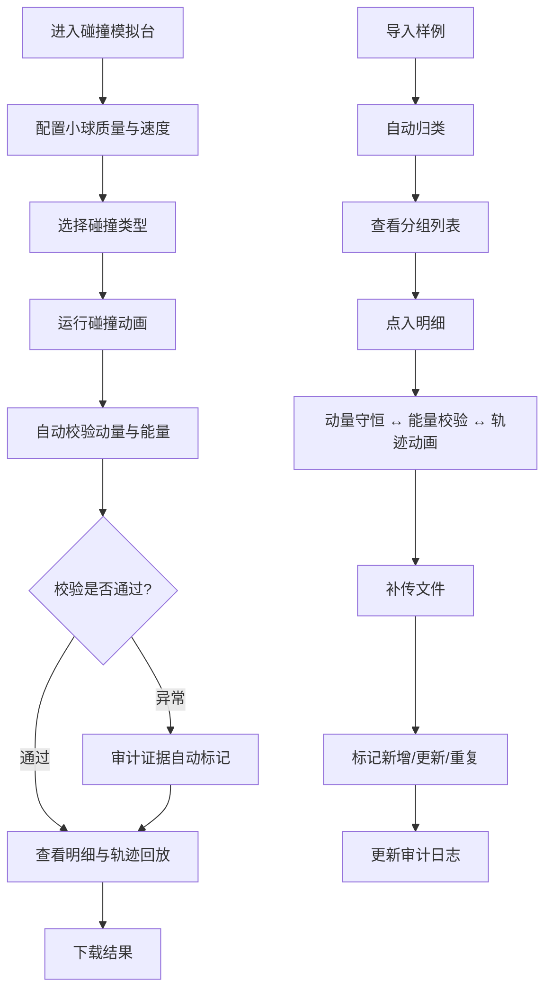

## 1. 产品概述

"多球碰撞能量台"是一款面向物理实验课的交互式碰撞模拟与数据管理工具。学生通过拖拽设置小球质量与初速度，实时观察碰撞过程并验证动量守恒与能量守恒；教师与同事可导入实验样例、查看图表、点入明细、下载结果，系统自动按质量/速度/碰撞类型等线索归并同一实验，并在零质量、能量增加、碰撞顺序覆盖等高风险环节保留审计证据，补传时清晰区分更新与重复提交。

- 目标用户：物理实验课学生、实验教师、教研组同事
- 核心价值：让碰撞实验从"凭印象"变为"有证据"，确保动量守恒、能量校验、轨迹动画三者不断链

## 2. 核心功能

### 2.1 用户角色

| 角色 | 使用方式 | 核心权限 |
|------|----------|----------|
| 学生 | 无需注册，直接使用 | 运行碰撞模拟、查看图表、下载个人实验结果 |
| 教师 | 无需注册，导入样例管理 | 导入/补传样例、查看审计证据、下载汇总结果 |

### 2.2 功能模块

1. **碰撞模拟台**：交互式 Canvas 碰撞动画，拖拽设置小球质量与速度，选择碰撞类型（弹性/非弹性/完全非弹性），实时计算并展示碰撞前后动量与能量
2. **样例管理中心**：导入 JSON/CSV 样例，按质量区间/速度范围/碰撞类型自动归类，支持补传去重与更新标记
3. **数据明细面板**：从摘要点入可查看动量守恒校验、能量校验、轨迹动画回放，三者双向链接不断链
4. **审计证据链**：自动标记质量为零、能量增加异常、碰撞顺序被覆盖等风险点，保留操作日志不可篡改
5. **结果下载**：导出单次实验或汇总报告（JSON/CSV），包含完整校验数据与审计记录

### 2.3 页面详情

| 页面名称 | 模块名称 | 功能描述 |
|----------|----------|----------|
| 碰撞模拟台 | 小球配置区 | 拖拽滑块设置 1-5 个小球的质量（0-20kg）与初速度（-20~20 m/s），选择碰撞类型 |
| 碰撞模拟台 | 动画播放区 | Canvas 实时渲染碰撞过程，支持播放/暂停/逐帧/回放 |
| 碰撞模拟台 | 实时数据区 | 碰撞前后动量与能量的数值对比，守恒校验状态指示（✓/✗） |
| 样例管理 | 导入面板 | 拖拽或点击导入 JSON/CSV 样例文件，解析并预览 |
| 样例管理 | 归类列表 | 按质量区间+速度范围+碰撞类型自动分组，展示组内样例数量 |
| 样例管理 | 补传对比 | 补传后标记"新增"/"更新"/"重复"，更新项高亮变更字段 |
| 数据明细 | 动量守恒卡 | 碰撞前后总动量对比，偏差百分比，守恒判定 |
| 数据明细 | 能量校验卡 | 碰撞前后总动能对比，损失/增加量，异常标记 |
| 数据明细 | 轨迹动画卡 | 碰撞全程轨迹回放，可定位到任意帧查看瞬时数据 |
| 审计证据 | 风险标记列表 | 列出所有风险项（零质量/能量增加/顺序覆盖），点击跳转明细 |
| 审计证据 | 操作日志 | 不可篡改的操作时间线，记录参数变更与补传动作 |
| 结果下载 | 导出面板 | 选择导出范围（单次/汇总）与格式（JSON/CSV），包含校验与审计数据 |

## 3. 核心流程

### 3.1 学生碰撞实验流程
1. 进入碰撞模拟台 → 添加小球并拖拽设置质量与速度 → 选择碰撞类型
2. 点击"开始碰撞" → Canvas 播放碰撞动画 → 实时显示动量与能量数值
3. 碰撞结束 → 自动校验动量守恒与能量守恒 → 结果卡片显示 ✓/✗
4. 点击结果卡片 → 进入数据明细面板 → 查看动量守恒/能量校验/轨迹动画
5. 下载本次实验结果

### 3.2 教师样例管理流程
1. 导入样例文件 → 系统解析并按质量/速度/碰撞类型归类
2. 查看归类列表 → 点击某组 → 查看组内样例明细
3. 补传新文件 → 系统自动比对，标记"新增"/"更新"/"重复"
4. 查看审计证据 → 风险标记列表 → 点入明细查看具体异常
5. 下载汇总报告

### 3.3 流程图

## 4. 用户界面设计

### 4.1 设计风格

- **主色调**：深蓝黑（#0A0E1A）为底，配合物理实验的科技感；碰撞能量用亮橙（#FF6B35）与电青（#00E5FF）双色系
- **辅助色**：守恒通过用翠绿（#00E676），异常警告用琥珀（#FFD600），严重风险用品红（#FF1744）
- **按钮风格**：圆角矩形，微凸 3D 感（box-shadow 模拟），hover 时发光
- **字体**：标题用 Orbitron（科技感显示字体），正文用 Noto Sans SC（中文可读性）
- **布局**：左侧模拟区 + 右侧数据面板的经典双栏布局，样例管理为全宽卡片网格
- **图标风格**：线性+微发光，科技仪表盘风格

### 4.2 页面设计概览

| 页面名称 | 模块名称 | UI 元素 |
|----------|----------|----------|
| 碰撞模拟台 | 小球配置区 | 深色卡片，圆形小球图标+滑块，Orbitron 数值显示 |
| 碰撞模拟台 | 动画播放区 | 深色 Canvas 画布，网格背景，发光小球轨迹 |
| 碰撞模拟台 | 实时数据区 | 荧光数字卡片，✓/✗ 图标带颜色脉冲动画 |
| 样例管理 | 导入面板 | 虚线拖拽区，扫描线动画反馈 |
| 样例管理 | 归类列表 | 分组卡片，标签色带，数量徽章 |
| 样例管理 | 补传对比 | 三色标记（新增绿/更新橙/重复灰），字段变更 diff 高亮 |
| 数据明细 | 动量守恒卡 | 数值对比条形图，守恒偏差百分比环图 |
| 数据明细 | 能量校验卡 | 能量柱状图，异常项红色闪烁边框 |
| 数据明细 | 轨迹动画卡 | 迷你 Canvas 轨迹回放，时间轴滑块 |
| 审计证据 | 风险标记列表 | 红色边框卡片，严重程度标签，点击链接到明细 |
| 审计证据 | 操作日志 | 时间轴样式，不可编辑，操作类型图标 |
| 结果下载 | 导出面板 | 格式选择卡片，范围开关按钮 |

### 4.3 响应式设计

- 桌面优先设计，1920px 为基准宽度
- 1280px 以下双栏变为单栏堆叠
- 触控优化：滑块支持触摸拖拽，Canvas 支持手势缩放

### 4.4 动画与微交互

- 小球碰撞时产生粒子爆散效果
- 守恒校验通过时卡片发出绿色脉冲
- 异常标记出现时边框红色闪烁
- 轨迹回放时小球带拖尾发光效果
- 导入解析时扫描线动画
- 补传对比时变更字段高亮渐入
