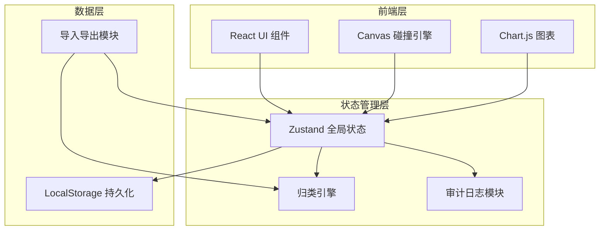
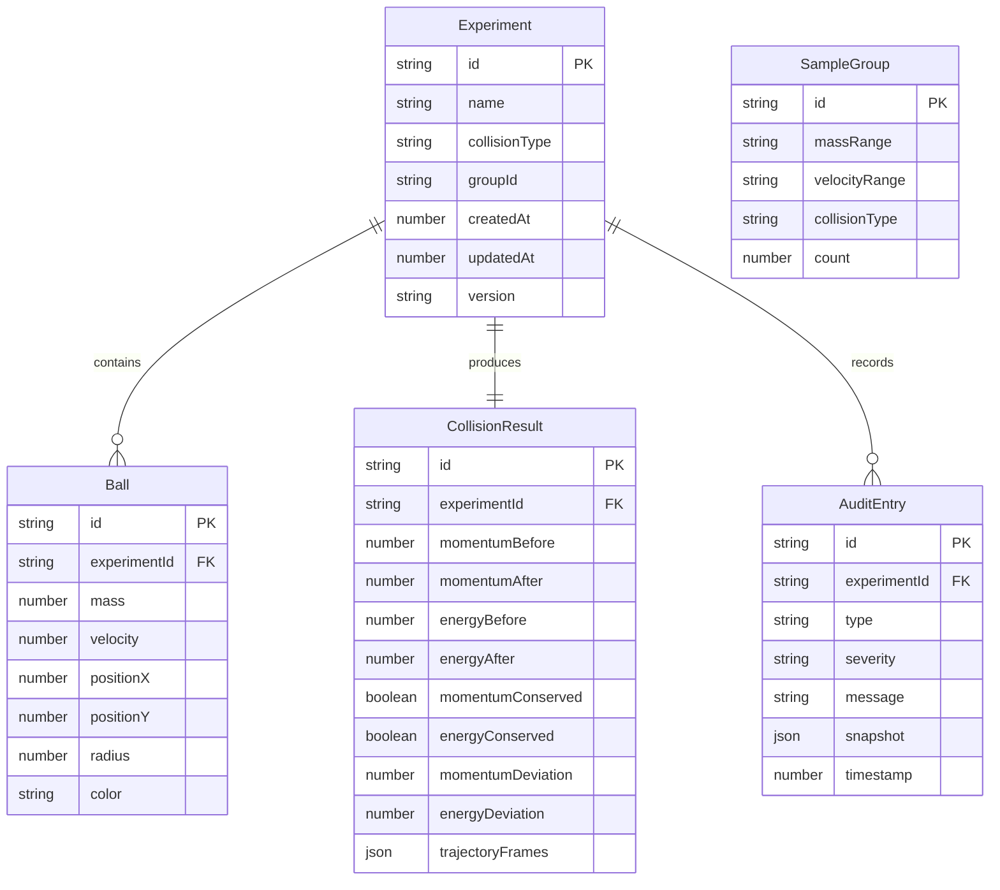

## 1. 架构设计



纯前端应用，无需后端服务。所有数据存储在浏览器 LocalStorage，导入导出通过文件系统完成。

## 2. 技术说明

- **前端框架**：React@18 + TypeScript
- **样式方案**：Tailwind CSS@3
- **构建工具**：Vite
- **碰撞引擎**：自实现 2D 弹性/非弹性碰撞物理引擎（基于动量守恒与能量守恒公式）
- **图表库**：Chart.js（动量/能量柱状图、偏差环图）
- **动画**：Canvas 2D API + requestAnimationFrame
- **状态管理**：Zustand（轻量、无 boilerplate）
- **持久化**：LocalStorage（实验数据、样例库、审计日志）
- **导入导出**：原生 File API + PapaParse（CSV 解析）
- **无后端**：所有计算在客户端完成

## 3. 路由定义

| 路由 | 用途 |
|------|------|
| `/` | 碰撞模拟台主页面 |
| `/samples` | 样例管理中心 |
| `/detail/:id` | 数据明细面板（动量守恒/能量校验/轨迹动画） |
| `/audit` | 审计证据链页面 |

## 4. 数据模型

### 4.1 数据模型定义



### 4.2 数据定义

#### Experiment（实验记录）
```typescript
interface Experiment {
  id: string;
  name: string;
  collisionType: "elastic" | "inelastic" | "perfectly_inelastic";
  groupId: string;
  balls: Ball[];
  result: CollisionResult;
  auditLog: AuditEntry[];
  createdAt: number;
  updatedAt: number;
  version: number;
  importBatchId?: string;
  previousVersionId?: string;
}
```

#### Ball（小球）
```typescript
interface Ball {
  id: string;
  mass: number;
  velocity: number;
  positionX: number;
  positionY: number;
  radius: number;
  color: string;
}
```

#### CollisionResult（碰撞结果）
```typescript
interface CollisionResult {
  momentumBefore: number;
  momentumAfter: number;
  energyBefore: number;
  energyAfter: number;
  momentumConserved: boolean;
  energyConserved: boolean;
  momentumDeviation: number;
  energyDeviation: number;
  trajectoryFrames: TrajectoryFrame[];
}
```

#### TrajectoryFrame（轨迹帧）
```typescript
interface TrajectoryFrame {
  timestamp: number;
  balls: { id: string; x: number; y: number; vx: number; vy: number }[];
}
```

#### AuditEntry（审计条目）
```typescript
interface AuditEntry {
  id: string;
  type: "zero_mass" | "energy_increase" | "sequence_overwrite" | "import" | "reupload" | "parameter_change";
  severity: "info" | "warning" | "critical";
  message: string;
  snapshot: Record<string, unknown>;
  timestamp: number;
}
```

#### SampleGroup（样例分组）
```typescript
interface SampleGroup {
  id: string;
  massRange: string;
  velocityRange: string;
  collisionType: string;
  experimentIds: string[];
}
```

#### ImportBatch（导入批次）
```typescript
interface ImportBatch {
  id: string;
  timestamp: number;
  experiments: ImportItem[];
}

interface ImportItem {
  experimentId: string;
  status: "new" | "updated" | "duplicate";
  changedFields?: string[];
  previousVersionId?: string;
}
```

## 5. 碰撞物理引擎核心算法

### 弹性碰撞
```
v1' = ((m1 - m2) * v1 + 2 * m2 * v2) / (m1 + m2)
v2' = ((m2 - m1) * v2 + 2 * m1 * v1) / (m1 + m2)
```

### 完全非弹性碰撞
```
v' = (m1 * v1 + m2 * v2) / (m1 + m2)
```

### 非弹性碰撞（恢复系数 e）
```
v1' = ((m1 - e * m2) * v1 + (1 + e) * m2 * v2) / (m1 + m2)
v2' = ((m2 - e * m1) * v2 + (1 + e) * m1 * v1) / (m1 + m2)
```

## 6. 归类引擎规则

1. **质量区间**：[0,2), [2,5), [5,10), [10,20] kg
2. **速度范围**：低速[-5,5], 中速(5,10]∪[-10,-5), 高速(10,20]∪[-20,-10) m/s
3. **碰撞类型**：elastic / inelastic / perfectly_inelastic
4. 三个维度组合生成 groupId，相同 groupId 的实验归入同一组
5. 补传时按 groupId + 球数 + 参数近似度判断：参数完全一致为"重复"，groupId 相同但参数有变为"更新"，groupId 不同为"新增"
