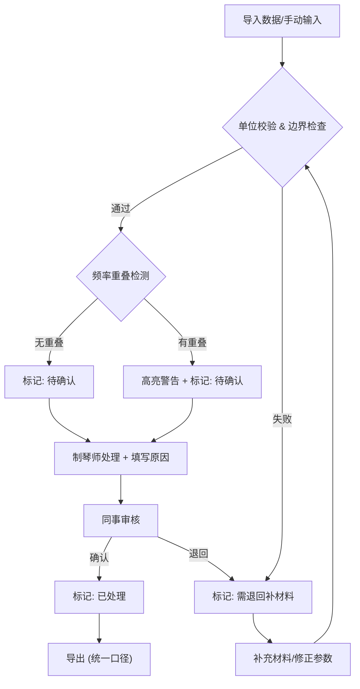

## 1. 产品概述

吉他共鸣箱模态分析工具，面向乐器制作师，用于比较箱体尺寸、音孔参数和木材属性对共鸣特性的影响。核心解决三个问题：跨单位参数统一、频率峰重叠检测与报告一致性、全流程可追溯的参数链路。目标用户为需要科学化调整吉他面板的制琴师和小型乐器工坊。

## 2. 核心功能

### 2.1 用户角色

| 角色 | 说明 | 核心权限 |
|------|------|----------|
| 制琴师 | 主要操作者 | 导入/处理/导出模态数据，管理参数记录 |
| 审核同事 | 查阅者 | 查看记录状态，确认或退回记录 |

### 2.2 功能模块

1. **模态工作台**：参数输入面板（箱体尺寸/音孔/木材）、单位实时换算、边界值校验、频率对比图表
2. **记录管理**：导入/处理/回看/导出全流程，状态标签（已处理/待确认/需退回），审计追踪日志
3. **样例验证**：内置含问题的样例数据集，验证工具对异常数据的处理能力

### 2.3 页面详情

| 页面名称 | 模块名称 | 功能描述 |
|----------|----------|----------|
| 模态工作台 | 参数输入面板 | 箱体尺寸（长/宽/深）、音孔直径、木材选择与自定义密度输入，单位切换（mm/cm/in）实时换算 |
| 模态工作台 | 单位换算引擎 | 所有尺寸/密度参数支持 mm/cm/in、kg/m³/g/cm³ 互转，换算结果可追溯到原始输入 |
| 模态工作台 | 边界值校验 | 尺寸范围检查（如箱体长度 300–600mm）、密度合理性检查、音孔直径比例检查，违规标红并提示 |
| 模态工作台 | 频率对比区 | 多组参数的频率峰叠加对比图，重叠检测（峰值间距 < 阈值时高亮警告），支持简化模态视图 |
| 记录管理 | 记录列表 | 全部记录分状态展示（已处理/待确认/需退回），支持筛选和排序，点击可回看完整参数链路 |
| 记录管理 | 导入功能 | JSON/CSV 导入，自动检测单位错误/材料缺失/频率重叠，导入即校验，异常直接标记为"需退回" |
| 记录管理 | 处理与确认 | 修改参数后重新计算，标记处理原因，提交审核；审核方可确认或退回 |
| 记录管理 | 导出功能 | 统一口径导出（简化模态+频率对比+参数快照），JSON 格式，包含完整审计日志 |
| 记录管理 | 审计追踪 | 每条记录完整时间线：谁在何时做了什么操作、为什么这样处理，支持回溯决策 |
| 样例验证 | 问题样例集 | 内置3类问题数据：尺寸单位错误、频率峰重叠、材料参数缺失，验证工具处理能力 |

## 3. 核心流程

### 3.1 参数输入与模态分析流程

制琴师在参数面板输入箱体尺寸、音孔直径、选择或自定义木材密度。系统实时换算单位、校验边界值。计算简化模态频率，生成频率对比图。若检测到峰值重叠，高亮警告。参数和结果保存为一条记录。

### 3.2 导入-处理-回看-导出流程

导入外部数据（JSON/CSV），系统自动校验单位和参数完整性。有问题的记录标记为"需退回"，需补充材料。校验通过的记录进入"待确认"。制琴师处理后提交，同事审核确认或退回。全流程审计日志记录。导出时统一口径。

## 4. 用户界面设计

### 4.1 设计风格

- **主色调**：深胡桃木色 (#3E2723) + 金色点缀 (#D4A84B)，呼应吉他木质感
- **辅助色**：暖灰色背景 (#F5F0EB)、奶白色卡片 (#FFFDF8)
- **按钮风格**：圆角微立体，木质纹理暗纹
- **字体**：Playfair Display（标题）+ Noto Sans SC（正文），呼应传统制琴工艺感
- **布局风格**：左侧参数面板 + 右侧频率对比图/记录列表，桌面优先
- **图标风格**：线条式木工/音乐相关图标（LUCIDE）

### 4.2 页面设计概览

| 页面名称 | 模块名称 | UI 元素 |
|----------|----------|---------|
| 模态工作台 | 参数输入面板 | 卡片式布局，每组参数（箱体/音孔/木材）独立卡片，单位下拉切换，输入框旁实时换算结果，校验错误红色徽标 |
| 模态工作台 | 频率对比区 | Canvas 图表区，多条曲线叠加，重叠区域橙色高亮，峰值点可悬浮显示数值 |
| 记录管理 | 记录列表 | 表格布局，状态列用色彩标签（绿/黄/红），行点击展开参数链路和审计日志 |
| 记录管理 | 导入/导出 | 顶部工具栏按钮，拖拽上传区，导出下拉选择格式 |

### 4.3 响应式

桌面优先设计，最小宽度 1024px。参数面板和图表区左右分栏。小屏幕下参数面板折叠为手风琴。

### 4.4 无3D场景
