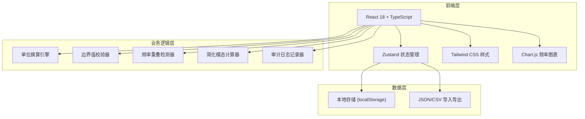
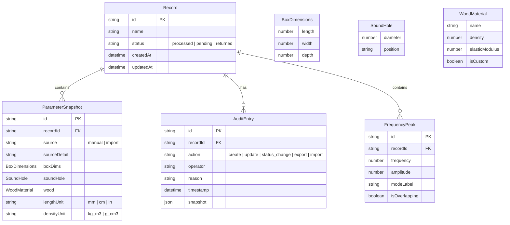

## 1. 架构设计



## 2. 技术说明

- **前端**：React@18 + TypeScript + Tailwind CSS@3 + Vite
- **初始化工具**：vite-init (react-ts 模板)
- **后端**：无（纯前端，数据存 localStorage）
- **数据库**：无（localStorage + JSON 文件导入导出）
- **图表**：Chart.js + react-chartjs-2
- **状态管理**：Zustand
- **路由**：react-router-dom

## 3. 路由定义

| 路由 | 用途 |
|------|------|
| `/` | 模态工作台主页面（参数输入 + 频率对比） |
| `/records` | 记录管理页面（列表 + 导入导出 + 审计追踪） |

## 4. API 定义

无后端 API。所有数据操作通过 Zustand store + localStorage 完成。

## 5. 数据模型

### 5.1 数据模型定义



### 5.2 核心类型定义

```typescript
type LengthUnit = 'mm' | 'cm' | 'in';
type DensityUnit = 'kg_m3' | 'g_cm3';
type RecordStatus = 'processed' | 'pending' | 'returned';

interface BoxDimensions {
  length: number;
  width: number;
  depth: number;
}

interface SoundHole {
  diameter: number;
  position: string;
}

interface WoodMaterial {
  name: string;
  density: number;
  elasticModulus: number;
  isCustom: boolean;
}

interface ParameterSnapshot {
  id: string;
  recordId: string;
  source: 'manual' | 'import';
  sourceDetail: string;
  boxDims: BoxDimensions;
  soundHole: SoundHole;
  wood: WoodMaterial;
  lengthUnit: LengthUnit;
  densityUnit: DensityUnit;
}

interface FrequencyPeak {
  id: string;
  recordId: string;
  frequency: number;
  amplitude: number;
  modeLabel: string;
  isOverlapping: boolean;
}

interface AuditEntry {
  id: string;
  recordId: string;
  action: 'create' | 'update' | 'status_change' | 'export' | 'import';
  operator: string;
  reason: string;
  timestamp: string;
  snapshot: ParameterSnapshot;
}

interface ModalRecord {
  id: string;
  name: string;
  status: RecordStatus;
  createdAt: string;
  updatedAt: string;
  parameters: ParameterSnapshot;
  peaks: FrequencyPeak[];
  auditLog: AuditEntry[];
}
```

### 5.3 单位换算规则

| 源单位 | 目标单位 | 换算公式 |
|--------|----------|----------|
| mm | cm | × 0.1 |
| mm | in | × 0.03937 |
| cm | mm | × 10 |
| cm | in | × 0.3937 |
| in | mm | × 25.4 |
| in | cm | × 2.54 |
| kg/m³ | g/cm³ | × 0.001 |
| g/cm³ | kg/m³ | × 1000 |

### 5.4 边界值校验规则

| 参数 | 最小值 | 最大值 | 单位 | 说明 |
|------|--------|--------|------|------|
| 箱体长度 | 300 | 600 | mm | 标准吉他范围 |
| 箱体宽度 | 200 | 400 | mm | 标准吉他范围 |
| 箱体深度 | 80 | 150 | mm | 标准吉他范围 |
| 音孔直径 | 50 | 120 | mm | 常见音孔范围 |
| 木材密度 | 200 | 1200 | kg/m³ | 常见木材密度范围 |
| 弹性模量 | 5 | 20 | GPa | 常见木材弹性模量范围 |

### 5.5 频率重叠检测规则

- 两个峰值频率差 < 5Hz 视为重叠
- 重叠峰值标记 `isOverlapping: true`
- 图表中重叠区域用橙色高亮

### 5.6 简化模态计算公式

简化 Helmholtz 共振频率近似：
```
f = (c / 2π) × √(S / (V × L_eff))
```
- c: 声速 ≈ 343 m/s
- S: 音孔面积 = π × (d/2)²
- V: 箱体容积 = 长 × 宽 × 深
- L_eff: 音孔有效长度 ≈ d × 1.7 (末端修正)

面板模态频率（简化）：
```
f_n = (n × π / 2L) × √(E / ρ)   (n = 1, 2, 3...)
```
- E: 弹性模量
- ρ: 密度
- L: 面板长度
