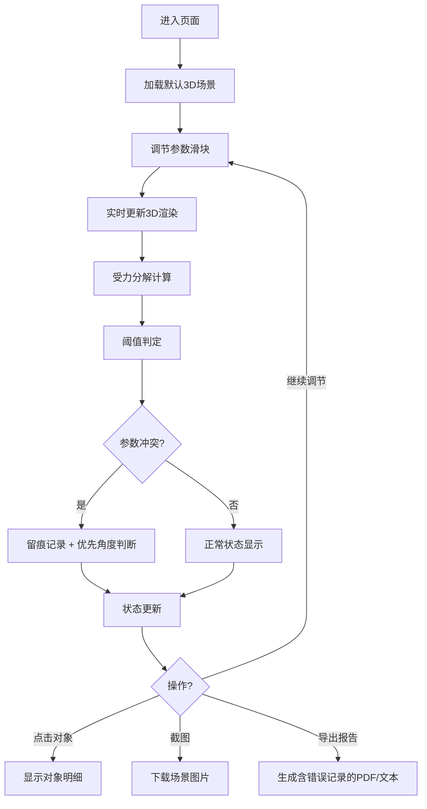

## 1. 产品概述

摩擦斜面课堂器是一款面向初中物理教学的Web3D交互工具，通过可视化的斜面摩擦实验，帮助学生直观理解静摩擦力、滑动摩擦力与斜面角度、摩擦系数、物块质量之间的关系。

- 核心用途：物理课堂演示、学生自主探究实验
- 目标用户：初中物理教师、学生
- 产品价值：将抽象的力学概念转化为可交互的3D可视化实验，降低学习门槛，提升课堂互动性

## 2. 核心功能

### 2.1 用户角色

| 角色 | 注册方式 | 核心权限 |
|------|----------|----------|
| 教师/学生 | 无需注册，直接使用 | 完整使用所有实验功能、导出报告和截图 |

### 2.2 功能模块

1. **3D实验场景**：斜面、物块的三维可视化，支持旋转、缩放、平移视角
2. **参数控制面板**：斜面角度、物块质量、摩擦系数的滑块调节
3. **受力分析系统**：实时显示重力、支持力、摩擦力的矢量分解图
4. **阈值判定引擎**：自动判断物块是否滑动，计算临界角度
5. **冲突检测与留痕**：参数冲突时记录证据链，优先保留角度主信息
6. **错误处理系统**：捕获角度单位错误、静摩擦越界、质量为零等异常
7. **报告导出模块**：生成包含所有参数、受力分析、错误记录的实验报告
8. **截图功能**：一键捕获当前3D场景并下载

### 2.3 页面详情

| 页面名称 | 模块名称 | 功能描述 |
|----------|----------|----------|
| 主实验页 | 3D场景区域 | 渲染斜面和物块，支持鼠标旋转、滚轮缩放、拖拽平移 |
| 主实验页 | 参数控制区 | 三个滑块（角度0-90°、质量0.1-10kg、摩擦系数0-1）实时联动 |
| 主实验页 | 受力分解面板 | 显示重力G、支持力N、摩擦力f的矢量箭头和数值 |
| 主实验页 | 阈值判定区 | 显示当前状态（静止/滑动/临界）和临界角度计算值 |
| 主实验页 | 对象信息卡 | 点击斜面或物块时弹出详细参数面板 |
| 主实验页 | 功能菜单 | 简洁的图标菜单：重置、截图、导出报告 |
| 主实验页 | 错误留痕区 | 记录所有参数异常和冲突处理过程 |

## 3. 核心流程

用户打开页面 → 查看默认3D场景（斜面30°、物块1kg、摩擦系数0.5）→ 调节参数滑块 → 实时观察受力变化和物块状态 → 点击斜面/物块查看详情 → 遇到参数冲突时系统自动留痕 → 一键截图或导出包含错误记录的完整报告

## 4. 用户界面设计

### 4.1 设计风格

- **主色调**：深蓝科技感（#0F172A背景）搭配物理实验主题的橙色（#F97316）作为强调色
- **辅助色**：绿色（#10B981）表示静止安全，红色（#EF4444）表示滑动，黄色（#F59E0B）表示临界状态
- **按钮风格**：微立体圆角按钮，悬停有光泽效果，激活状态有深度变化
- **字体**：标题使用有科技感的 Orbitron，正文使用清晰易读的 Inter
- **布局**：左侧3D场景占70%，右侧控制面板占30%的分栏布局
- **图标**：使用简洁的线性图标，配合轻微的发光效果

### 4.2 页面设计概述

| 页面名称 | 模块名称 | UI元素 |
|----------|----------|--------|
| 主实验页 | 3D场景区 | 暗色背景带轻微噪点纹理，斜面用木质纹理，物块用金属质感，受力箭头用不同颜色区分 |
| 主实验页 | 参数控制区 | 卡片式布局，滑块轨道带渐变，数值显示有科技感的数字字体 |
| 主实验页 | 受力分解面板 | 半透明玻璃拟态效果，矢量箭头动态更新 |
| 主实验页 | 阈值判定区 | 状态指示灯动画，临界角度高亮显示 |
| 主实验页 | 功能菜单 | 顶部浮动图标栏，悬停展开文字说明 |
| 主实验页 | 错误留痕区 | 底部可折叠面板，时间线样式展示异常记录 |

### 4.3 响应性

- 桌面端：分栏布局，3D场景为主
- 平板端：上下布局，控制面板自适应宽度
- 移动端：单列布局，3D场景支持触摸手势，控制面板折叠展开

### 4.4 3D场景指导

- **环境**：深色工作室环境，柔和的环境光配合方向性主光源
- **光照**：一盏主光源（右上方45°）营造立体感，两盏补光消除死黑，环境光提供基础照明
- **相机**：初始视角为斜上方45°，支持OrbitControls轨道控制，限制垂直旋转角度避免穿模
- **构图**：斜面位于场景中心，物块在斜面中上部，受力箭头从物块中心向外辐射
- **交互**：物块滑动时有平滑动画，受力箭头实时跟随更新，点击对象有高亮描边效果
- **后处理**：轻微的Bloom泛光效果增强科技感，FXAA抗锯齿
- **资源**：程序化生成纹理，不依赖外部资源，确保加载速度
