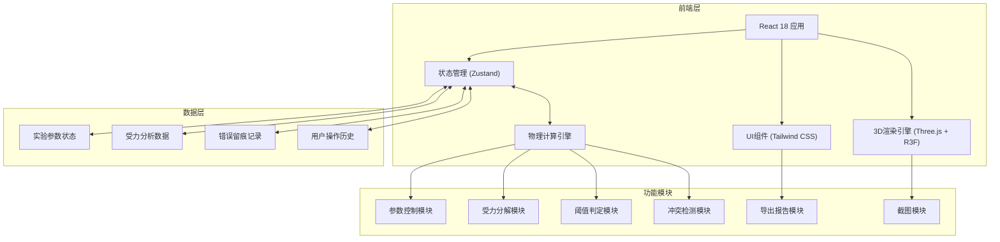

## 1. 架构设计



## 2. 技术描述

- **前端框架**：React@18 + TypeScript
- **构建工具**：Vite@5
- **样式方案**：TailwindCSS@3
- **3D引擎**：three@0.160 + @react-three/fiber@8 + @react-three/drei@9 + @react-three/postprocessing@2
- **状态管理**：zustand@4
- **图标库**：lucide-react@0.312
- **后端**：无（纯前端应用）
- **数据库**：无（本地状态管理）

## 3. 核心依赖说明

| 依赖包 | 版本 | 用途 |
|--------|------|------|
| three | ^0.160.0 | WebGL 3D渲染核心库 |
| @react-three/fiber | ^8.15.0 | Three.js的React渲染器 |
| @react-three/drei | ^9.92.0 | R3F常用组件库（Controls、Text等） |
| @react-three/postprocessing | ^2.15.0 | 后处理效果（Bloom、FXAA） |
| zustand | ^4.4.0 | 轻量级状态管理 |
| lucide-react | ^0.312.0 | 图标组件库 |
| html2canvas | ^1.4.1 | 截图功能 |

## 4. 目录结构

```
src/
├── components/
│   ├── Scene3D/          # 3D场景组件
│   │   ├── InclinedPlane.tsx  # 斜面组件
│   │   ├── Block.tsx          # 物块组件
│   │   ├── ForceArrows.tsx    # 受力箭头组件
│   │   └── SceneLights.tsx    # 光照组件
│   ├── Controls/          # 控制面板
│   │   ├── ParamSliders.tsx   # 参数滑块
│   │   ├── ForcePanel.tsx     # 受力分析面板
│   │   └── StatusPanel.tsx    # 状态判定面板
│   ├── UI/                # 通用UI组件
│   │   ├── FloatingMenu.tsx   # 浮动功能菜单
│   │   ├── ObjectInfo.tsx     # 对象信息卡片
│   │   └── ErrorTrace.tsx     # 错误留痕面板
│   └── Export/            # 导出功能
│       ├── Screenshot.tsx     # 截图组件
│       └── ReportExport.tsx   # 报告导出组件
├── store/
│   └── useExperimentStore.ts  # 实验状态管理
├── utils/
│   ├── physics.ts         # 物理计算函数
│   ├── validation.ts      # 参数校验函数
│   └── export.ts          # 导出工具函数
├── types/
│   └── index.ts           # TypeScript类型定义
├── App.tsx
├── main.tsx
└── index.css
```

## 5. 数据模型

### 5.1 类型定义

```typescript
// 实验参数
interface ExperimentParams {
  angle: number;           // 斜面角度 (度)
  mass: number;            // 物块质量 (kg)
  frictionCoefficient: number;  // 摩擦系数 (0-1)
}

// 受力分析结果
interface ForceAnalysis {
  gravity: number;         // 重力 G = mg
  normalForce: number;     // 支持力 N = mgcosθ
  frictionForce: number;   // 摩擦力 f = μN
  parallelForce: number;   // 沿斜面向下的分力 = mgsinθ
  perpendicularForce: number; // 垂直斜面的分力 = mgcosθ
}

// 物块状态
type BlockStatus = 'static' | 'sliding' | 'critical';

// 判定结果
interface ThresholdResult {
  status: BlockStatus;
  criticalAngle: number;   // 临界角度 arctan(μ)
  reason: string;          // 人性化判定理由
}

// 错误记录
interface ErrorRecord {
  id: string;
  timestamp: number;
  type: 'angle_unit' | 'friction_out_of_range' | 'mass_zero' | 'conflict';
  message: string;
  params: ExperimentParams;
  resolved: boolean;
}

// 冲突记录
interface ConflictRecord {
  id: string;
  timestamp: number;
  angleEvidence: { param: string; value: number; priority: number };
  massEvidence: { param: string; value: number; priority: number };
  frictionEvidence: { param: string; value: number; priority: number };
  resolution: string;
  finalJudgment: BlockStatus;
}

// 实验状态
interface ExperimentState {
  params: ExperimentParams;
  forces: ForceAnalysis;
  threshold: ThresholdResult;
  selectedObject: 'plane' | 'block' | null;
  errorTraces: ErrorRecord[];
  conflictTraces: ConflictRecord[];
  isPlaying: boolean;
}
```

### 5.2 物理计算公式

1. **重力**：G = m × g，其中 g = 9.8 m/s²
2. **沿斜面分力**：F∥ = G × sin(θ)
3. **垂直斜面分力**：F⊥ = G × cos(θ)
4. **最大静摩擦力**：f_max = μ × F⊥
5. **临界角度**：θ_critical = arctan(μ)
6. **滑动条件**：F∥ > f_max 即 θ > θ_critical

## 6. 核心函数

### 6.1 物理计算模块

```typescript
// 计算所有力
function calculateForces(params: ExperimentParams): ForceAnalysis;

// 判定物块状态
function determineStatus(params: ExperimentParams): ThresholdResult;

// 检测参数冲突
function detectConflicts(params: ExperimentParams): ConflictRecord | null;

// 参数校验
function validateParams(params: ExperimentParams): ErrorRecord[];
```

### 6.2 导出模块

```typescript
// 生成实验报告文本
function generateReport(state: ExperimentState): string;

// 下载报告
function downloadReport(report: string): void;

// 截取3D场景
function takeScreenshot(canvas: HTMLCanvasElement): void;
```

## 7. 状态管理流程

1. 用户调节滑块 → 更新 `params`
2. `params` 变化 → 自动触发 `validateParams` 检查错误
3. 有错误 → 添加到 `errorTraces`
4. 无错误 → 触发 `calculateForces` 更新 `forces`
5. `forces` 更新 → 触发 `determineStatus` 更新 `threshold`
6. 检测参数冲突 → 添加到 `conflictTraces` 并优先角度判断
7. 点击对象 → 更新 `selectedObject` 显示信息卡
8. 导出报告 → 整合 `params`、`forces`、`threshold`、`errorTraces`、`conflictTraces`
