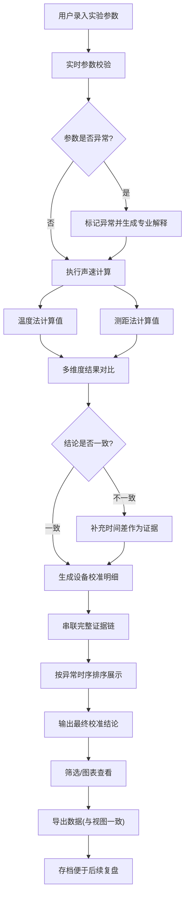

## 1. 产品概述
声速温度校准表是面向科普馆讲解员的专业实验数据计算工具，用于自动对比不同温度下声速的测量值与理论值，确保实验结果的可复算性、可追溯性和可审计性。

- 核心目标：解决声速实验中数据计算繁琐、异常参数难以解释、多证据链无法互相印证的痛点
- 目标用户：科普馆讲解员、实验操作人员、教研人员
- 核心价值：提供确定性计算结果、智能异常诊断、多维度证据链、完整审计追踪

## 2. 核心功能

### 2.1 用户角色
| 角色 | 注册方式 | 核心权限 |
|------|----------|----------|
| 讲解员 | 无需注册，本地使用 | 数据录入、计算、导出、查看完整证据链 |
| 教研人员 | 无需注册，本地使用 | 高级分析、批量处理、自定义校准参数 |

### 2.2 功能模块
1. **数据录入页**：实验参数输入、批量导入、预设模板
2. **校准计算页**：声速计算、理论对比、设备校准、实时验证
3. **结果详情页**：多证据链展示、异常解释、时序追踪、计算溯源
4. **筛选图表页**：数据筛选、趋势图表、视图-导出一致性控制
5. **历史记录页**：计算存档、复盘分析、版本对比

### 2.3 页面详情
| 页面名称 | 模块名称 | 功能描述 |
|----------|----------|----------|
| 数据录入页 | 参数输入区 | 温度、测距、时间差、设备偏差、时间单位等参数输入 |
| 数据录入页 | 批量导入 | 支持CSV/JSON批量导入实验数据 |
| 数据录入页 | 参数校验 | 实时校验参数合法性，异常参数即时提示 |
| 校准计算页 | 核心计算 | 基于温度的声速理论值计算、基于测距的测量值计算 |
| 校准计算页 | 对比验证 | 测量值与理论值自动对比，偏差计算与判定 |
| 校准计算页 | 设备校准 | 结合设备偏差进行校准，输出校准后结果 |
| 结果详情页 | 证据链面板 | 温度结论、测距结论、时间差证据三者并列展示 |
| 结果详情页 | 异常解释 | 对缺失值、单位错误、偏差未标等异常提供专业解释 |
| 结果详情页 | 时序追踪 | 按事件发生顺序展示异常出现的先后关系 |
| 结果详情页 | 计算溯源 | 显示完整计算过程，支持点击追溯每一步公式 |
| 筛选图表页 | 数据筛选 | 按温度范围、时间范围、设备编号筛选数据 |
| 筛选图表页 | 趋势图表 | 声速-温度曲线、偏差分布柱状图、对比散点图 |
| 筛选图表页 | 导出控制 | 确保导出范围与屏幕可见范围完全一致 |
| 历史记录页 | 计算存档 | 保存每次计算的完整输入输出、时间戳、操作人 |
| 历史记录页 | 复盘分析 | 支持回溯查看当时的计算逻辑和异常处理理由 |

## 3. 核心流程

用户录入实验参数 → 系统实时校验参数完整性与合法性 → 标记异常参数并生成解释 → 执行确定性声速计算（温度法+测距法）→ 多维度结果对比 → 检测结论一致性 → 若不一致，补充时间差证据 → 生成设备校准明细 → 串联完整证据链 → 按异常发生时序排序 → 输出校准结论 → 支持筛选查看与图表展示 → 导出（与视图一致）→ 存档便于复盘

## 4. 用户界面设计

### 4.1 设计风格
- 主色调：科技蓝 (#165DFF) 搭配深灰背景 (#0F172A)，营造专业科学实验氛围
- 辅助色：验证通过用翠绿色 (#10B981)，异常警告用琥珀色 (#F59E0B)，严重错误用玫红色 (#EF4444)
- 按钮风格：微立体、圆角8px、悬停有细微阴影变化和颜色加深
- 字体：标题用"思源黑体 Heavy"，正文用"Inter"等宽数字用"JetBrains Mono"
- 布局风格：卡片式分区布局，左侧参数输入，右侧实时计算结果，底部证据链时间轴
- 图标风格：线性科学仪器图标，搭配微妙的发光效果

### 4.2 页面设计概览
| 页面名称 | 模块名称 | UI元素 |
|----------|----------|--------|
| 数据录入页 | 参数输入区 | 分组表单、实时校验图标、单位选择器、数值步进器 |
| 数据录入页 | 校验反馈区 | 异常参数高亮、悬浮解释气泡、修复建议按钮 |
| 校准计算页 | 计算结果区 | 大号数值卡片、计算公式展开、偏差百分比显示 |
| 校准计算页 | 对比面板 | 左右分栏对比理论值与测量值、偏差指示器 |
| 结果详情页 | 证据链时间轴 | 横向时间轴、事件节点可展开、异常标签颜色区分 |
| 结果详情页 | 计算溯源区 | 公式树状展开、点击高亮对应数据、单位换算标注 |
| 筛选图表页 | 图表区 | 交互式折线图、悬停显示数据点、支持缩放平移 |
| 筛选图表页 | 筛选控制栏 | 范围滑块、下拉筛选、当前筛选条件标签组 |
| 历史记录页 | 记录列表 | 卡片式记录、时间戳、操作摘要、复算按钮 |

### 4.3 响应式
- 桌面端优先（1280px+）：三栏布局，充分利用屏幕空间
- 平板端（768px-1279px）：两栏布局，参数与结果上下排列
- 移动端（<768px）：单栏流式布局，重点保留核心计算和结果展示功能，优化触控区域
- 触摸优化：表单控件最小高度44px，滑动手势支持图表缩放

### 4.4 视觉动效
- 页面加载：卡片依次淡入上移，形成错落有致的入场动画
- 计算过程：数值滚动动画，从旧值平滑过渡到新值
- 异常检测：异常项轻微晃动提醒，解释气泡优雅滑入
- 时间轴：节点依次点亮，连接线从左到右描边动画
- 图表交互：数据点悬停放大，背景网格线呼吸效果
