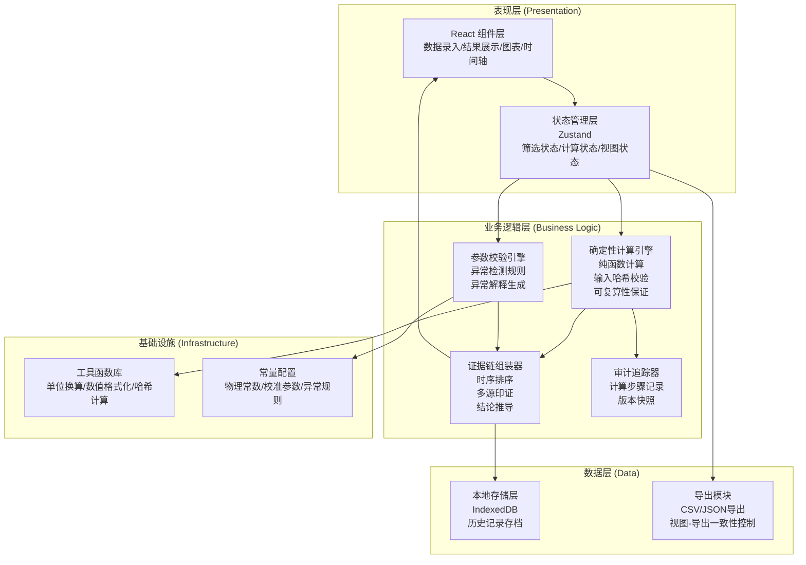
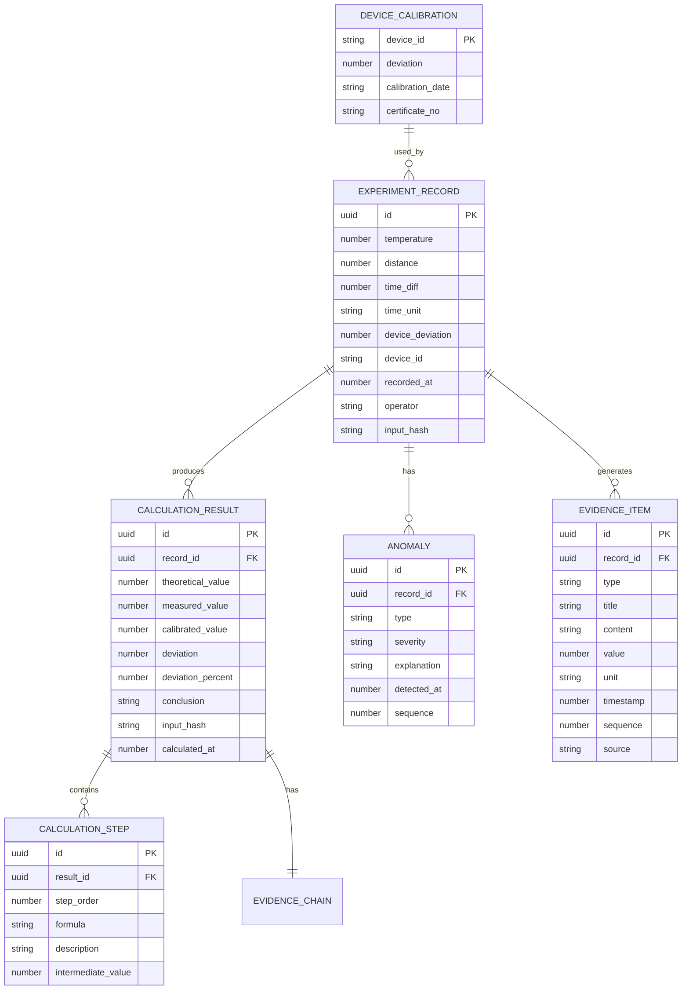

## 1. 架构设计



## 2. 技术选型说明

| 层级 | 技术选型 | 选型理由 |
|------|----------|----------|
| 前端框架 | React 18 + TypeScript 5 | 类型安全保证，组件化开发，利于复杂交互实现 |
| 构建工具 | Vite 5 | 开发效率高，热更新快，生产构建优化 |
| 样式方案 | TailwindCSS 3 | 快速构建UI，原子化样式，主题一致性 |
| 状态管理 | Zustand | 轻量级，API简洁，支持状态持久化 |
| 图表库 | Chart.js 4 + react-chartjs-2 | 交互式图表，支持缩放平移，轻量化 |
| 图标库 | Lucide React | 线性科学风格图标，与设计风格匹配 |
| 本地存储 | IndexedDB (idb) | 大容量存储历史记录，支持复杂查询 |
| 时间处理 | date-fns | 轻量级，函数式，TypeScript支持好 |

## 3. 核心技术方案

### 3.1 可复算性机制设计

**核心原理**：使用纯函数+输入哈希校验确保同样输入永远产生同样输出

```typescript
// 输入参数接口
interface SoundVelocityInput {
  temperature: number | null;      // 温度 (℃)
  distance: number | null;         // 测距 (m)
  timeDiff: number | null;         // 时间差 (s/ms)
  timeUnit: 's' | 'ms';            // 时间单位
  deviceDeviation: number | null;  // 设备偏差 (m/s)
  deviceId?: string;               // 设备编号
  timestamp: number;               // 录入时间戳
  operator?: string;               // 操作人员
}

// 计算结果接口
interface CalculationResult {
  inputHash: string;               // 输入参数哈希，用于校验
  theoreticalValue: number;        // 理论值 (温度法)
  measuredValue: number;           // 测量值 (测距法)
  calibratedValue: number;         // 校准后值
  deviation: number;               // 偏差值
  deviationPercent: number;        // 偏差百分比
  conclusion: 'consistent' | 'inconsistent' | 'warning';
  calculationSteps: CalculationStep[]; // 计算步骤
}

// 关键实现：计算输入哈希
function calculateInputHash(input: SoundVelocityInput): string {
  // 按固定字段顺序序列化，确保同样输入产生同样哈希
  const orderedKeys = ['temperature', 'distance', 'timeDiff', 'timeUnit', 
                       'deviceDeviation', 'deviceId'] as const;
  const orderedInput = orderedKeys.reduce((acc, key) => {
    acc[key] = input[key];
    return acc;
  }, {} as Record<string, any>);
  return crypto.subtle ? 
    sha256(JSON.stringify(orderedInput)) : 
    simpleHash(JSON.stringify(orderedInput));
}
```

### 3.2 异常检测与解释系统

**异常检测规则引擎**：
```typescript
// 异常类型定义
enum AnomalyType {
  TEMPERATURE_MISSING = 'temperature_missing',
  TIME_UNIT_ERROR = 'time_unit_error',
  DEVICE_DEVIATION_MISSING = 'device_deviation_missing',
  VALUE_OUT_OF_RANGE = 'value_out_of_range',
  CONCLUSION_INCONSISTENT = 'conclusion_inconsistent',
}

// 异常元数据
const ANOMALY_METADATA: Record<AnomalyType, AnomalyInfo> = {
  [AnomalyType.TEMPERATURE_MISSING]: {
    severity: 'warning',
    explanation: '温度参数缺失，理论声速计算将使用标准温度(20℃)估算，结果可能存在偏差。声速与温度的关系公式为: v = 331.45 × sqrt(1 + T/273.15)',
    impact: '理论值可信度降低',
    suggestion: '请补充实际测量的温度值',
  },
  [AnomalyType.TIME_UNIT_ERROR]: {
    severity: 'error',
    explanation: '时间单位可能错误。当前测量的时间差与距离不匹配，若为毫秒(ms)计算出的声速会超出合理范围(300-400m/s)。请确认时间单位设置。',
    impact: '测量值完全不可信',
    suggestion: '检查并修正时间单位',
  },
  [AnomalyType.DEVICE_DEVIATION_MISSING]: {
    severity: 'warning',
    explanation: '设备偏差参数未提供，校准计算将使用默认偏差值(±0.5m/s)。不同设备的系统偏差可能不同，建议录入设备校准证书上的偏差值。',
    impact: '校准值精度降低',
    suggestion: '补充设备偏差参数，或使用设备编号自动查询校准值',
  },
  [AnomalyType.VALUE_OUT_OF_RANGE]: {
    severity: 'error',
    explanation: '参数值超出合理范围。温度应在-50℃~100℃之间，声速计算结果应在250~450m/s之间。',
    impact: '结果无效',
    suggestion: '检查输入参数是否正确',
  },
  [AnomalyType.CONCLUSION_INCONSISTENT]: {
    severity: 'warning',
    explanation: '温度法与测距法得出的结论不一致，偏差超过5%。时间差数据已作为补充证据列入详情，请综合判断。',
    impact: '结论存疑，需人工复核',
    suggestion: '检查测量过程是否存在误差来源',
  },
};
```

### 3.3 时序追踪与证据链

**证据链数据结构**：
```typescript
interface EvidenceItem {
  id: string;
  type: 'temperature_conclusion' | 'distance_conclusion' | 
        'time_diff_evidence' | 'calibration_detail' | 'anomaly';
  title: string;
  content: string;
  value?: number;
  unit?: string;
  timestamp: number;           // 证据生成时间，用于排序
  sequence: number;            // 处理顺序，确保可复现
  supports?: string[];         // 支持的结论ID
  contradicts?: string[];      // 矛盾的结论ID
  source: 'temperature' | 'distance' | 'time' | 'device' | 'system';
}

interface EvidenceChain {
  items: EvidenceItem[];
  orderedBy: 'timestamp' | 'sequence' | 'type';
  overallConclusion: string;
  confidence: number;          // 0-100
  auditLog: AuditLogEntry[];   // 完整审计日志
}
```

**时序排序算法**：
- 主要按 `sequence`（处理顺序）排序，确保处理先后关系可复现
- 次要按 `timestamp` 排序，记录实际发生时间
- 异常事件可标记 `priority` 提升显示优先级

### 3.4 视图-导出一致性机制

```typescript
// 视图状态接口
interface ViewState {
  filters: {
    temperatureRange: [number, number];
    dateRange: [Date, Date];
    deviceIds: string[];
    conclusionTypes: string[];
  };
  sort: { field: string; order: 'asc' | 'desc' };
  pagination: { page: number; pageSize: number };
  visibleColumns: string[];
  chartZoom?: { x: [number, number]; y: [number, number] };
}

// 导出时必须捕获当前视图状态
interface ExportPayload {
  data: CalculationResult[];
  viewState: ViewState;         // 导出时的视图快照
  viewHash: string;             // 视图状态哈希
  exportTimestamp: number;
  filterDescription: string;    // 人类可读的筛选描述
}

// 关键约束：导出数据 = 屏幕可见数据
function exportData(): ExportPayload {
  const viewState = getCurrentViewState();
  const visibleData = getFilteredData(viewState);  // 与屏幕显示完全相同
  return {
    data: visibleData,
    viewState,
    viewHash: calculateViewHash(viewState),
    exportTimestamp: Date.now(),
    filterDescription: generateFilterDescription(viewState),
  };
}
```

### 3.5 多维度结论印证机制

```typescript
// 结论印证矩阵
interface ConclusionCorroboration {
  mainConclusion: string;
  evidenceFromTemperature: EvidenceItem | null;
  evidenceFromDistance: EvidenceItem | null;
  evidenceFromTimeDiff: EvidenceItem | null;
  evidenceFromCalibration: EvidenceItem | null;
  corroborationLevel: 'full' | 'partial' | 'none';
  contradictions: string[];
}

function corroborateConclusions(chain: EvidenceChain): ConclusionCorroboration {
  // 收集各来源证据
  const tempEvidence = chain.items.find(i => i.source === 'temperature');
  const distEvidence = chain.items.find(i => i.source === 'distance');
  const timeEvidence = chain.items.find(i => i.source === 'time');
  const caliEvidence = chain.items.find(i => i.source === 'device');
  
  // 判断印证级别
  let level: 'full' | 'partial' | 'none' = 'none';
  const conclusions = [tempEvidence, distEvidence, timeEvidence, caliEvidence]
    .filter(Boolean)
    .map(e => e!.content);
  
  const uniqueConclusions = [...new Set(conclusions)];
  if (uniqueConclusions.length === 1) level = 'full';
  else if (uniqueConclusions.length < conclusions.length) level = 'partial';
  
  return {
    mainConclusion: getMajorityConclusion(conclusions),
    evidenceFromTemperature: tempEvidence,
    evidenceFromDistance: distEvidence,
    evidenceFromTimeDiff: timeEvidence,
    evidenceFromCalibration: caliEvidence,
    corroborationLevel: level,
    contradictions: getContradictions(chain.items),
  };
}
```

## 4. 数据模型

### 4.1 实体关系图



### 4.2 物理常数配置

```typescript
// 声速计算相关物理常数
export const PHYSICAL_CONSTANTS = {
  // 0℃时的声速 (m/s)
  SOUND_VELOCITY_AT_0C: 331.45,
  // 标准大气压 (Pa)
  STANDARD_PRESSURE: 101325,
  // 绝对零度 (℃)
  ABSOLUTE_ZERO: -273.15,
  // 空气绝热指数
  ADIABATIC_INDEX: 1.4,
  // 摩尔气体常数 (J/(mol·K))
  GAS_CONSTANT: 8.314,
  // 空气摩尔质量 (kg/mol)
  MOLAR_MASS_AIR: 0.0289645,
  // 声速合理范围 (m/s) - 用于异常检测
  MIN_REASONABLE_VELOCITY: 250,
  MAX_REASONABLE_VELOCITY: 450,
  // 温度合理范围 (℃)
  MIN_REASONABLE_TEMP: -50,
  MAX_REASONABLE_TEMP: 100,
  // 结论一致阈值 (%)
  CONSISTENCY_THRESHOLD: 5,
};
```

## 5. 路由定义

| 路由 | 页面 | 功能 |
|------|------|------|
| `/` | 数据录入页 | 实验参数输入、实时校验、快速计算 |
| `/calculator` | 校准计算页 | 核心计算、理论对比、设备校准 |
| `/result/:id` | 结果详情页 | 证据链、异常解释、时序追踪、计算溯源 |
| `/charts` | 筛选图表页 | 数据筛选、趋势图表、视图导出 |
| `/history` | 历史记录页 | 存档记录、复盘分析、版本对比 |

## 6. 审计追踪与可复盘设计

### 6.1 计算步骤记录

每次计算都必须记录完整的计算步骤，包括：
- 输入参数快照
- 每一步计算公式和中间结果
- 异常检测过程和判定依据
- 结论推导逻辑
- 使用的校准参数来源

### 6.2 版本化存储

每条记录支持：
- 查看历史修改记录
- 对比不同版本的差异
- 一键复算历史版本
- 标注处理理由（可追加备注）

### 6.3 复算功能

```typescript
async function recalculate(recordId: string): Promise<CalculationResult> {
  // 1. 获取历史输入快照
  const record = await getRecordById(recordId);
  const originalInput = record.inputSnapshot;
  
  // 2. 校验输入完整性（与原哈希对比）
  const currentHash = calculateInputHash(originalInput);
  if (currentHash !== record.inputHash) {
    throw new Error('输入数据已被篡改，无法复算');
  }
  
  // 3. 使用完全相同的算法重新计算
  const newResult = await calculateSoundVelocity(originalInput);
  
  // 4. 校验结果一致性
  if (Math.abs(newResult.calibratedValue - record.result.calibratedValue) > 0.001) {
    throw new Error('计算结果不一致，请检查算法版本');
  }
  
  return newResult;
}
```

## 7. 性能与安全考虑

1. **计算性能**：核心计算逻辑使用纯函数，可Web Worker化处理大量数据
2. **数据安全**：所有数据本地存储，不上传服务器；支持导出加密
3. **浏览器兼容**：Chrome 90+，Firefox 88+，Safari 14+
4. **离线可用**：PWA支持，无网络环境可正常使用
5. **数据备份**：支持一键导出完整数据库备份，便于迁移和归档
