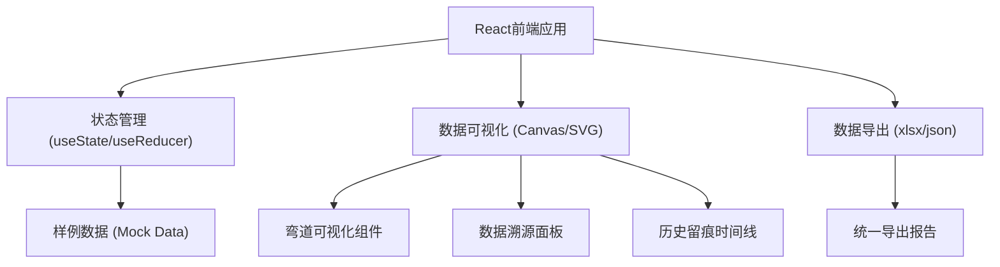

## 1. 架构设计



## 2. 技术描述

- **前端框架**：React@18 + TypeScript + Vite
- **样式方案**：TailwindCSS@3
- **图表可视化**：原生 Canvas API
- **数据导出**：xlsx + file-saver
- **图标**：Lucide React
- **后端**：无（纯前端应用）
- **数据库**：无（使用 Mock 数据）

## 3. 路由定义

| 路由 | 用途 |
|------|------|
| / | 弯道分析看板（单页应用） |

## 4. 数据模型

### 4.1 弯道数据模型

```typescript
interface CornerData {
  id: string;
  cornerNumber: number;
  cornerName: string;
  
  // 速度数据及来源
  speed: {
    value: number; // km/h
    source: string; // 数据来源：GPS/车载传感器/人工记录
    timestamp: string;
    confidence: number; // 置信度 0-1
  };
  
  // 转弯半径数据及来源
  radius: {
    value: number; // 米
    source: string;
    timestamp: string;
    confidence: number;
    isCorrected?: boolean;
    originalValue?: number;
  };
  
  // 轮胎数据及来源
  tire: {
    type?: string; // 轮胎类型：Slick/Wet/Hard/Soft
    compound?: string;
    source?: string;
    timestamp?: string;
    isMissing: boolean;
  };
  
  // 计算结果
  centripetalForce: number; // G值
  gripThreshold: number; // 抓地阈值
  gripUtilization: number; // 抓地利用率 %
  status: 'normal' | 'warning' | 'danger' | 'incomplete';
  
  // 历史记录
  history: HistoryRecord[];
}

interface HistoryRecord {
  id: string;
  timestamp: string;
  type: 'correction' | 'annotation' | 'data_add' | 'issue_mark';
  field: string;
  oldValue?: any;
  newValue?: any;
  operator: string;
  reason: string;
}

interface ExportReport {
  exportTime: string;
  dataset: CornerData[];
  summary: {
    totalCorners: number;
    normalCount: number;
    warningCount: number;
    dangerCount: number;
    incompleteCount: number;
  };
  calculations: {
    maxCentripetalForce: number;
    avgGripUtilization: number;
    cornerComparisons: CornerComparison[];
  };
}

interface CornerComparison {
  cornerName: string;
  speed: number;
  radius: number;
  gripUtilization: number;
}
```

### 4.2 抓地计算公式

- 向心力 G = v² / (r * 9.81)
  - v: 速度 m/s
  - r: 半径 米
- 抓地利用率 = 实际G / 抓地阈值 * 100%

## 5. 核心组件结构

```
src/
├── components/
│   ├── Header/              # 头部导航
│   ├── TrackVisualization/  # 赛道可视化
│   ├── DataTracePanel/      # 数据溯源面板
│   ├── HistoryTimeline/     # 历史留痕时间线
│   ├── CalculationSummary/  # 计算汇总
│   └── ExportModal/         # 导出弹窗
├── data/
│   └── mockData.ts          # 样例数据
├── types/
│   └── index.ts             # 类型定义
├── utils/
│   ├── calculations.ts      # 计算工具
│   └── export.ts            # 导出工具
├── App.tsx
└── main.tsx
```

## 6. 样例数据类型

1. **顺利流程数据**：3条弯道，数据完整，抓地匹配正常
2. **边界记录**：1条弯道，接近抓地阈值（90%+）
3. **待补全数据**：1条弯道，轮胎数据缺失，需要人工补充
