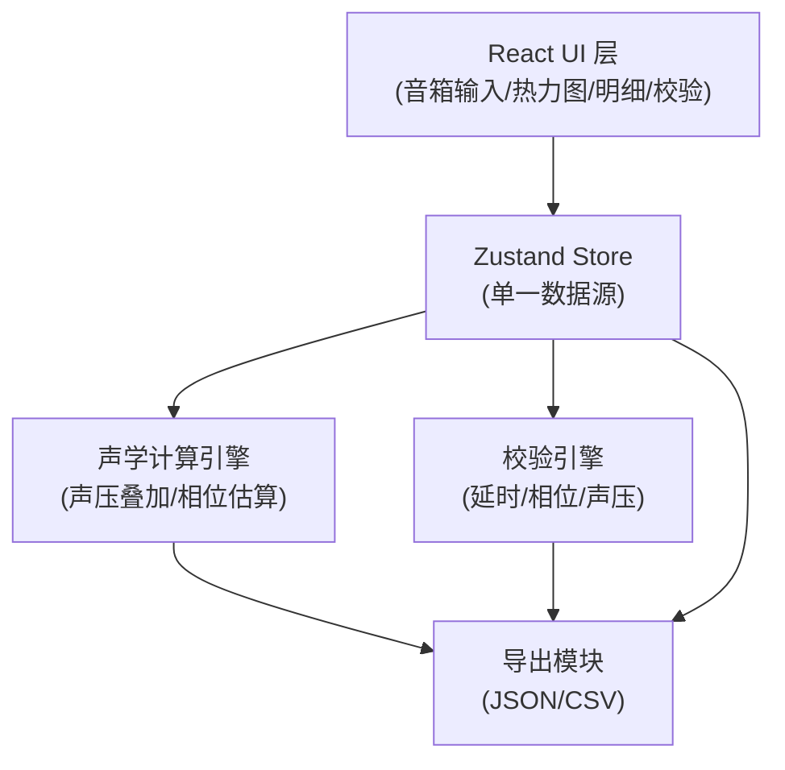
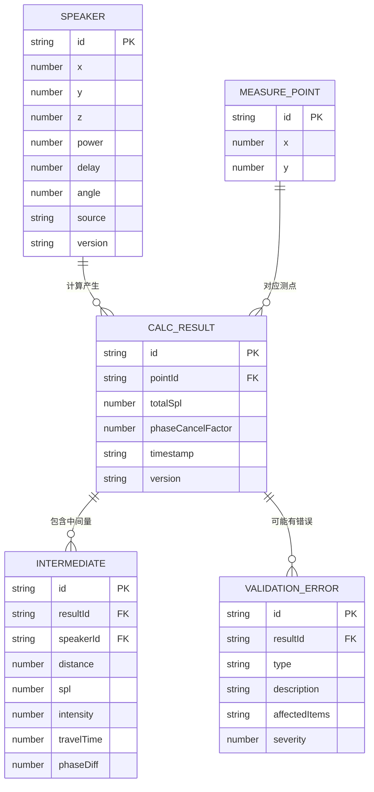

## 1. 架构设计



## 2. 技术描述
- **前端框架**：React@18 + TypeScript + Vite@5
- **状态管理**：Zustand（轻量级，保证单一数据源）
- **样式方案**：TailwindCSS@3 + CSS Variables
- **可视化**：Canvas API（热力图绘制）
- **导出功能**：原生 File API + SheetJS (xlsx)
- **数学计算**：原生 Math API，自定义声学计算库
- **数据持久化**：LocalStorage（保存音箱参数和版本历史）

## 3. 路由定义
| 路由 | 用途 |
|------|------|
| / | 主页面：音箱参数输入、热力图、计算明细、校验面板 |

## 4. 数据模型

### 4.1 数据模型定义



### 4.2 TypeScript 类型定义

```typescript
// 音箱参数
interface Speaker {
  id: string;
  x: number;
  y: number;
  z: number;
  power: number;
  delay: number;
  angle: number;
  source: string;
  version: string;
}

// 测点
interface MeasurePoint {
  id: string;
  x: number;
  y: number;
}

// 关键中间量
interface IntermediateValue {
  speakerId: string;
  distance: number;
  spl: number;
  intensity: number;
  travelTime: number;
  totalTime: number;
}

// 相位计算中间量
interface PhaseIntermediate {
  speakerId1: string;
  speakerId2: string;
  timeDiff: number;
  phaseDiff: number;
  cancelFactor: number;
}

// 计算结果（明细行）
interface CalculationResult {
  id: string;
  pointId: string;
  x: number;
  y: number;
  totalSpl: number;
  phaseCancelFactor: number;
  intermediates: IntermediateValue[];
  phaseIntermediates: PhaseIntermediate[];
  errors: ValidationError[];
}

// 校验错误
interface ValidationError {
  type: 'delay_direction' | 'phase_missed' | 'spl_overlimit';
  severity: 'warning' | 'error';
  description: string;
  affectedResultIds: string[];
}

// 版本元数据
interface VersionMeta {
  version: string;
  source: string;
  timestamp: string;
  speakerCount: number;
  pointCount: number;
}

// 全局状态
interface AppState {
  speakers: Speaker[];
  measurePoints: MeasurePoint[];
  results: CalculationResult[];
  errors: ValidationError[];
  versionMeta: VersionMeta;
  selectedResultId: string | null;
  splThreshold: number;
}
```

## 5. 核心算法模块

### 5.1 声压叠加计算模块
```
函数: calculateSoundPressure(speakers, point) → CalculationResult
  对每个音箱:
    d = 计算到测点的距离
    Lp = Lw + 10*log10(Q/(4πd²)) + 10*log10(power/1000)
    I = 10^(Lp/10) * I_ref
    t = d / 343
    记录 IntermediateValue
  I_total = Σ(I_i * k_cancel_i)
  Lp_total = 10*log10(I_total / I_ref)
  返回包含所有中间量的结果
```

### 5.2 相位抵消估算模块
```
函数: calculatePhaseCancellation(speakers, point, frequency) → PhaseIntermediate[]
  对每对音箱(i,j):
    t_i = d_i / 343 + delay_i
    t_j = d_j / 343 + delay_j
    Δt = |t_i - t_j|
    Δφ = 360° * frequency * Δt
    k_cancel = |cos(Δφ * π / 180°)|
    记录 PhaseIntermediate
  返回所有音箱对的相位关系
```

### 5.3 校验模块
```
函数: validateResults(results, speakers) → ValidationError[]
  检查延时方向: 距离递增但延时递减 → delay_direction 错误
  检查相位漏算: Δφ 在 [150°, 210°] 但 cancelFactor > 0.3 → phase_missed
  检查声压超限: totalSpl > threshold → spl_overlimit
  每个错误记录受影响的 resultId 列表
```

## 6. 数据一致性保证

1. **单一数据源**：所有模块从 Zustand Store 读取 `results` 数组
2. **ID 关联**：热力图点 `id` ↔ 明细行 `id` ↔ 导出数据 `id` 完全一致
3. **计算触发**：修改音箱参数后统一触发重新计算，避免部分更新
4. **导出校验**：导出前比对热力图数据与明细行总和，不一致则拒绝导出
5. **版本锁定**：计算结果生成后不可修改，修改参数生成新版本
