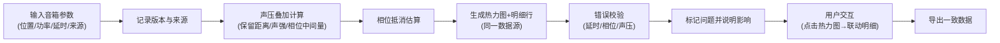

## 1. 产品概述
舞台声压叠加估算工具，为演出音响师提供专业的声场分析能力。解决音箱布置时声压叠加、相位抵消的量化估算问题，确保演出音质安全可靠。
- 核心用户：演出音响师、舞台技术总监
- 核心价值：避免相位抵消、防止声压超限、量化声场分布、保留可追溯的计算过程

## 2. 核心 Features

### 2.1 用户角色
| 角色 | 注册方式 | 核心权限 |
|------|----------|----------|
| 音响师 | 无需注册 | 输入音箱参数、执行计算、查看热力图、导出结果 |

### 2.2 功能模块
1. **主页面**：音箱参数输入、声场热力图、计算明细、版本管理
2. **计算模块**：声压叠加算法、相位抵消估算、关键中间量保留
3. **校验模块**：延时方向检查、相位抵消漏算检查、声压超限检查
4. **导出模块**：JSON/CSV 导出，与热力图、明细行数据完全一致
5. **版本管理**：数据来源记录、版本号、计算时间戳

### 2.3 页面详情
| 页面名称 | 模块名称 | 功能描述 |
|----------|----------|----------|
| 主页面 | 音箱参数输入 | 输入音箱位置(x/y/z)、功率、延时、指向角度、来源信息 |
| 主页面 | 声场热力图 | 2D 俯视热力图，显示各测点声压级分布，点击测点显示明细 |
| 主页面 | 计算明细 | 逐行展示每个测点的声压叠加、相位差、中间量 |
| 主页面 | 错误校验面板 | 高亮显示延时方向错误、相位抵消漏算、声压超限条目及影响范围 |
| 主页面 | 导出与版本 | 记录数据来源、版本号，导出完整计算结果 |

## 3. 核心流程

音响师输入音箱位置、功率、延时参数 → 系统记录数据来源与版本 → 执行声压叠加计算（保留关键中间量）→ 执行相位抵消估算 → 生成热力图与明细行 → 错误校验并标记问题条目 → 用户点击热力图点联动明细行 → 导出一致的计算结果

## 4. 用户界面设计

### 4.1 设计风格
- 主色调：专业深色主题 `#0f172a`，配合声学行业特征色 `#06b6d4`（青蓝）
- 强调色：声压超限警示 `#ef4444`，相位抵消警告 `#f59e0b`，正常通过 `#22c55e`
- 按钮风格：扁平矩形，4px 圆角，悬浮状态轻微发光
- 字体：等宽字体 `JetBrains Mono` 用于数值显示，`Noto Sans SC` 用于中文说明
- 布局风格：三栏布局，左侧参数输入、中间热力图、右侧明细与校验
- 图标风格：线性技术风格图标，避免卡通化

### 4.2 页面设计概览
| 页面名称 | 模块名称 | UI 元素 |
|----------|----------|----------|
| 主页面 | 音箱参数输入 | 动态表单、可增删行、数值输入带单位标注 |
| 主页面 | 声场热力图 | Canvas 绘制热力图，彩色渐变图例，可点击测点 |
| 主页面 | 计算明细 | 固定表头表格，斑马纹，错误行高亮，中间量可展开 |
| 主页面 | 错误校验面板 | 彩色标签，点击跳转到对应明细行，说明影响范围 |
| 主页面 | 导出与版本 | 版本号输入框，来源备注，导出按钮组 |

### 4.3 响应性
- Desktop-first 设计，1440px 以上为最佳体验
- 1024px 以下自动调整为两栏（参数输入在上，热力图与明细在下）
- 移动端保留核心功能，热力图支持手势缩放

### 4.4 数据一致性设计
- 所有显示模块共用同一个计算结果 Store
- 热力图点击时，通过测点 ID 定位到明细行对应记录
- 导出数据包含与页面显示完全一致的测点 ID、计算值、中间量、错误标记
- 版本号与来源信息嵌入导出文件元数据

## 5. 关键计算规则（核心中间量保留）

### 5.1 声压叠加计算
保留以下中间量用于复核：
- 各音箱到测点的距离 `d`
- 各音箱在测点的直达声声压级 `Lp_i`
- 各音箱的声强 `I_i`
- 叠加总声强 `I_total`
- 最终叠加声压级 `Lp_total`

### 5.2 相位抵消估算
保留以下中间量：
- 各音箱信号到测点的传播时间 `t_i`
- 延时器设置的延时 `delay_i`
- 总时间差 `Δt_ij`
- 相位差 `Δφ_ij`
- 相位抵消系数 `k_cancel`

### 5.3 错误校验规则
- **延时方向错误**：检查延时值与物理距离是否匹配，如近距离音箱反而设置更大延时
- **相位抵消漏算**：相位差在 150°~210° 范围但未被标注
- **声压超限**：叠加声压级超过设定阈值（默认 110dB），需标记并说明影响的测点
