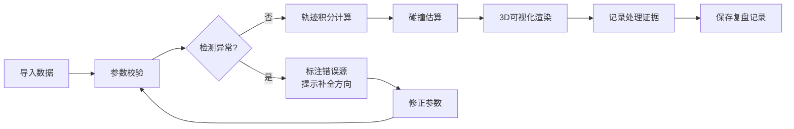

## 1. 产品概述

冰壶碰撞路径复盘3D工作台，用于教练团队根据出手速度、旋转和冰面摩擦等参数估算石壶轨迹，支持多人协作导入数据、碰撞检测和误差分析。

- 核心解决：冰壶训练复盘时轨迹估算、碰撞验证、误差溯源的问题
- 目标用户：冰壶教练、技术分析人员、运动员复盘团队

## 2. 核心功能

### 2.1 功能模块

1. **3D轨迹可视化工作台**：冰壶运动轨迹实时渲染、碰撞检测、多视角切换
2. **参数输入与数据导入**：出手速度/旋转/摩擦参数输入、JSON数据导入、多人数据源区分
3. **碰撞分析与误差标注**：摩擦异常检测、旋转方向验证、碰撞顺序校验、错误溯源
4. **证据记录与复查**：处理历史留存、决策原因标注、版本对比复查

### 2.2 页面详情

| 页面名称 | 模块名称 | 功能描述 |
|---------|---------|---------|
| 主工作台 | 3D场景画布 | 冰壶场地3D渲染、轨迹积分动画播放、暂停/快进控制 |
| 主工作台 | 参数控制面板 | 出手速度(0-3m/s)、旋转方向(顺/逆时针)、旋转强度、冰面摩擦系数 |
| 主工作台 | 数据导入区 | JSON文件导入、数据源标签、原始材料与处理结果分区展示 |
| 主工作台 | 错误分析面板 | 摩擦过小警告、旋转反向提示、碰撞顺序错误标注、触发材料溯源 |
| 主工作台 | 证据记录区 | 处理步骤日志、决策原因标注、版本快照、复查导航 |

## 3. 核心流程

## 4. 用户界面设计

### 4.1 设计风格
- **主色调**：冰蓝色系 (#165DFF, #4080FF, #E8F3FF) 搭配深灰背景，体现冰壶运动的专业感和科技感
- **按钮风格**：直角微圆角(4px)、扁平设计、悬停时轻微上浮效果
- **字体**：JetBrains Mono (数值显示) + PingFang SC (中文说明)，强调数据可读性
- **布局风格**：左侧参数面板 + 中央3D画布 + 右侧分析面板的三栏专业工具布局
- **图标风格**：简约线框图标，避免花哨装饰，突出功能实用性

### 4.2 页面设计概述

| 页面名称 | 模块名称 | UI元素 |
|---------|---------|--------|
| 主工作台 | 3D场景画布 | 冰面纹理、冰壶模型、轨迹线(渐变色)、碰撞点标记、视角操控提示 |
| 主工作台 | 参数面板 | 数值滑块、方向切换按钮、实时计算预览、数据源标签(彩色) |
| 主工作台 | 错误分析区 | 红色警告卡片、错误定位高亮、下一步建议列表、溯源链接 |
| 主工作台 | 证据记录区 | 时间线布局、处理步骤卡片、可展开详情、备注输入框 |

### 4.3 响应性
- 桌面端优先：三栏固定布局，最小宽度1440px
- 面板可折叠：左右面板支持收起，最大化3D画布空间
- 触控优化：3D场景支持触摸旋转/缩放

### 4.4 3D场景指导
- **环境**：冷色调冰场环境，低饱和度蓝色氛围光
- **光照**：主光源模拟场馆顶灯，柔和漫反射减少反光
- **相机**：默认45度俯视视角，支持轨道控制，预设"全场""出手端""碰撞区"快捷视角
- **交互**：点击冰壶显示详细参数，悬停轨迹点显示速度/位置数据
- **后处理**：轻微泛光效果突出轨迹线，保持整体画面干净专业
