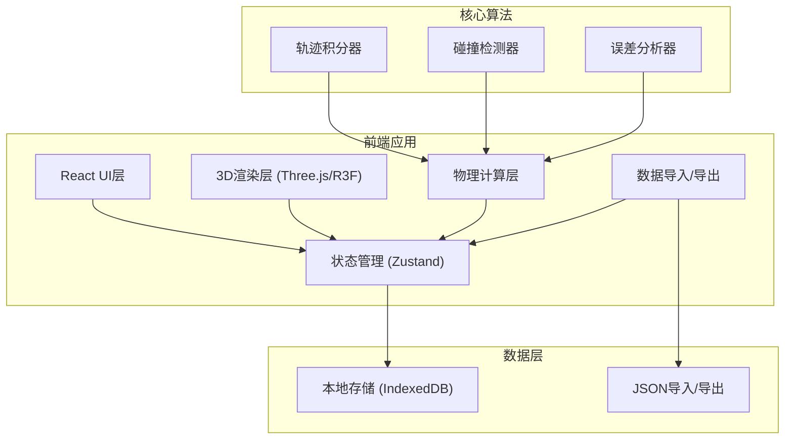

## 1. 架构设计



## 2. 技术描述

- **前端框架**: React@18 + TypeScript
- **构建工具**: Vite@5
- **样式方案**: TailwindCSS@3
- **3D渲染**: Three@0.160 + @react-three/fiber@8 + @react-three/drei@9
- **状态管理**: Zustand@4
- **物理计算**: 自定义轨迹积分算法 (无外部物理引擎)
- **本地存储**: IndexedDB (用于保存复盘记录)

## 3. 目录结构

```
src/
├── components/
│   ├── ControlPanel/      # 左侧参数控制面板
│   ├── AnalysisPanel/     # 右侧分析面板
│   ├── EvidenceLog/       # 证据记录组件
│   └── ThreeDCanvas/      # 3D画布组件
├── store/
│   └── curlingStore.ts    # 全局状态管理
├── physics/
│   ├── trajectory.ts      # 轨迹积分算法
│   ├── collision.ts       # 碰撞检测算法
│   └── errorAnalysis.ts   # 误差分析
├── types/
│   └── index.ts           # 类型定义
├── utils/
│   ├── dataImport.ts      # 数据导入工具
│   └── evidence.ts        # 证据记录工具
└── App.tsx
```

## 4. 核心数据模型

### 4.1 冰壶参数定义

```typescript
interface StoneParams {
  id: string;
  sourceId: string;        // 数据源ID
  color: 'red' | 'yellow';
  initialVelocity: {       // 出手速度 (m/s)
    x: number;
    y: number;
  };
  rotation: {              // 旋转参数
    direction: 'clockwise' | 'counterclockwise';
    speed: number;         // 旋转强度 (rpm)
  };
  friction: number;        // 冰面摩擦系数 (0.01-0.05)
  initialPosition: {
    x: number;
    y: number;
  };
}

interface DataSource {
  id: string;
  name: string;
  contributor: string;     // 提交人
  timestamp: number;
  type: 'raw' | 'processed'; // 原始材料/处理结果
  stones: StoneParams[];
}
```

### 4.2 轨迹与碰撞数据

```typescript
interface TrajectoryPoint {
  position: { x: number; y: number };
  velocity: { x: number; y: number };
  timestamp: number;
}

interface CollisionEvent {
  id: string;
  stoneA: string;
  stoneB: string;
  position: { x: number; y: number };
  timestamp: number;
  type: 'stone-stone' | 'stone-wall';
}

interface AnalysisError {
  id: string;
  type: 'friction_too_low' | 'rotation_reversed' | 'collision_order_wrong';
  sourceId: string;       // 触发错误的数据源
  stoneId?: string;       // 关联的冰壶ID
  severity: 'warning' | 'error';
  message: string;
  nextStep: string;       // 下一步建议
  evidence: {             // 可复查证据
    parameterName: string;
    expectedValue: number;
    actualValue: number;
  };
}

interface EvidenceLog {
  id: string;
  timestamp: number;
  action: string;
  reason: string;
  dataSnapshot: any;      // 当时的数据快照
}
```

## 5. 核心算法说明

### 5.1 轨迹积分算法
- 使用数值积分 (Verlet积分) 计算冰壶运动
- 考虑：摩擦力、旋转产生的横向力(Coriolis效应简化)
- 时间步长：10ms

### 5.2 碰撞检测
- 连续碰撞检测 (CCD) 防止穿透
- 冰壶半径：14.5cm
- 弹性碰撞模型，能量损失系数：0.95

### 5.3 误差检测规则
- 摩擦系数 < 0.008：标记为"摩擦过小"
- 旋转方向与轨迹弯曲方向矛盾：标记"旋转反向"
- 碰撞事件时间戳与物理逻辑矛盾：标记"碰撞顺序错误"
