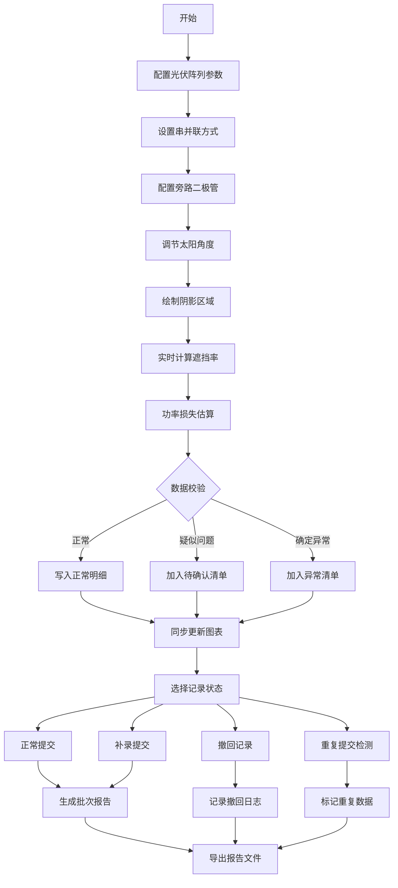

## 1. 产品概述

光伏阴影损失估算教学系统，用于新能源专业教学，帮助学生直观理解光伏阵列中遮挡、串并联和旁路二极管对发电效率的影响。

- **核心目标**：解决教学中口径不一致问题，实现筛选条件与图表明细的实时同步
- **目标用户**：新能源专业教师、光伏专业学生、工程技术人员
- **教学价值**：通过可视化交互，让抽象的光伏电学原理变得可感知、可验证

## 2. 核心功能

### 2.1 用户角色

| 角色 | 注册方式 | 核心权限 |
|------|---------|---------|
| 教师 | 无需注册 | 配置参数、生成教学案例、导出报告 |
| 学生 | 无需注册 | 调整参数、查看影响、学习原理 |

### 2.2 功能模块

1. **主控面板**：组件位置配置、太阳角度调节、阴影区域绘制
2. **阵列可视化**：2D/3D 光伏阵列展示、实时遮挡效果
3. **数据分析**：功率曲线图表、损失明细表格、异常检测清单
4. **报告生成**：批次化报告导出、含时间戳和水印

### 2.3 页面详情

| 页面名称 | 模块名称 | 功能描述 |
|---------|---------|---------|
| 主工作台 | 阵列配置区 | 设置组件数量、串并联方式、旁路二极管配置 |
| 主工作台 | 阴影模拟区 | 拖拽绘制遮挡物、调节太阳高度角/方位角 |
| 主工作台 | 实时图表 | 功率输出曲线、I-V 特性曲线、损失占比饼图 |
| 主工作台 | 数据明细 | 正常数据列表、待确认清单、异常数据清单 |
| 主工作台 | 记录管理 | 支持正常/补录/撤回/重复提交状态流转 |
| 报告预览 | 批次报告 | 按批次生成，含数据溯源、异常标注 |

## 3. 核心流程

## 4. 用户界面设计

### 4.1 设计风格

- **主色调**：科技蓝 (#165DFF) 搭配光伏绿 (#00B42A)，象征清洁能源
- **辅助色**：警示橙 (#FF7D00) 用于待确认，危险红 (#F53F3F) 用于异常
- **中性色**：深灰 (#1D2129) 背景，浅灰 (#86909C) 文字，确保专业感
- **按钮风格**：圆角 8px，微悬浮动效，不同状态色彩区分明显
- **字体方案**：标题使用思源黑体 Bold，正文使用思源宋体 Regular，数据展示使用等宽字体
- **布局风格**：三栏式布局（左配置、中可视化、右数据），卡片式模块化设计
- **图标风格**：线性图标配合填充色，使用太阳能板、太阳、图表等主题图标

### 4.2 页面设计概览

| 页面名称 | 模块名称 | UI 元素 |
|---------|---------|--------|
| 主工作台 | 阵列配置区 | 滑块控件、单选组、开关组件、数值输入框 |
| 主工作台 | 可视化区 | SVG 阵列图、渐变填充、动画过渡、悬停提示 |
| 主工作台 | 图表区 | ECharts 折线图、柱状图、饼图，支持联动筛选 |
| 主工作台 | 数据表格 | 斑马纹、行高亮、状态标签、操作按钮组 |
| 报告预览 | 报告页 | 页眉页脚、批次水印、数据表格、图表嵌入 |

### 4.3 响应式设计

- **桌面优先**：1920px 宽度优化，三栏并列布局
- **平板适配**：1024px 时改为上下两栏，配置区折叠为侧边抽屉
- **移动适配**：768px 以下单栏流式布局，触控操作优化
- **交互优化**：触摸目标 ≥ 44px，关键操作二次确认

### 4.4 特殊设计点

- **异常数据高亮**：异常记录使用红色背景闪烁动画
- **实时同步效果**：筛选条件变化时，图表使用过渡动画平滑更新
- **旁路二极管演示**：二极管导通时使用发光效果
- **批次标识**：报告文件名格式 `光伏阴影分析_批次{编号}_{YYYYMMDD}_{HHMMSS}.pdf`
